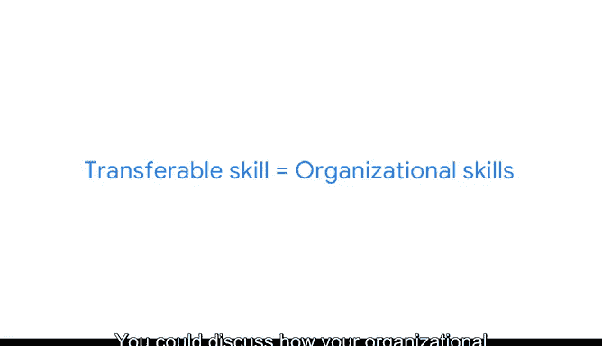

# 028：作品集的价值 📁

在本节课中，我们将探讨**作品集**在数据科学学习与求职中的核心价值，并了解如何通过实践项目来巩固知识、展示技能。

---

参加课程、观看教学视频或阅读资料都是获取新知识的有效途径。然而，没有什么比**应用这些知识**更有效。当你真正动手实践时，这能切实帮助你确认自己是否理解了所学内容。

这一概念被称为**体验式学习**，其核心含义是**通过实践来理解**。它要求你沉浸在一个可以练习所学、进一步发展技能并反思学习成果的情境中。

体验式学习能让你对世界有更广阔的视野，为你特定的兴趣和热情提供宝贵的见解，并有助于建立自信。在本课程的背景下，体验式学习将让你有机会发现组织如何每天使用数据分析。

这类活动可以帮助你确定最感兴趣的特定行业和项目类型，并获得与潜在雇主讨论这些内容所需的信心。这能让你在求职过程中真正脱颖而出。

因此，你将通过完成一个**作品集项目**来实践体验式学习。

---

## 什么是作品集？

作品集是一套可以与潜在雇主分享的材料集合。作品集可以存储在公共或个人网站上，也可以链接到你的数字简历或任何在线职业档案中，例如你的LinkedIn个人资料。

本课程的作品集项目将涉及使用**PA模型**来规划项目的任务。

---

## 作品集项目的价值

创建作品集项目是一个宝贵的机会，因为公司在面试过程中常常会要求你完成某种类型的项目。雇主通常使用这种方法来评估你作为候选人，并深入了解你如何处理常见的业务挑战。

完成这个作品集项目，将为你申请数据相关职位时可能遇到的此类情况做好准备。

接下来，你将了解作品集项目的具体细节，并收到清晰的操作指南。

---

## 应用所学知识与技能

当你开始工作时，请思考你在本课程中获得的知识和技能，以及如何将它们应用到你的项目中。

在每个作品集项目中，你都需要准备一份**PACE策略文档**。这将帮助你识别每个项目中的关键点，以便与招聘经理分享，例如你获得的许多**可转移技能**。

> **可转移技能**是一种可以从一份工作应用到另一份工作的能力或熟练程度。在换工作或行业时，强调你的可转移技能尤为重要。

以下是可转移技能的一些例子：

*   **问题解决能力**：例如，如果你在餐厅担任接待员时学会了如何处理客户投诉，那么在申请数据领域的工作时，你可以强调这项可转移的**问题解决**技能。
*   **组织能力**：也许你在非营利组织的行政部门工作时学会了如何按时完成任务、做笔记和遵循指示。你可以讨论你的**组织能力**如何转移到数据分析领域。

关键在于，你在一个角色中培养了解决问题或保持事物有条理的能力，你就可以在任何地方应用这些知识。你可以将各种可转移技能添加到你的简历中。

---

## 总结与展望

回顾你的可转移技能以及在PACE策略文档中所做的笔记，将帮助你思考如何清晰地传达技术概念。这也有助于你展示如何将你的专业知识应用于数据职业领域的各种工具和场景。

当你完成时，你不仅会拥有一份非常有用的数据分析过程文档，还会为你的作品集积累一套全面的成果。这听起来很令人兴奋，不是吗？😊

在本节课中，我们一起学习了作品集的价值、体验式学习的重要性，以及如何通过项目实践来展示可转移技能。现在，让我们开始行动吧！