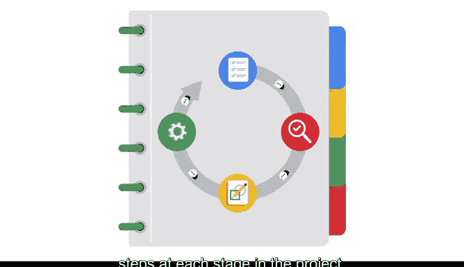

# 029：《数据科学基础》课程1期末作品集项目介绍 🎯

在本节课中，我们将学习课程1的期末作品集项目。该项目旨在帮助你整合并展示在本课程中学到的知识和技能，为未来的求职做好准备。

---

当我在谷歌面试求职者时，我非常喜欢查看他们的在线作品集。我发现，那些能够以清晰且引人入胜的形式展示其知识的候选人，会让我更有信心。

拥有作品集在数据领域已变得非常普遍。在求职过程中，展示你理解业务场景、有效沟通以及使用工具解决复杂问题的能力非常有价值。你的作品集能真正帮助你从其他候选人中脱颖而出。

到目前为止，在本课程中，你已经获得了大量知识和即战力技能来帮助你脱颖而出。你了解了数据专业人员在组织中的角色和典型的职业路径。你探索了核心分析实践和工具，并见证了数据专业人员如何使用它们来产生积极影响。

所有这些都将帮助你成功完成你的作品集项目。此外，你将应用你所学到的关于团队成员、利益相关者和客户的知识，例如他们的特定角色或优先事项。

---

上一节我们介绍了作品集项目的重要性，本节中我们来看看项目的具体步骤。

你将首先阅读你将从事的具体项目。这份阅读材料将描述你将要合作的组织类型、涉及的人员、需要解决的业务问题以及其他关键细节。这将使你能够进一步定义项目、理解利益相关者，并思考为了取得成功的成果需要回答的关键问题。

然后，你将创建一个PACE策略文档，概述项目的目的、利益相关者、可交付成果等。在这个文档中，你将开始整合PACE模型，以识别项目每个阶段的步骤。

---

以下是关于PACE模型和项目流程的说明。

对于每个作品集项目，你将继续使用PACE模型来指导你。通过完成每个PACE策略文档，你将顺利踏上开发自己数据分析工作流的道路。

在后续的课程中，你将继续完善你的作品集项目，并继续使用PACE模型来指导你的流程。当你完成时，你将设计出一些可以用来真正打动招聘经理的东西。

此外，你将拥有一个展示你数据分析技能的动态示例，展示你解决问题的思维过程、你获得的关键技能等等。这些都是面试时可以谈论的绝佳内容。

---

好了，让我们开始吧。是时候去探索你将如何帮助一个组织在激动人心的数据世界中前进了。

---

本节课中我们一起学习了课程1期末作品集项目的目标、价值以及具体执行步骤。我们了解到，通过整合PACE模型来规划并完成一个实际项目，不仅能巩固所学技能，还能创建一个有力的求职作品集，为未来的职业发展打下坚实基础。