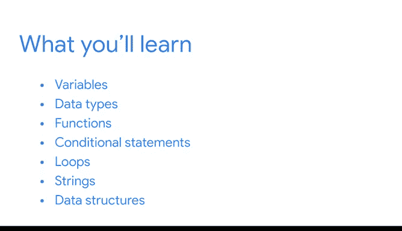
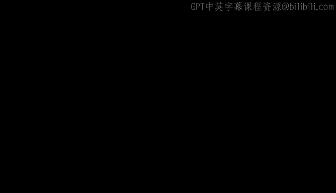

# 001：《Python入门》课程介绍 🐍

在本节课中，我们将要学习Python编程语言的基础知识，了解它为何成为数据专业人士的强大工具，并预览整个课程的学习路径。

## 概述

恭喜您完成第一门课程的学习。您已经了解了数据专业人士如何为组织的成功做出贡献，以及他们在工作中使用的主要工具和技术。

现在，您将学习如何使用数据专业人士可用的最强大工具之一：Python编程语言。

编程是指向计算机发出指令以执行一个或一系列操作的过程。您可以使用不同的编程语言来编写这些指令。您可以根据正在进行的项目或想要解决的问题来选择特定的语言。

Python编程语言对于处理数据非常有用。数据专业人士使用Python以更快、更高效、更强大的方式分析数据，因为它优化了数据工作流的每个阶段，从探索、清理和可视化数据到构建机器学习模型。

本课程将为您打下坚实的Python基础，为您未来职业生涯中更高级的数据工作做好准备。

## 课程起点与导师介绍

如果这是您第一次接触Python编程语言，欢迎您。本课程不假定您有任何Python的先验知识。我们将从头开始，逐步讲解每个概念。请一步一步来，按照自己的节奏学习。在您发展Python技能的同时，您将应用所学知识来获得处理数据的宝贵实践经验。

如果您有Python经验，那也很好。我将帮助您以新的方式应用您的知识，并专门演示如何使用Python进行数据分析。

让我自我介绍一下。我叫Adrian，在Google Cloud担任客户工程师。这意味着我与客户合作，了解他们可以利用哪些技术来满足数据分析需求。我第一次学习Python是为了创建一个电子日记本。我厌倦了每年都买新的实体日记本，我学会了如何为它设置密码保护，直到今天，这仍然是我使用Python最自豪的时刻之一。

在您作为数据专业人士的整个职业生涯中，您将有机会不断学习和成长。对我来说，这是这份工作最酷的方面之一。而学习Python是这个成长过程中最有价值的部分之一。无论是在工作中还是为了乐趣，我一直在学习使用Python的新方法。

## 课程内容预览

现在，让我们回顾一下您将学习的内容。

我们将从对Python的总体介绍开始，并讨论为什么它在数据专业人士中如此受欢迎。

您将学习基本的编码概念，例如变量和数据类型，以及它们如何帮助存储和组织数据。您还将有机会开始编写自己的Python代码。

接下来，您将探索函数，即可重复使用的代码块，它们让您可以执行特定任务。函数帮助您快速高效地处理数据。

您还将学习条件语句，它告诉计算机如何根据您的指令做出决策。

然后，您将发现循环的强大功能，它可以重复一部分代码直到某个过程完成。

您还将学习如何处理字符串，即字符序列，例如字母和标点符号。

之后，您将探索Python中的数据结构，这是在计算机中存储和组织数据的方法。您将回顾对数据专业人士最有用的结构，例如列表、集合、字典和数据框。

最后，您将在课程结束项目中应用您的Python技能，该项目可以添加到您的专业作品集中。

## 课程项目与价值

课程结束项目基于一个工作场景，包含一个独特的数据集。在未来的工作面试中，您可以分享您的项目，作为您技能的展示，给潜在雇主留下深刻印象。

学习Python将使您的数据分析技能提升到一个新的水平。它也将是您简历上的一个很好的补充。知道如何使用Python是数据专业人士的关键资质，将极大地提升您作为求职者的竞争力。

我将在这里帮助您完成每一步。请记住，您自己设定节奏。请随意多次观看视频，并复习对您来说是新的主题。

在本课程结束时，您将知道如何使用Python来探索和分析数据。

让我们开始吧。

## 总结

本节课中，我们一起学习了本门Python入门课程的概述、学习目标、导师背景以及详细的学习路径。我们了解到Python是数据分析的核心工具，本课程将从零开始，涵盖变量、函数、条件语句、循环、字符串和数据结构等核心概念，并通过一个实战项目来巩固所学。准备好开启您的Python数据分析之旅了吗？