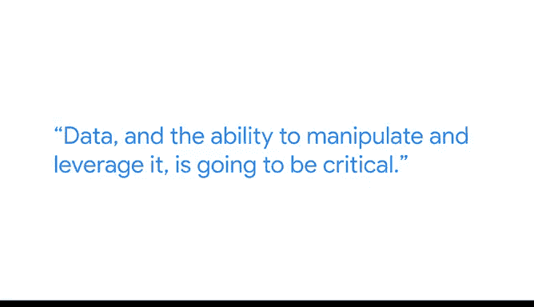

# 002：我的数据职业发展之路 🚀

在本节课中，我们将跟随谷歌客户工程师阿德里安的分享，了解他从非技术背景转型进入数据分析领域的职业发展之路。我们将探讨可迁移技能的重要性以及如何开启数据分析职业生涯。

## 背景介绍

我的名字是阿德里安，我在谷歌云担任客户工程师。这意味着我与客户合作，帮助他们理解并运用现有技术来满足数据分析需求。

## 从护理到科技的转型 🩺➡️💻

我来自一个非传统的背景，最初从事护理工作。我在护理领域工作了几年后意识到，虽然与病人打交道并帮助他们确实很有成就感，但这并非我余生想从事的事业。

## 可迁移的技能

以下是我从护理职业生涯中学到的、可迁移到数据分析领域的几项关键技能：

*   **批判性思维**：在高级数据分析中，批判性思维至关重要。
*   **问题解决能力**：当尝试调试代码或解决问题时，问题解决能力变得关键。
*   **评估能力**：在网上寻找答案时，你需要能够评估所获得的信息，并理解如何应用这些信息来解决你的问题。

上一节我们介绍了硬技能，本节中我们来看看同样重要的软技能。

我从护理工作中带来的另一项技能是软技能，即人际交往能力。当你尝试在协作空间中与他人合作时，这些技能在高级数据分析中同样至关重要。

## 进入数据分析领域的契机

我之所以进入这个职业，是因为我在生活中积累了一些与编程相关的技能。然而，当时我并未真正理解如何应用这些技能，甚至没有意识到我可以应用它们。我本科攻读的是英语和历史专业。在了解到人文学科的就业机会后，我不得不重新思考我的下一步。这时，技术进入了我的视野。我发现，我实际上可以运用技术，并将其与我从人文学科（英语和历史）角度所做的事情结合起来，从而进入数字人文领域。

## 通往数据分析之路

通过知识管理的过程或概念，我最终进入了数据分析领域。我们处在一个每个公司都将成为数据公司的时代。无论你从事医疗、零售还是其他任何行业，数据以及处理和利用数据的能力都将是至关重要的。

## 数据分析的魅力

关于数据分析，我最喜欢的一点是它的入门门槛可以非常低。一旦你理解了那些基础知识，你就可以自己开始学习。你不需要拥有正规的大学学位，也不需要拥有多年的经验。只要你投入努力打下基础，就可以开始学习。

本节课中我们一起学习了阿德里安从护理专业成功转型为谷歌云数据分析工程师的职业路径。我们了解到，批判性思维、问题解决能力和人际交往等可迁移技能在数据分析领域极为重要，并且进入这个领域的关键在于掌握基础并付诸实践。