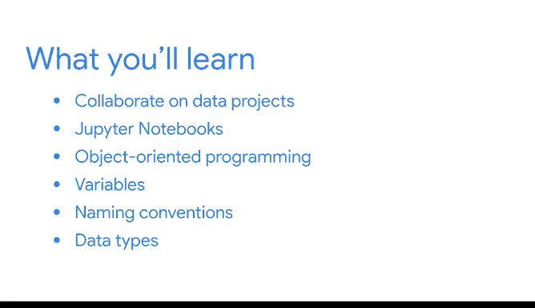

# 003：模块1概述 🐍

在本节课中，我们将一起探索Python编程语言，了解其核心特性、基本概念以及如何利用Python进行高效的数据分析工作。课程内容将涵盖Python的基础知识、Jupyter Notebook的使用、面向对象编程的概念、变量的定义与命名规则，以及基本的数据类型及其操作。


---

## Python概述与基础

Python是一种功能强大的编程语言，特别适合数据分析工作。它具备简洁的语法和丰富的库支持，能够帮助数据专业人员快速、高效地处理数据。

接下来，我们将深入了解Python的主要特性和基本编程概念。

---

## Jupyter Notebook：交互式编程环境

上一节我们介绍了Python的基本特性，本节中我们来看看Jupyter Notebook。Jupyter Notebook是一个交互式的编码和数据工作环境，为数据分析和编程提供了极大的便利。

以下是Jupyter Notebook的主要功能：

*   它允许用户在笔记本环境中编写和运行Python代码。
*   支持实时查看代码执行结果。
*   便于结合代码、文本说明和可视化结果进行展示。

---

## 面向对象编程（OOP）基础

在熟悉了编程环境后，我们需要理解Python的编程范式。Python是一种面向对象的编程语言，其核心思想是基于对象进行编程。

面向对象编程对数据专业人员非常有益，因为它能帮助组织和管理复杂的代码与数据结构。

以下是其基本概念：

*   **对象**：包含数据（属性）和相关操作（方法）的实体。
*   **类**：创建对象的蓝图或模板。

一个简单的类定义示例如下：
```python
class DataPoint:
    def __init__(self, value):
        self.value = value
```

---

## 变量：数据的容器

理解了编程范式后，我们来学习一个具体的编程构件：变量。变量是Python编程的基础构建块之一，用于存储和标记数据。

以下是关于变量的关键点：

*   变量帮助存储数据并为数据赋予有意义的标签。
*   通过赋值操作符 `=` 可以将特定值分配给变量，例如 `count = 10`。
*   遵循变量命名约定可以使代码更清晰、精确和一致。

---

## 基本数据类型

最后，我们来探讨Python中的基本数据类型。有效组织数据是数据分析的前提，而数据类型是数据的分类方式。

Python有几种基本的数据类型，用于表示不同种类的数据。

以下是三种最常用的基本数据类型：

*   **整数（int）**：表示没有小数部分的数字，如 `42`。
*   **浮点数（float）**：表示包含小数点的数字，如 `3.14`。
*   **字符串（str）**：表示文本数据，用引号包围，如 `"数据分析"`。

你可以通过类型转换函数来转换和组合这些数据类型，例如 `int()`, `float()`, `str()`。

---

## 总结

本节课中我们一起学习了Python编程的入门知识。我们从Python的概述开始，了解了Jupyter Notebook交互环境，探讨了面向对象编程的基本概念，学习了如何使用变量存储数据，并认识了整数、浮点数和字符串这三种基本数据类型。这些知识为你后续的数据分析工作奠定了坚实的基础。



---

准备好后，请进入下一个视频继续学习。