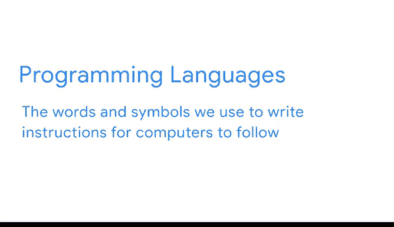
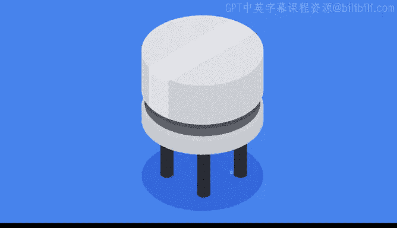
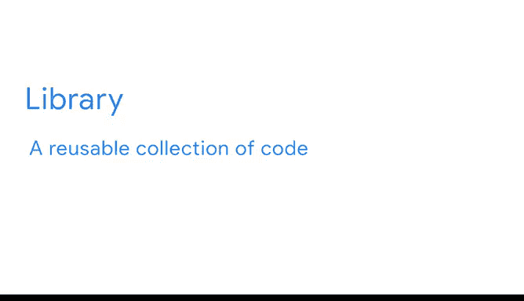

# 004：《Python入门》课程 04_01_06_Python入门 🐍

在本节课中，我们将要学习Python编程语言的基础知识，包括它的起源、特点以及为何在数据分析领域如此受欢迎。

## 什么是Python？ 🤔

Python是一种强大的编程语言，已成为全球数据专业人士的首选工具之一，这有其充分的理由。

## 编程语言的基本元素 💻

在深入了解Python之前，让我们先讨论一下编程语言的一些基本元素。

编程语言起源于电子计算机的发展。它们过去是，现在仍然是我们用来编写计算机执行指令的词语和符号。

与计算机的通信最终依赖于计算机硬件。

### 晶体管：计算机的基础

晶体管是计算机最基本的组件，因为它控制着电路中电流的流动。

一个晶体管可以存在于两种状态：**开**或**关**，就像一个开关。当晶体管处于“开”状态时，电流通过它；当它处于“关”状态时，它会阻断电流。这种二元性定义了计算机的运作方式。

### 从晶体管到二进制

如果你将足够多的晶体管（每个都处于开或关状态）连接在一起，就可以创建复杂的逻辑。

那么，这与计算机编程有什么关系呢？因为计算机本质上只是数十亿个晶体管或开关，它们只能理解二进制概念。你可能之前接触过这个概念。

二进制用**1**和**0**表示。这些数字只是指代晶体管开关序列的一种更简单的方式。当计算机从程序接收指令时，它处理的就是这些二进制序列。

## 编程语言的诞生与发展 📜

计算机功能强大，但仍需要被给予指令，并且它们只能理解以二进制形式给出的指令。

最初设计计算机的工程师们遇到了这个问题，并发现了一个难题：计算机非常擅长理解二进制，但人类却不擅长。正是这个难题催生了第一批编程语言。

最早的编程语言使用困难，需要大量培训，并且通常只能在为其设计的特定机器上运行。这类语言被称为**低级语言**。

随着时间的推移，新的编码语言发展起来，以简化和通用化编程指令。编程语言变得更容易学习，因为它们采用了更简单的规则和结构，即**语法**。

大多数现代编程语言使用的语法对人类来说要熟悉得多。这些语言被称为**高级语言**。这又把我们带回了Python。

## Python：一种高级语言 🚀

Python是一种高级语言，它功能多样且易于学习。简单来说，Python很友好。

事实上，有些人可能会认为它的名字本身听起来有点吓人，但Python的创造者并不是以一条巨蛇来命名的。他以英国喜剧团体“Monty Python”来命名，因为他希望这门语言简单且平易近人。

除了功能多样和易于学习之外，Python还很强大。这种品质的结合使其不仅成为数据专业人士的最爱，也深受科学家和网络开发者的青睐。

## Python的强大之处：开源与库 📚

Python如此强大的部分原因在于它是**开源**的，并且开发者们创建了许多**库**和工具，使得许多需要使用Python的工作变得更加容易。

一个**库**是一个可重用的代码集合。

例如，你可以手动编写一个函数，该函数接收两个数字，将它们相加，然后返回总和。但如果你现在想加三个数字或四个数字呢？你可以编写一个更复杂的函数，让你输入任意数字组合，并返回总和。

然而，求和是一个非常常见的任务，因此你可以通过直接使用包含求和函数的数学库来节省大量时间。

有成千上万的Python库，其中包含的代码任务范围广泛，从简单的数字求和到为人工智能应用程序构建神经网络的复杂任务。

你很快会学到更多关于库的知识，并且在后续课程中，你将了解神经网络、人工智能以及它们如何融入数据分析的世界。

## Python在数据分析中的应用 🔍

本证书课程侧重于高级数据分析，因此你将学习如何将Python最常用于数据分析工作中。

你还将了解以下代码库，这些是数据专业人士在日常工作中每天都会使用的：
*   **NumPy**：用于高效的数值计算。
*   **Pandas**：用于数据操作和分析。
*   **Statsmodels**：用于统计建模和检验。
*   **Matplotlib** 和 **Seaborn**：用于数据可视化。
*   **Scikit-learn**：用于机器学习。

你将在后续课程中详细探索这些库。

## 学习Python的优势与社区 🌟

易于学习、易于使用、功能多样且强大，这些特点使Python成为当今使用最广泛的编程语言之一。

正因为其应用广泛，Python拥有一个庞大且活跃的用户社区，他们乐于提供帮助和支持，这使得Python成为一门非常适合探索和学习的编程语言。

## 给初学者的建议 💡

在你学习本课程乃至整个证书课程的过程中，请始终记住：编码既是简单的，也是复杂的。换句话说，每一行代码都代表一个简单的小想法，但这些代码行组合在一起，可以表达非常复杂的逻辑。

编码有时可能会令人沮丧，但也充满乐趣且非常有回报。你将在本课程中进行大量编码练习，从而不断进步。

最后，不要害怕犯错。实验是学习过程的一部分，练习将帮助你快速提高编码技能。

---

**本节课总结**：在本节课中，我们一起学习了Python编程语言的基础知识。我们了解了编程语言如何从计算机的二进制本质发展而来，以及Python作为一种高级语言如何因其友好、强大、开源和拥有丰富的库生态系统而脱颖而出。我们还探讨了Python在数据分析中的核心应用库，并获得了作为初学者开始学习编码的宝贵建议。