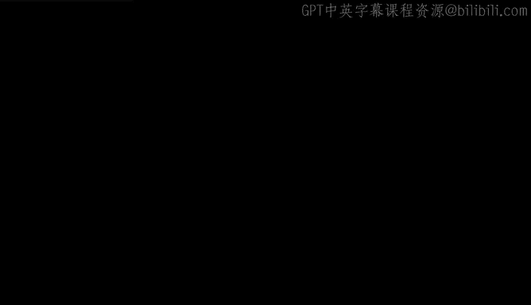
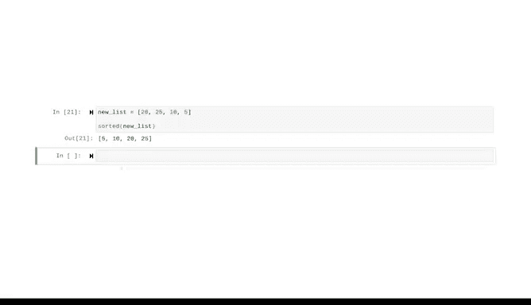

# 005：深入了解Python 🐍



在本节课中，我们将通过一系列简单的示例，初步了解Python编程语言的基本概念和功能。我们将学习如何打印输出、进行计算、使用变量、评估逻辑语句、编写条件判断与循环，以及定义和使用函数。这些基础操作是构建更复杂程序的基石。

---

## 打印输出与计算

上一节我们介绍了Python是一种高级编程语言。本节中，我们来看看如何让Python执行最基本的任务：在控制台输出信息以及进行数学计算。

使用`print()`函数可以向控制台输出信息。在括号内输入的内容将被打印出来。

```python
print("Hello world")
```

Python也能执行数学运算。运算符与数学中类似，例如`+`用于加法，`/`用于除法，`**`用于计算幂。

```python
print((5 + 4) / 3)
```

---

## 变量与赋值

变量可以看作是一个有名字的容器，用于存储数据（即值）。我们可以通过变量名来引用这些值。

以下是创建和使用变量的示例：

```python
country = "Brazil"
age = 30
print(country)
print(age)
```

---

## 运算符与逻辑评估

Python使用运算符进行运算和比较。需要注意的是，**单个等号`=`用于赋值**，而**双等号`==`用于检查两个值是否相等**。

以下是使用运算符进行逻辑评估的示例：

```python
print(10 ** 3 == 1000)  # 检查10的3次方是否等于1000
print(10 * 3 == 40)     # 检查10乘以3是否等于40
print(10 * 3 == age)    # 使用之前定义的变量age进行比较
```

---

## 条件判断

条件判断允许程序根据不同的情况执行不同的代码块。其基本结构是`if...else...`。

以下是一个判断年龄是否为成年人的示例：

```python
if age >= 18:
    print("adult")
else:
    print("minor")
```

---

## 循环

循环用于对一组元素中的每一个执行相同的操作。`for`循环是其中一种常见形式。

以下是两个循环的示例。第一个直接遍历数字列表，第二个遍历一个已赋值的变量列表。

示例一：遍历并打印数字1到5。

```python
for number in [1, 2, 3, 4, 5]:
    print(number)
```

示例二：创建一个列表变量，并遍历其中的每个元素进行计算。

```python
my_list = [3, 6, 9]
for number in my_list:
    print(number / 3)
```

---

## 函数

函数是一段可重复使用的代码块，用于执行特定任务。它可以接收输入（称为参数）并返回结果。

我们可以将上面的条件判断逻辑封装成一个函数，以便重复使用。

以下是定义和调用函数的示例：

```python
def is_adult(age):
    if age >= 18:
        print("adult")
    else:
        print("minor")

# 调用函数
is_adult(14)
is_adult(30)
```

---

## 内置函数

Python拥有一个丰富的内置函数库，可以执行许多常见任务，例如排序。

以下是使用内置`sorted()`函数对列表进行排序的示例：



```python
new_list = [20, 25, 10, 5]
print(sorted(new_list))
```

---

## 总结

本节课中我们一起学习了Python的多个核心概念。我们了解了如何打印输出、进行数学计算、使用变量存储数据、利用运算符进行比较、编写条件判断和循环结构、创建可复用的函数，以及调用Python强大的内置函数。这些简单的操作可以通过组合与叠加，构建出能够解决复杂问题、甚至改变世界的算法与程序。Python的能力仅受限于你的想象力。