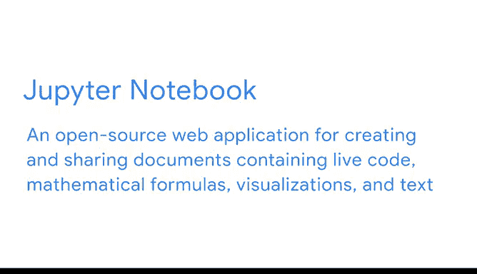
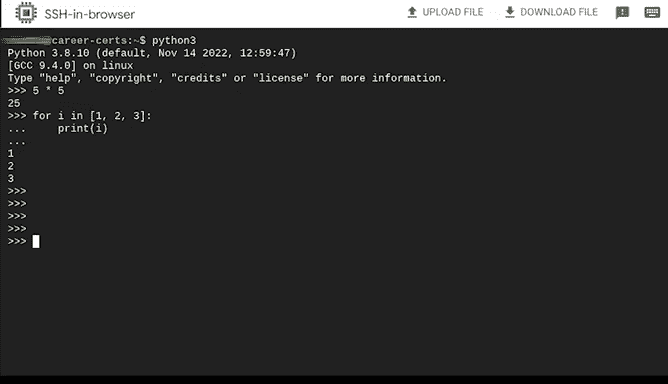
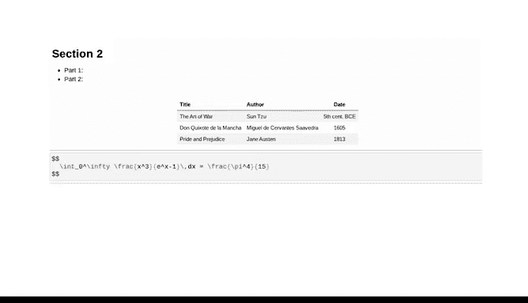

# 006：Jupyter笔记本介绍 🧑‍💻

在本节课中，我们将要学习Jupyter笔记本这一在数据分析领域广泛使用的工具。我们将了解它的基本概念、核心功能以及它为何成为数据专业人士的首选平台。

---

## 什么是Jupyter笔记本？ 📓

上一节我们探讨了Python的强大功能，本节中我们来看看编写和运行Python代码的一种流行环境。

Jupyter笔记本是一个开源的Web应用程序，用于创建和共享包含**实时代码**、数学公式、可视化图表和文本的文档。在课程中，我们将使用这个平台来编写代码和进行分析。

我们也会提供如何在您自己的电脑上设置Jupyter笔记本的信息，但这对于完成高阶数据分析课程是可选的，并非必需。

---

## 为何选择Jupyter笔记本？ 🤔

为了说明原因，我们先看看计算世界的另一个例子。

在大多数情况下，代码是在类似这样的环境中编写的：这是一个基于终端的文本编辑器。请注意，它就像一个无限长的单页。

如果我执行一个操作或写一行代码，当我移动到下一行时它会立即执行，并且我只能向前移动。我无法返回到更早的代码行，将光标插入那里并更改或运行它。

基于终端的文本编辑器在许多情况下是非常有用的环境，但对于数据分析项目而言，它并不总是最好或最容易使用的。

---

## Jupyter笔记本的核心优势 ✨

现在，将其与我们之前的笔记本环境进行比较。

在这里，我可以更轻松地将代码模块化为**单元格**，以便分节组织它们。

> **单元格**是Jupyter笔记本被划分成的模块化代码输入输出区域。

我可以移动代码、添加代码、或通过点击鼠标或按下按钮来删除代码。它非常适合可视化和演示。

我可以使用**Markdown语法**添加注释、注解和解释。

> **Markdown**允许您在编码环境或纯文本编辑器中编写格式化的文本。

例如，我可以添加标题、项目符号、表格和数学公式。

---

## Jupyter笔记本的主要功能列表

以下是Jupyter笔记本的一些关键功能，使其在数据专业人士中备受欢迎：

*   **模块化单元格**：将代码和输出组织在独立的单元中，便于管理和测试。
*   **交互式执行**：可以单独运行任何一个单元格，并立即看到结果。
*   **非线性和可编辑**：可以自由地向前或向后移动，修改并重新运行任何单元格中的代码。
*   **丰富的文档支持**：使用Markdown在代码旁添加格式化的文本说明。
*   **内置可视化**：直接在同一文档中生成和显示图表、图形。
*   **易于分享**：整个笔记本（包含代码、输出和文档）可以保存为一个文件并共享。

---

## 总结与展望 📈

本节课中我们一起学习了Jupyter笔记本的基本概念和优势。它通过**单元格**的模块化设计、**交互式**的代码执行环境以及**Markdown**文档支持，极大地提升了数据分析和探索的效率和清晰度。

随着课程的深入，您将在Jupyter笔记本中创建项目，以展示您作为数据专业人士的技能。