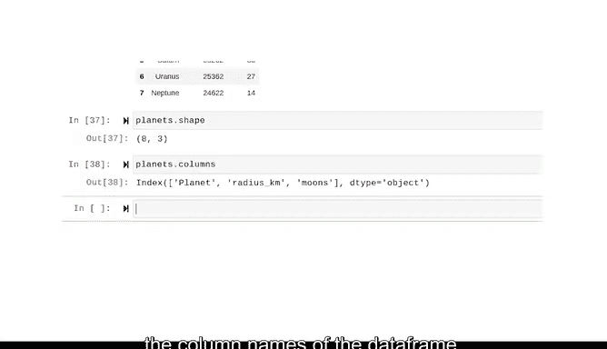

# 007：面向对象编程 🐍


在本节课中，我们将学习Python中一个核心且强大的概念：面向对象编程。我们将重点介绍类、方法和属性，理解它们如何共同作用，使Python代码更加组织化、可访问和可重用。

---

## 概述

面向对象编程是一种基于“对象”的编程范式。对象将数据（属性）和操作该数据的代码（方法）捆绑在一起。这种结构使得代码更易于管理和扩展，是Python成为数据分析强大工具的重要原因之一。

---

## 什么是面向对象编程？🤔

面向对象编程是一种编程体系，它围绕“对象”构建。对象包含数据以及用于操作这些数据的有用代码。一个对象是某个“类”的实例。你可以将其视为Python的基本构建模块。列表、函数、字符串，这些都是对象。

面向对象编程的核心思想是将数据和处理数据的方法都封装在对象内部，从而创建出更有组织、更易访问和可重用的代码。

---

## 核心概念：类 🧱

面向对象编程中最重要的概念是**类**。

一个类是一种对象的数据类型，它将数据和功能捆绑在一起。换句话说，对象之所以有用，是因为它属于某个类，这允许我们将一系列有用的工具直接打包到对象本身。

通过一个例子会更容易理解。当我们把单词 `"hocus pocus"` 放在引号中，并将其赋值给一个名为 `magic` 的变量时，这个变量就成为了**字符串类**的一个实例。

```python
magic = "hocus pocus"
```

因为它属于字符串类，所以它以一种特定的方式行为，并拥有许多为字符串保留的内置功能。

---

## 类的方法：执行操作 🛠️

以下是字符串类的一些内置功能示例。

我们可以通过输入 `magic.swapcase()` 来交换字符的大小写。

```python
print(magic.swapcase())  # 输出：HOCUS POCUS
```

我们可以通过输入 `magic.replace()` 并用新字符替换某些字符。

```python
print(magic.replace('pocus', 'focus'))  # 输出：hocus focus
```

我们可以使用 `.split()` 和一对空括号将字符串拆分为两个字符串的列表。

```python
print(magic.split())  # 输出：['hocus', 'pocus']
```

这些操作被称为**方法**。方法是属于某个类的函数，通常用于执行某个动作或操作。它们使用括号 `()`。在我们的例子中，每个方法都作用于我们变量的值，并以某种方式改变了它。

你不需要记住所有方法。大多数编码环境都提供了访问给定类可用方法列表的方式。在Jupyter Notebook中，你可以输入一个点 `.` 然后按Tab键。请注意，我们使用点 `.` 将方法附加到其类的实例上，这被称为**点表示法**，是我们访问属于类实例的方法和属性的方式。

---

## Python中的类 📦

Python中有许多不同的类。你已经遇到过其中一些了。

Python的核心类包括：
*   **整数** (`int`)
*   **浮点数** (`float`)
*   **字符串** (`str`)
*   **布尔值** (`bool`)
*   **列表** (`list`)
*   **字典** (`dict`)
*   **元组** (`tuple`)
*   **集合** (`set`)
*   **冻结集合** (`frozenset`)
*   **函数** (`function`)
*   **范围** (`range`)
*   **空值** (`NoneType`)，这是一种返回空值的数据类型。

此外，还有许多随库和包提供的额外自定义类，你甚至可以创建自己的类。

---

## 类的属性：访问特征 📐

我们要讨论的最后一个概念是**属性**。

属性是与对象或类关联的值，通过使用点表示法按名称引用。它们**不使用括号** `()`。属性对于自定义构建的类和更复杂的数据结构（如DataFrame）尤其重要。

这里有一个例子。假设我们有一个名为 `planets` 的DataFrame，它包含每个行星的行，以及代表行星名称、半径和卫星数量的列。

这个DataFrame的一个属性是它的**形状** (`shape`)。这个DataFrame是8行乘3列。

```python
# 示例：获取DataFrame的形状属性
print(planets.shape)  # 可能输出：(8, 3)
```

DataFrame类的另一个属性是**列** (`columns`)。在DataFrame对象上调用此属性会返回一个包含DataFrame列名的索引对象。

```python
# 示例：获取DataFrame的列名属性
print(planets.columns)
```

属性允许你访问类的特征，但它们不会对类执行任何操作或改变它。

---

## 总结

在本节课中，我们一起学习了Python面向对象编程的基础知识。

我们了解到，**类**是对象的蓝图，它将数据与功能捆绑在一起。**方法**是属于类的函数，用于对对象执行操作。**属性**是与对象关联的值，用于描述其特征。

通过将数据与操作和了解数据的方法打包在一起，面向对象编程是数据分析的理想结构。对象是Python的基本构建模块，也是使其成为数据专业人士强大工具的部分原因。



希望这节课能帮助你开始欣赏Python代码的组织之美和强大功能。在未来的数据职业生涯中，你将有机会进一步探索面向对象编程。