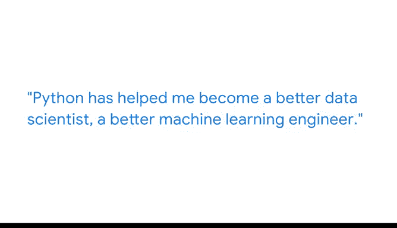

# 008：Python如何助力我的数据科学职业 🚀

## 概述

在本节课中，我们将跟随应用机器学习工程师哈姆扎，了解Python编程语言如何成为他数据科学职业生涯的核心工具，并探索Python在数据科学领域的独特优势。

---

我叫哈姆扎，是一名应用机器学习工程师。我热爱构建模型。

我热爱构建大规模系统，这正是我工作中的主要内容。

对我而言，这就像一种艺术形式：你从零开始创造一些不存在的东西，将其投入生产，并被大约一亿用户使用。我的工作范围是构建、维护并使大规模模型投入生产。

因此，Python几乎是我工作的核心主题。

Python是一种编程语言，它帮助你**操作数据**，帮助你**构建模型**，并且你可以用它来创建可用于生产的模型和软件。

有很多其他编程语言也能实现你想要的相同功能。就我个人而言，我使用Python是因为它有大量的文档和帮助资源，并且它吸收了许多其他编程语言过去的失败经验，这些经验被整合进来，使Python变得用户友好，易于被世界各地的人使用和适应。

你永远不会因为拥有好刀而被聘为一名好厨师，你被聘为一名好厨师是因为你拥有出色的烹饪技能。这是同样的道理。

Python帮助我成为一名更好的数据科学家，一名更好的机器学习工程师。

它帮助我理解了机器学习中多样化的数学应用，这些是我以前未曾意识到的。

我认为Python的独特优势在于它是一个多面手工具，它不仅仅用于一件事。它不仅仅用于数据操作或数据清洗。

你可以进行数据转换、数据清洗，你可以构建模型，将它们投入生产，你可以基于它创建API，你还可以在其之上构建监控系统。这些是Python的优势，使你在数据科学领域几乎成为全能大师。

当你进行在线课程或学习任何东西时，最重要的一点是：学习过程不是线性的。

学习曲线非常陡峭，但最终你会迎来“顿悟”时刻。

关键在于，在你学习某个课程的前两周，你可能会觉得：“好吧，这没有意义，对我不起作用，没有达到我想要的效果。”所以，请坚持下去，保持一致性。

在这些事情上，学习曲线总是陡峭的，但最终你会达到一个阶段，你会说：“哦，我知道所有这些事情，我可以将我所有的知识结合起来，构建出很棒的东西。”

---

## 总结

本节课中，我们一起学习了哈姆扎作为应用机器学习工程师的视角。我们了解到Python不仅是他工作的核心工具，更是一个功能全面的多面手，覆盖了从数据清洗、模型构建到系统部署的整个数据科学流程。同时，我们也认识到学习编程和数据分析的过程充满挑战，但保持坚持和一致性是跨越陡峭学习曲线、最终实现能力飞跃的关键。