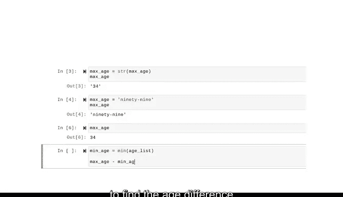

# 009：变量与数据类型 📊


在本节课中，我们将要学习Python编程中的两个核心概念：**变量**与**数据类型**。理解它们是编写有效、清晰代码的基础。

## 变量：代码中的“名词” 📦

上一节我们介绍了编程的基本思想，本节中我们来看看如何用变量为数据赋予意义。在编程中，变量就像语言中的名词，用于标识和指向特定的值。

变量本身并不是值，而是指向存储在计算机内存中某个值的标签或容器。例如，在表达式 `X = 3` 中，`X` 是变量，而 `3` 是它指向的存储值。

另一种理解方式是，变量像一个贴有标签的容器。容器和它内部装的东西是分开的，但标签让我们知道里面是什么。

## 数据类型：数据的属性 🔢

变量可以存储任何数据类型的值。数据类型是根据数据的值、在编程语言中的角色或可执行的操作来描述数据片段的属性。

在Python中，常见的数据类型包括字符串、整数、浮点数、列表和字典等。本课程中你已经接触过其中一些，我们将在整个课程中深入探索。

## 如何创建变量：三个关键问题 ❓

在编写代码创建新变量之前，思考以下三个问题会很有帮助：
*   **变量名称是什么？**
*   **变量类型是什么？**
*   **变量的初始值是什么？**

思考这些问题有助于你创建含义明确、便于后续引用的变量名。

以下是命名变量和考虑数据类型的重要性：
1.  **变量名是提示**：好的变量名能提醒你和其他人该变量存储了什么内容。
2.  **数据类型决定功能**：明确数据类型有助于你理解数据能做什么、不能做什么。

接下来，考虑如何通过**赋值**和**表达式**来使代码更简洁。

## 在Python中实践：赋值与动态类型 🐍

赋值是指将值存储到变量中的过程。表达式则是数字、符号或其他变量的组合，经计算后会产生一个结果。

现在，让我们在Python中实践。我们将把一个变量算法转化为Python代码。

首先，我们有一个职业篮球队首发五名球员的年龄列表。我们将把这个列表赋值给一个名为 `age_list` 的变量。

```python
age_list = [22, 28, 34, 24, 30]
```

注意，我们没有将其命名为 `X`，因为 `X` 无法告诉我们它包含什么值。Python的一个优点是，当我们赋值一个新变量时，计算机会自动解释其数据类型，这称为**动态类型**。

动态类型意味着变量可以指向任何数据类型的对象。同时，大多数新变量没有默认类型，因此我们需要在调用它们之前进行赋值或初始化。

回到我们的例子。我们将使用Python内置的 `max()` 函数，并将 `age_list` 作为参数传递给它，以找到球员的最大年龄。然后将结果赋值给一个新变量 `max_age`。

```python
max_age = max(age_list)
print(max_age)  # 输出：34
```

当我们调用这个变量时，计算机返回值 `34`，这是一个**整数**。所以 `max_age` 变量的数据类型是整数。

## 修改变量：类型转换与重新赋值 🔄

现在，假设我们想让 `max_age` 变量包含一个字符串值。我们可以使用 `str()` 函数将其转换为字符串，并将结果重新赋值给 `max_age` 变量。

```python
max_age = str(max_age)
print(max_age)  # 输出：'34'
```

现在，我们的变量数据类型变成了**字符串**，输出中的引号表明了这一点。引号是字符串独有的特征。

我们也可以完全覆盖变量的内容。例如，我们可以在其中存储文本字符串 `"99"`。

```python
max_age = "99"
print(max_age)  # 输出：'99'
```

这里有两点非常重要：
1.  **重新赋值**：当我们将 `max_age` 从整数转换为字符串时，我们将其结果**重新赋值**给了它自己。如果只是使用 `str()` 函数而不重新赋值，计算机虽然会返回一个字符串，但变量的内容不会改变。通常，要修改变量的内容，必须重新赋值。
2.  **运行顺序**：在Jupyter Notebook等环境中，运行单元格的顺序很重要。如果重新运行最初赋值 `max_age` 的单元格，然后再在新单元格中调用它，它的值会变回整数 `34`，而不再是字符串 `"99"`。

在这些例子中，`max_age` 变量包含的值在我们每次重新赋值时都改变了，这就是它“动态”的原因。

## 变量的便利性：进行计算 🧮

变量很方便，因为你可以引用它们，而不是直接引用它们包含的值。

如果我们定义一个新变量 `min_age` 来存储年龄列表中的最小值，我们就可以用这两个变量相减来找出最年长和最年轻球员的年龄差。

```python
min_age = min(age_list)
age_difference = max_age - min_age  # 注意：此处的max_age在上一步已被覆盖为字符串"99"，直接相减会报错。应使用原始的整数变量。
# 正确的做法是使用最初存储整数最大年龄的变量，或重新计算。
max_age_int = max(age_list) # 重新获取整数最大值
age_difference = max_age_int - min_age
print(age_difference)
```



## 总结 📝


本节课中我们一起学习了Python中变量与数据类型的基础知识。

我们了解到，**变量**是存储和指向数据的标签，如同语言中的名词。**数据类型**（如整数、字符串）描述了数据的特性与可执行的操作。创建变量前思考名称、类型和初始值至关重要。Python的**动态类型**特性让变量使用更加灵活。重要的是，要修改变量必须进行**重新赋值**，并且在Jupyter Notebook中需要注意代码单元格的**运行顺序**。

变量和表达式在Python中功能强大，程序提出问题，变量帮助我们从特定输入中捕获答案。

记住，如果你想修改变量的内容，通常需要重新赋值。同时，在Jupyter Notebook中编码时，考虑单元格的运行顺序也很重要。

接下来，我们将学习变量的命名规范和限制。