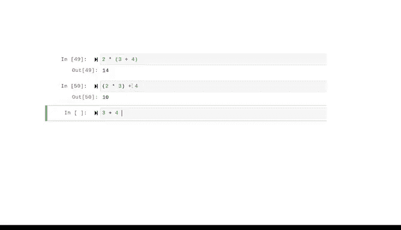

# 010：变量命名规则与括号使用 🐍

在本节课中，我们将学习Python中变量命名的核心规则与限制，以及括号在数学运算中的基本作用。掌握这些基础概念是编写清晰、有效代码的关键。

---

## 变量命名规则与限制

上一节我们介绍了变量的基本概念，本节中我们来看看如何为变量选择合适的名称。Python对变量命名有明确的拼写和语法规则，就像任何语言一样。在编程中，我们称这些规则为**命名规范**和**命名限制**。

命名规范是一套一致的指导原则，用于描述文件内容、创建日期和版本。命名限制则是语言语法本身内置的、必须遵守的规则。

以下是Python中需要牢记的一些重要命名规范：

*   **避免使用关键字**：关键字是保留用于特定目的的特殊单词，只能用于该目的。你已经遇到过一些关键字，例如 `for`、`in`、`if` 和 `else`。命名变量时绝不应使用关键字。
*   **避免使用内置函数名**：例如 `print` 和 `str`。你也应该避免使用现有函数的名称。

关于变量命名规范，一个重要的注意事项是：**不要使用保留的关键字或函数名**。

编程中精确性至关重要，这就是为什么变量有命名限制。

以下是主要的命名限制：

*   变量名只能包含**字母**、**数字**和**下划线（_）**。
*   这意味着不能使用空格、制表符或特殊字符，如美元符号（$）或与符号（&）。
*   变量名可以包含数字，但**必须以字母或下划线开头**。
*   Python是**大小写敏感**的，这意味着大写很重要。
*   变量名不能包含**圆括号**，因为圆括号在Python中有其他用途。

---

## 有效与无效的变量名示例

为了更清楚地理解这些规则，让我们看一些有效和无效的变量名示例。

以下是有效的变量名：
*   `any_variable`
*   `any_variable_2`

以下是无效的变量名：
*   `1_is_a_number`：无效，因为变量名必须以字母或下划线开头。
*   `apples_&_oranges`：无效，因为它使用了特殊字符“&”。

在为变量命名时，你确实有一定的灵活性。由于这些是你创建的引用，上述规范和限制只是帮助它们保持一致性和实用性。

---

## 括号在运算中的作用

好了，现在让我们回到括号，以更深入地了解它们在Python中的功能。在进行计算时，括号的规则遵循数学中的运算顺序。

例如：
*   如果我们输入 `2 * (3 + 4)`，Python会先计算 `(3 + 4)`，因为它遵循运算顺序。这等于 `14`。
*   但是 `(2 * 3) + 4` 等于 `10`。这是因为括号内的运算总是会优先完成。

顺便说一下，如果我们不使用任何括号，Python将遵循标准的数学运算顺序。

---

## 总结

在本节课中，我们一起学习了Python变量命名的核心规则与括号的基本用法。变量命名规范和限制有助于在你进行各种Python活动时保持代码的一致性和实用性。作为一名数据分析专业人士，能够有效地命名变量以创建有意义的代码，是使用Python工作的关键部分。接下来，我们将探索数据类型转换，但目前，请先掌握好这些基础。

