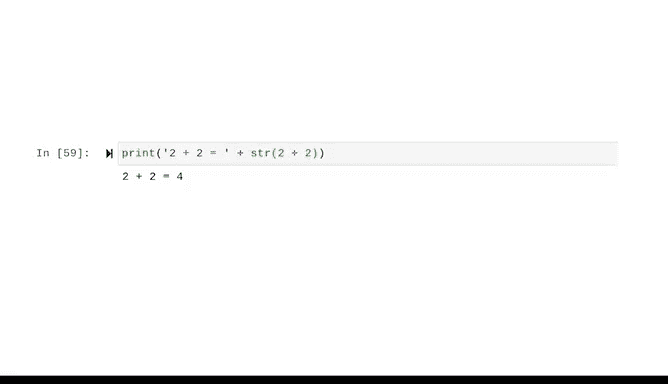

# 011：数据类型与转换 📊➡️🔀


在本节课中，我们将要学习Python中的不同数据类型，以及如何在这些类型之间进行转换。理解数据类型是编写有效程序的基础，它可以帮助我们避免错误并正确地处理数据。

## 变量与值：数据的容器 📦

上一节我们介绍了变量及其命名规则。变量指向存储在计算机内存中的值。换句话说，变量就像容器，而它们存储的值就是其中的内容。

现在，我们将更深入地了解变量可以包含的值的类型。

## 认识基本数据类型 🔤

程序需要处理数据，而数据可以有许多不同的形式或类型。这些数据类型包括字符串、整数和浮点数。

以下是三种核心数据类型：

*   **字符串**：字符串是一个包含文本信息的字符和标点符号序列。字符串用单引号或双引号实例化，也可以使用`str()`函数。这是一种**不可变**的数据类型，意味着其值永远不能被更改或更新。
*   **整数**：整数是一种用于表示没有小数部分的**整数**的数据类型。
*   **浮点数**：浮点数据类型用于表示包含**小数**的数字。

## 数据类型冲突与错误提示 ⚠️

大多数计算机知道如何将两个整数相加，或者将两个字符串相加。但一般来说，计算机不知道如何处理不同的数据类型。

如果你尝试混合不同的数据类型，有时会引发错误。计算机总是会告诉我们错误的原因，这就像一个小线索，可以帮助你提高编程技能。

请仔细阅读错误信息，理解它们试图告诉你什么，并利用这些知识来修复错误。

在这个例子中，错误信息的最后一行说我们遇到了一个“类型错误”。数字`7`被读取为整数，而`"8"`因为引号被读取为字符串。难怪会出现错误——你不能把一个数字和一个“词”相加。

## 识别数据类型：`type()`函数 🔍

作为数据专业人士，你经常需要聚合许多不同类型的数据。这就需要转换各种类型，以便能够成功地将它们组合起来。

有一个有效的方法可以做到这一点，但首先，了解你正在处理的数据类型至关重要。Python提供了一个有用的`type()`函数来识别数据类型。

你可以使用`type()`函数让计算机告诉你数据的类型。例如：
```python
type('a')  # 输出：<class 'str'>
type(2)    # 输出：<class 'int'>
type(2.5)  # 输出：<class 'float'>
```
这里的`type()`函数告诉我们，`'a'`属于`str`类（字符串的缩写），数字`2`属于`int`类（整数），而`2.5`属于`float`类（浮点数）。

提醒一下，**类**是对象的数据类型，它将数据和功能捆绑在一起。

## 数据类型转换 🛠️

现在让我们看看如何组合这些不同的数据类型。在Python中，有两种转换数据的方式。

### 隐式转换

**隐式转换**会自动将一种数据类型转换为另一种，无需用户参与。

以下是一个例子。在涉及整数和浮点数的算术运算中，解释器会在后台工作，将整数转换为浮点数。你不需要在代码中指定任何内容来完成这个转换。

### 显式转换（类型转换）

然而，如果你想将数值转换为字符串，就需要进行**显式转换**。

显式转换是指用户将对象的数据类型转换为所需的数据类型。我们使用预定义的函数`int()`、`float()`和`str()`。这有时被称为**类型转换**，因为用户“投射”或更改了数据类型。

让我们在希望被解释为输出的字符串内部使用`str()`函数：
```python
result = "The answer is " + str(7 + 8)
print(result)  # 输出：The answer is 15
```
现在，这个计算的结果将作为字符串存储和输出。



## 总结与职业建议 💡

本节课中我们一起学习了Python的核心数据类型——字符串、整数和浮点数，以及如何使用`type()`函数识别它们。我们还探讨了隐式转换和显式转换（类型转换），这是处理混合数据类型操作的关键技能。

调试代码或找出代码不工作的原因，对任何数据专业人士来说都是一项非常有用的技能。

最后，作为一个专业提示：我们行业中的所有人，即使是经验丰富的数据专业人士和代码开发者，在遇到错误时也会在线搜索答案。这是一个常见的策略，可以节省大量时间。

请始终向数据社区寻求答案和灵感。