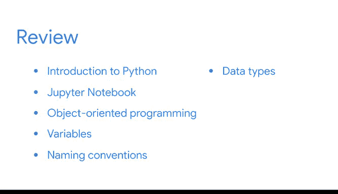

# 012：12_01_01_总结_1

在本节课中，我们将对《Python入门》课程的第一部分进行回顾与总结。我们将梳理已学习的关键概念和技能，并为接下来的评估做好准备。

## 课程回顾与总结

我们已经完成了Python课程第一部分的全部内容。

你已经掌握了许多新的Python技能，做得很好。

在此过程中，你发现Python是数据专业人士的强大工具，并学习了Python如何帮助你快速高效地处理数据。

### 1. Python语言简介

我们首先对Python编程语言进行了总体介绍，并探讨了数据专业人士如何使用Python来驱动数据分析。

### 2. Jupyter Notebooks 环境

接着，我们讨论了Jupyter Notebooks。你了解了Jupyter Notebooks的主要功能，以及如何在Notebook环境中编写Python代码。

### 3. 面向对象编程基础

上一节我们介绍了编程环境，本节中我们来看看编程范式。你探索了面向对象编程对数据专业人士的好处，并学习了其基本概念。

### 4. 变量与数据存储

之后，我们重点学习了如何使用变量。你学会了如何为变量赋值，以及如何有效地存储和标记你的数据。

我们还回顾了变量的标准命名规范。

以下是关于命名规范的核心要点：
*   使代码清晰、精确且一致。

### 5. Python数据类型

最后，我们探索了Python中的不同数据类型，例如整数（`int`）、浮点数（`float`）和字符串（`str`）。

你学习了如何转换和组合数据类型以组织你的数据。

## 准备迎接评估

接下来，你将面临一次分级评估。

为了做好准备，请复习列出了所有新术语的阅读材料，并随时重新观看视频、阅读资料和其他涵盖关键概念的资源。

祝贺你到目前为止取得的进步，我们很快会再次见面。