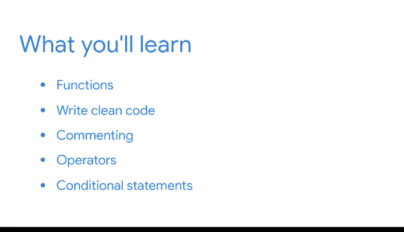

# 013：模块2概述 🐍


在本节课中，我们将要学习Python编程的进阶概念，包括函数、编写整洁代码、注释、运算符以及条件语句。这些知识将帮助你编写更高效、更易于协作的Python代码。

## 欢迎来到模块2 🚀

上一节我们介绍了Python的基础知识，包括变量、数据类型和编写简单代码。本节中，我们将继续构建你的Python知识体系。

在本课程结束时，你将能够编写Python代码语句来对数据执行多步骤操作。你还将学习如何编写整洁、可读的代码，这些代码可以轻松地被其他数据专业人员理解和复用。

对于数据专业人员来说，能够与团队成员协作是最重要的技能之一。编写整洁的代码是与队友协作并帮助团队实现目标的绝佳方式。使用整洁的代码有助于团队工作更快、沟通更有效并产生更好的结果。

## 核心概念详解

### 1. 函数：代码的“动词” 🔧

我们将从函数开始学习。函数是可重用的代码块，用于执行特定任务。函数就像是编程语言中的动词或动作词。

你可以在任何时候调用函数来帮助你执行对数据有用的操作，例如排序、分类、汇总等等。

**代码示例：定义一个简单的函数**
```python
def greet_user(name):
    """向用户打招呼"""
    print(f"Hello, {name}!")

# 调用函数
greet_user("Alice")
```

### 2. 编写整洁代码：可重用性与模块化 ✨

接下来，我们将讨论如何编写易于队友和协作者理解的整洁代码。你将学习编写整洁代码的两个重要元素：**可重用性**和**模块化**。

这两种实践都能加速项目开发，帮助数据专业人员专注于核心业务需求，避免花费时间进行返工。

### 3. 注释：记录你的思路 📝

之后，我们将探讨编写整洁代码的另一个关键方面：注释。注释是一种有用的实践，因为它帮助你在为队友记录工作流程的同时，理清自己的思路。

使用注释来描述问题的组成部分，可以帮助你以清晰、简单的步骤解决问题。

**代码示例：使用注释**
```python
# 计算列表的平均值
def calculate_average(numbers):
    total = sum(numbers)  # 求和
    count = len(numbers)  # 计数
    average = total / count  # 计算平均值
    return average
```

### 4. 运算符：比较与逻辑判断 ⚖️

接下来，我们将讨论如何使用运算符来比较值。我们将回顾两种类型的运算符：比较运算符和逻辑运算符。

- **比较运算符**（如大于 `>` 或小于 `<`）允许你比较两个值。
- **逻辑运算符**（如 `and` 和 `or`）让你将多个语句连接在一起，执行更复杂的比较。

数据专业人员使用运算符来分析和决策他们的数据。

**公式示例：比较与逻辑运算**
```
比较: value1 > value2
逻辑: (condition1) and (condition2)
```

### 5. 条件语句：让代码做决策 🤔

最后，我们将探讨条件语句，它告诉计算机如何根据你的指令做出决策。你将学习如何编写 `if`、`else` 和 `elif` 语句。

数据专业人员使用条件语句来构建复杂的操作，并执行各种实际任务，例如数据分箱和组织文件。条件语句使你的Python代码更加灵活和强大。

**代码示例：条件语句**
```python
temperature = 25

if temperature > 30:
    print("It's hot outside.")
elif temperature > 20:
    print("It's warm outside.")
else:
    print("It's cool outside.")
```

## 总结 🎯

本节课中我们一起学习了Python编程的进阶主题。我们探讨了函数作为可重用的代码块，编写整洁代码的原则（可重用性与模块化），注释的重要性，用于值比较和逻辑连接的运算符，以及让代码能够做出决策的条件语句。掌握这些概念将使你能够编写更高效、更清晰且易于协作的Python代码，为处理复杂数据分析任务奠定坚实基础。



当你准备好后，我们将在下一个视频中再见。