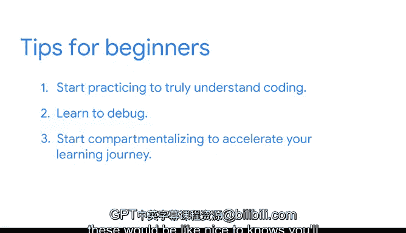

# 014：应对编程学习挑战的技巧 🧠

## 概述

在本节课中，我们将跟随谷歌客户工程师拉蒂法，学习她如何克服学习Python编程时遇到的挑战。课程将分享实用的心态调整方法和学习技巧，帮助初学者顺利开启编程之旅。

---

## 从服务员到工程师的启示

我的名字是拉蒂法，是谷歌云的一名客户工程师。我的专长是数据分析，主要工作是将客户在其他云提供商或数据中心已有的架构，迁移并适配到我们的云平台上。

小时候，我有两个梦想职业：秘书和服务员。这两份工作我都做过，并且非常享受。从服务员经历中，我学到的最重要一课是：直面问题。

刚开始做服务员时，我非常胆怯。如果客人的订单出了问题，我会躲在厨房里，直到新菜做好，然后假装一切正常。可以想象，这通常不会让事情变好，反而会让客人更生气。因此，我学会了承认错误、直面问题，并且不害怕与人沟通解决。

---

## 初学Python的挑战与突破

学习Python起初有些困难。我遇到的第一个主要问题是环境设置和IDE选择。

如果你玩过电子游戏，就会知道你可能在初始的角色选择界面花费大量时间。同样，在开始编程的核心内容之前，你很容易在挑选这些细枝末节的小事上陷入困境。

我克服这些挑战的方法是：**第一，承诺开始行动**。我意识到“开始做”这件事本身的力量非常强大。你可以设定一个时间段专门做这件事，即使没有进展，至少当晚你可以对自己说：“我已经尽力了。”如果这还不够，那也只是说明今天还不够。

**第二，我花时间学习如何阅读Stack Overflow**。刚开始编程时，我对它感到非常沮丧，因为我只想把代码复制粘贴到控制台，然后魔法般地让它为我工作。或者，我总是试图将问题归咎于正在运行的Python版本或包版本。但事实并非如此。学会放慢速度，真正理解错误信息在说什么，以及它如何与我遇到的错误或问题相关联，而不是试图强行进入下一个主题或问题，这对我帮助巨大。

---

## 编程带来的实际价值

在我第一个纯销售团队工作时，我们被要求为大约2300个不同的客户或潜在客户创建商业智能报告。当时的经理计算过，我们所有人每周必须工作50小时，连续三周才能完成这个任务。

这显然不理想。没有人愿意每天花8到10小时制作智能报告。但凭借我的编程知识，我能够自动化这些商业报告的生成过程，并在一个半小时内创建了2300份报告。知道自己有能力做到这一点，感觉非常好。

---

## 给编程初学者的核心建议

以下是给想要开始编程的人的核心建议：

**首要建议**：你将会观看大量视频，接收大量信息，有人会和你谈论优化、如何编写最佳代码。但除非你真正动手去做，否则你无法理解编码和调试过程中所有复杂的细节。

**第二个建议**：学会调试。

**第三个建议**：学会处理“噪音”。如果你能开始分门别类，区分“这是我入门和前进必须掌握的知识”和“这些是锦上添花的知识”，你将真正加速你的学习旅程。

---

## 总结

本节课中，我们一起学习了拉蒂法分享的编程学习心得。核心要点包括：**以行动克服起步的犹豫**、**学会有效利用Stack Overflow等资源**、**理解编程带来的自动化价值**，以及给初学者的三个关键建议：**动手实践**、**掌握调试**和**聚焦核心、过滤噪音**。记住，编程之旅始于直面挑战和写下第一行代码。