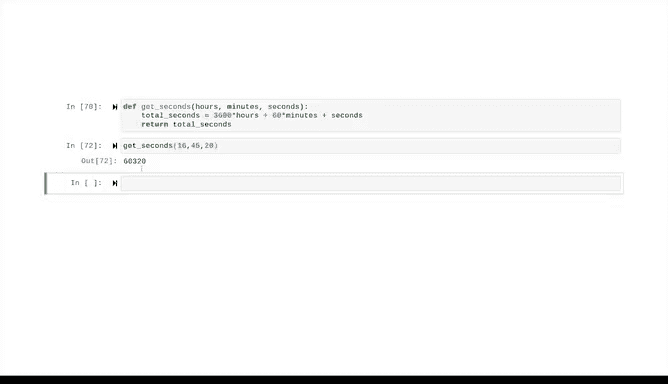

# 015：定义函数与返回值 📘


在本节课中，我们将要学习Python编程中的一个核心概念：函数。我们将了解什么是函数，如何定义自己的函数，以及如何使用`return`语句从函数中获取计算结果。掌握这些知识将帮助你编写更高效、可重用的代码。

## 概述

之前我们已经探索了变量、表达式和数据类型。本节视频将介绍编程和Python中的另一个重要组成部分：函数。函数是一段可重复使用的代码，用于执行特定的过程或任务。

## 什么是函数？ 🤔

我们已经遇到过一些Python内置函数。例如：
*   `print()`函数在屏幕上输出文本。
*   `type()`函数告诉我们变量中包含的数据类型。
*   `str()`函数将一个对象转换为字符串。

需要注意的是，在Python 3中，`print`的语法是一个函数，因此需要使用括号，即使括号内没有参数。

Python虽然有许多内置函数，但如果我们想让计算机执行特定于我们自己用例的任务，学会定义自己的函数就非常重要。

## 如何定义函数

要定义一个函数，我们使用关键字`def`来开始函数块。

以下是定义函数的步骤：
1.  始终以`def`关键字开头。
2.  接下来是函数名，例如我们将其命名为`greeting`。
3.  然后是函数的参数（也称为形参），写在括号内。参数是你提供给函数以进行某种修改的东西。你可以随意命名它们，但在函数体内必须使用定义时使用的名称。
4.  定义完参数后，关闭括号，在末尾加上冒号，然后按回车键转到新的一行。

现在，我们可以编写函数体了。这里是我们指定函数实际要执行的操作的地方。

请注意，函数体会自动向右缩进。在Python中，代码行是分层的。任何缩进的行都专门属于前面缩进较少的代码。

我们可以向函数体添加任意多行代码，但每一行都必须向右缩进。通常使用四个空格，这使代码更具可读性。

让我们看一个例子。我们的`greeting`函数将接收一个名字，并使用该名字输出问候语。

```python
def greeting(name):
    print("Welcome, " + name + "!")
    print("You are part of the team.")
```

要完成函数的定义，只需让下一行代码取消缩进即可。

现在，我们可以调用这个函数了。在括号内使用函数名`greeting`并传入参数。

```python
greeting("Rebecca")
```

运行单元格后，将输出：
```
Welcome, Rebecca!
You are part of the team.
```

当然，函数能做的远不止打印信息。这只是定义自定义函数的一个简单示例。

## 使用`return`返回值

接下来，让我们看看如何从函数中获取值。这时就可以使用返回值。

`return`是Python中的一个保留关键字，它让函数执行计算以产生新结果，但不是打印结果，而是将结果保存起来供后续使用。

让我们定义一个新函数，它接受两个参数（三角形的底和高），并返回三角形的面积。面积计算公式为：**底 × 高 ÷ 2**。

```python
def triangle_area(base, height):
    area = base * height / 2
    return area
```

我们使用关键字`return`来告诉Python，这是我们希望从函数中输出的值。与`print`不同，`return`允许我们将这个值存储在变量中。

假设我们有两个三角形，想要计算它们面积的总和。我们可以这样做：

```python
# 分别计算两个面积，将每个值存储在自己的变量中
area1 = triangle_area(5, 10)
area2 = triangle_area(7, 8)

# 将两个面积相加，结果赋值给变量 total_area
total_area = area1 + area2

# 调用这个变量，Jupyter Notebook会返回它的值
total_area
```

如果我们调用这个变量，Jupyter Notebook会返回它的值，但我们不一定非要调用它，可以根据需要继续编写代码。这展示了`return`语句的强大之处，它使我们能够将函数调用与其他操作结合起来，从而使代码可重用。

## 再举一个例子

这里还有一个名为`get_seconds`的函数。这个函数接收小时、分钟和秒作为输入，并返回这些输入所代表的总秒数。

```python
def get_seconds(hours, minutes, seconds):
    total_seconds = hours * 3600 + minutes * 60 + seconds
    return total_seconds
```

在第一行，我们以关键字`def`开始，并将函数命名为`get_seconds`。在括号内，我们给它三个参数：`hours`、`minutes`和`seconds`。下一行执行计算，计算总秒数并将该值赋给变量`total_seconds`。第三行也是最后一行是`return`语句，它返回`total_seconds`的值。

当我们调用这个函数时，必须提供三个参数：小时、分钟和秒。

```python
get_seconds(16, 45, 20)
```

运行后得到结果：`60320`秒。

## 总结

本节课中，我们一起学习了Python函数的基础知识。我们了解了如何定义自己的函数，包括指定函数名、参数和函数体。更重要的是，我们学习了如何使用`return`关键字从函数中返回计算结果，并将其保存下来供后续使用，这是实现代码重用的关键。




代码重用是Python的一个关键要素，作为数据分析专业人士，你会越来越体会到它的价值。你的数据工具箱正在不断扩充，未来还有更多内容等待探索。