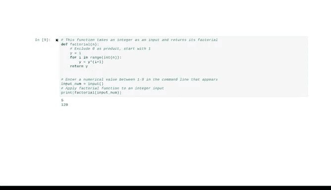

# 016：编写整洁代码 🧹

在本节课中，我们将学习如何编写整洁、可重用且易于理解的Python代码。我们将探讨代码复用、模块化、重构以及编写自文档化代码的重要性，这些实践能帮助数据专业人员更高效地协作并减少错误。

---

在软件开发早期，开发者通常需要自己编写每一段代码。

如今我们知道，复用他人编写并存放在在线代码仓库中的代码要高效得多。

我们也可以开发模块化代码，这将在本视频中学习。

这两种实践都能加速开发进程，并帮助数据专业人员专注于使用代码逻辑来满足业务需求，而不是进行重复劳动。

正如我们讨论过的，可复用性意味着定义一次代码，然后多次使用它而无需重写。

😊 考虑以下示例。这个脚本使用了 `len` 函数，它返回对象的长度。

在这个例子中，它是字符串的字符数。

然后它使用这个长度来计算一个数字，我们称之为幸运数字。最后，它打印一条包含姓名和数字的消息。每次我们想执行这个计算时，都需要更改变量的值并重写公式。

请注意，在代码的第一部分和第二部分中，有两行代码是完全相同的。

当你在脚本中发现代码重复时，最好检查是否可以通过使用函数来清理代码。

让我们重写这段代码，创建一个函数，将所有重复的代码整合到一行中。😊

更新后的脚本给出了与原始脚本完全相同的结果，但它更整洁、更易于理解。最重要的是，它现在是可复用的。

我们只需用不同的名字调用 `lucky_number` 函数，就可以根据需要多次执行其中的代码。

由于其模块化特性，Python非常适合编写可复用的代码。

模块化是指编写代码并将其分离成可以协同工作、并且可以被其他程序复用的独立组件的能力。

😊 模块化与可复用性密切相关，因为它允许你复用代码块或代码段。

复用代码块可以帮助你更有效地与数据工程师在大型项目上协作，这样他们就不必从头开始编写代码。

以下是一个例子。这些变量名并没有真正告诉我们这段代码试图做什么。

我们可以运行它。是的，它确实做了些事情，但阅读和理解那段代码相当困难。

因此，让我们尝试让这段代码对其他用户来说更清晰。

重构是在保持原始功能的同时重组代码的过程。

这是创建自文档化代码的一部分。自文档化代码是指以可读性强且目的明确的方式编写的代码。

这涉及到从选择变量名到编写清晰、简洁的表达式的方方面面。

注释是对代码的有益补充说明。

当你的计算机识别到注释行前的井号 `#` 字符时，它会忽略该行中该字符之后的所有内容。

所以，让我们重构这段代码，使其成为自文档化的。现在，代码的意图和结构更加清晰了。

它也被分解成了函数和带注释的部分。添加注释是一个有用的实践，因为它能帮助你在为其他协作者记录工作流程的同时，思考自己的过程。

😊 虽然混乱的代码不一定会导致脚本失败，但代码越整洁，对你的团队其他成员就越有用。你的同事会欣赏整洁的代码，因为他们可以理解并复用它，从而为自己节省时间和精力。

此外，代码复用和模块化可以减少错误、增强团队合作并建立信任。

---

本节课中，我们一起学习了编写整洁Python代码的核心原则。我们了解了如何通过创建函数来复用代码，如何通过模块化组织代码结构，以及如何通过重构和添加注释使代码更清晰、更易于维护。记住，整洁的代码不仅能提高个人效率，也是团队协作成功的基石。