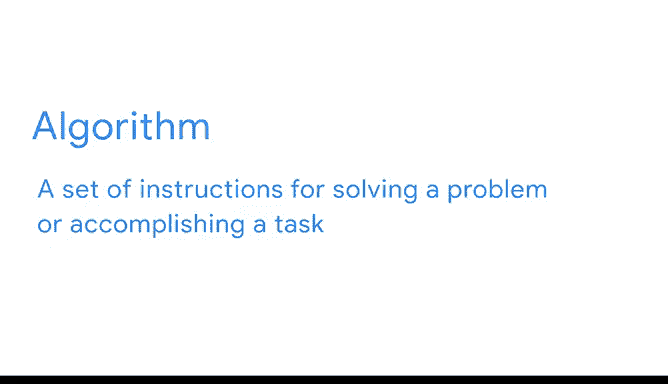
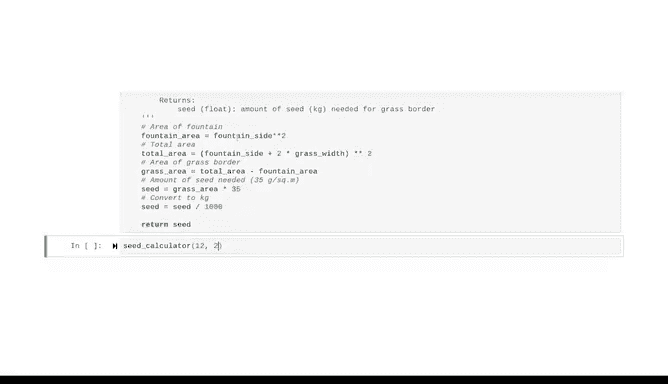

# 017：使用注释构建代码框架 📝


在本节课中，我们将学习如何使用注释来构建代码框架。注释是代码中不会被计算机执行的文本，它们的主要作用是向阅读代码的人解释代码的意图和逻辑。我们将探讨如何通过注释来规划复杂的函数，并介绍如何编写清晰、有用的文档字符串。

---

## 算法思维与注释的重要性



上一节我们介绍了编写整洁代码的概念。本节中，我们来看看如何通过注释来辅助我们像程序员一样思考，即进行“算法思维”。


在编程中，**算法**是一套用于解决问题或完成任务的指令集。一个日常生活中的算法例子是烘焙面包的食谱。

**算法示例（食谱）**：
1.  将烤箱预热至 425 华氏度。
2.  将两杯面粉、三个鸡蛋、两杯水和一茶匙酵母放入碗中，用手持电动搅拌器混合。
3.  让面团发酵一小时。
4.  将面团从碗中转移到烤盘上。
5.  将烤盘放入烤箱。


同样，每个计算机设备都通过算法形式的指令（基于硬件或软件的例程）来执行其功能。因此，学会如何向计算机进行逻辑解释非常重要，这就是算法思维的含义。你已经通过函数开始了这种思维方式，因为函数本身就是算法。

随着编码技能的发展，你将能够编写更长、更复杂的函数。处理新函数的最佳方法是将其分解为小而简单的部分，并从注释开始。

---


## 使用注释构建代码框架：一个示例

在编写任何代码之前，先用注释勾勒出步骤，这有助于你更好地理解问题。让我们通过一个例子来实践。

假设我们有一个方形喷泉，我们想在喷泉周围种植一圈草。我们需要编写一个函数来计算所需的草籽量，已知条件是喷泉的边长和草带的宽度。

以下是构建函数框架的步骤：

首先，我们使用 `def` 关键字定义函数，将其命名为 `seed_calculator`。它的参数是我们已知的两个量：喷泉边长和草带宽度。

现在，我们来编写函数体，用注释将其分解为小步骤。

以下是该函数逻辑步骤的注释框架：

```python
def seed_calculator(fountain_side, grass_width):
    # 第一步：计算喷泉的面积
    # 第二步：计算喷泉和草带的总面积
    # 第三步：通过相减得到草带的面积
    # 第四步：计算所需草籽量（每平方米35克）
    # 第五步：将克转换为千克
    # 第六步：返回结果
```

我们使用注释在编写任何代码之前创建了一个逻辑框架。换句话说，我们用注释分解了思维过程，勾勒出为实现目标所需的每一段代码。剩下要做的就是逐步用代码填充它。

---

## 填充代码并添加文档字符串

现在，让我们将注释转换为实际的代码，并添加一个重要的部分：**文档字符串**。

文档字符串是位于函数体开头的一个字符串，用于总结函数的行为并解释其参数和返回值。它以三个引号开始和结束。

以下是填充代码并添加文档字符串后的完整函数：

```python
def seed_calculator(fountain_side, grass_width):
    """
    计算围绕方形喷泉的草带所需的草籽千克数。

    参数:
        fountain_side (float): 喷泉一边的长度，单位米。
        grass_width (float): 草带的宽度，单位米。

    返回:
        seed (float): 草带所需草籽的量，单位千克。
    """
    # 第一步：计算喷泉的面积
    fountain_area = fountain_side ** 2

    # 第二步：计算喷泉和草带的总面积
    total_side = fountain_side + 2 * grass_width
    total_area = total_side ** 2

    # 第三步：通过相减得到草带的面积
    grass_area = total_area - fountain_area

    # 第四步：计算所需草籽量（每平方米35克）
    seed_grams = grass_area * 35

    # 第五步：将克转换为千克
    seed = seed_grams / 1000

    # 第六步：返回结果
    return seed
```

我们完成了一个可以执行复杂任务并可根据需要多次使用的函数。使用注释来分解问题的各个部分，使我们能够以清晰、简单的步骤解决问题。最重要的是，其他人可以使用这段代码并准确理解它的作用，因为我们编写了文档字符串和简洁的注释。

---

## 测试函数

那么，如果我们的喷泉是边长为12米的正方形，并且我们想要一个2米宽的草带，需要多少草籽呢？

```python
result = seed_calculator(12, 2)
print(result)  # 输出：3.92
```

答案是 **3.92 千克**。



---

## 总结 🎯

本节课中，我们一起学习了如何使用注释构建代码框架。注释充当了脚手架，将你的代码分解为可管理的部分。结合函数的文档字符串，它们能帮助你和他人理解并使用你的代码。养成编写有良好文档的代码的习惯对数据专业人士非常重要。虽然前期需要多做一些工作，但你以后会感谢自己，你的同事也会感谢你。