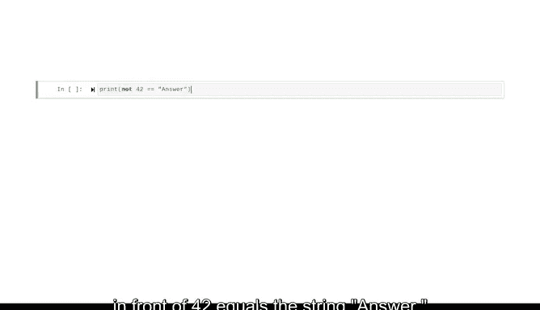

# 018：使用运算符进行比较 🔍


## 概述
在本节课中，我们将要学习Python中的**比较运算符**和**逻辑运算符**。这些运算符能帮助我们比较数值、字符串等数据，并根据比较结果（真或假）来控制程序的逻辑流程。这是编写复杂代码和进行数据分析的基础。

---

## 布尔数据类型
在之前的课程中，我们学习了整数、字符串和浮点数等数据类型。另一种重要的数据类型是**布尔数据**。

布尔数据只有两个可能的值：`True`（真）或 `False`（假）。这个词来源于19世纪英国数学家乔治·布尔。在Python中，每次进行比较操作时，结果都是布尔类型的数据。数据专业人员每天都会使用布尔数据来控制代码的逻辑流程。

---

## 比较运算符
上一节我们介绍了布尔数据类型，本节中我们来看看如何使用比较运算符来生成布尔值。

比较运算符用于比较两个值，并产生一个布尔值结果。例如，如果我们执行 `print(10 > 1)`，比较运算符 `>` 会产生结果 `True`。

Python中有六种比较运算符：
*   `>`：大于
*   `>=`：大于或等于
*   `<`：小于
*   `<=`：小于或等于
*   `==`：等于
*   `!=`：不等于

数据专业人员利用这些比较表达式的结果来对数据做出决策。例如，`"cat" == "dog"` 的结果是 `False`。

现在，让我们看看 `!=`（不等于）运算符的例子：
```python
print(1 != 2)  # 输出：True
```
这段代码检查1是否不等于2，并产生布尔值 `True`。

正如我们所学过的，`+` 运算符不能在整数和字符串之间使用。那么，如果我们尝试比较一个整数和一个字符串会发生什么呢？是的，会出现类型错误。

---

## 逻辑运算符
了解了基本的比较后，我们可以进行更复杂的逻辑判断。Python还提供了一组逻辑运算符。

逻辑运算符用于连接多个语句，并执行更复杂的比较。以下是主要的逻辑运算符：
*   `and`：与
*   `or`：或
*   `not`：非

`and` 运算符要求**两个**表达式都为真，整个结果才为真。以下是使用字符串比较的例子：
```python
print(("yellow" > "cyan") and ("brown" > "magenta"))
```
当用于文本字符串时，比较运算符会根据字母顺序（a最小，z最大）评估每个字符串的第一个字母。如果两个字符串首字母相同，则会比较第二个字母。在这个例子中，`"yellow"` 中的 ‘y’ 大于 `"cyan"` 中的 ‘c’，所以第一部分为真。但 `"brown"` 中的 ‘b’ 并不在 `"magenta"` 中的 ‘m’ 之后，所以第二部分为假。因此，整个 `and` 语句的结果是 `False`。

`or` 运算符则相反。如果使用 `or` 运算符，只要**任意一个**表达式为真，整个表达式就为真；只有当两个表达式都为假时，结果才为假。

尝试运行以下代码：
```python
print((25 > 50) or (1 != 2))
```
25肯定不大于50，但1不等于2。所以，最终整个表达式的结果是 `True`。

`not` 运算符会反转其后表达式的布尔值。如果它为真，则变为假；如果它为假，则变为真。
```python
print(not (42 == "answer"))  # 输出：True
```
因为 `42 == "answer"` 的结果是 `False`，前面的 `not` 语句将其反转为 `True`。



---

## 总结
本节课中，我们一起学习了Python中的比较运算符和逻辑运算符。我们了解到，比较运算符（如 `>`、`==`、`!=`）用于比较两个值并返回布尔结果。而逻辑运算符（`and`、`or`、`not`）则用于连接多个比较，构建更复杂的逻辑条件。这些工具在数据领域非常有用，它们使得编写复杂的数据处理和分析代码成为可能。请继续练习和复习这些运算符，我们很快会再次见面，演示这些表达式的更多实际例子。