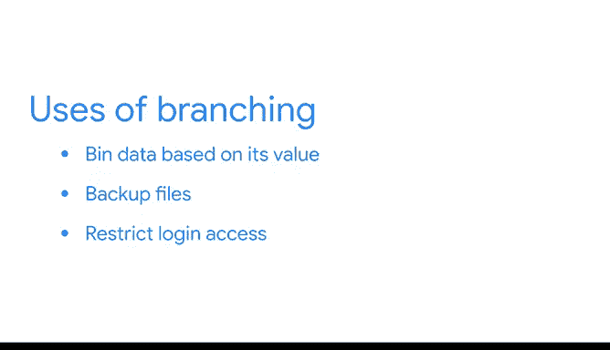

# 019：使用if-elif-else语句进行决策 🧠


在本节课中，我们将要学习Python中的**分支**概念。分支允许程序根据特定条件改变其执行顺序，这是编写有用脚本的关键组成部分。我们将重点学习如何使用 `if`、`elif` 和 `else` 语句来构建决策逻辑。

上一节我们介绍了变量、表达式、函数、数据类型、比较运算符和逻辑运算符。本节中我们来看看如何利用这些知识，通过分支结构让脚本根据不同的值执行不同的操作。

## 什么是分支？

分支描述了程序改变其执行顺序的能力。它使用基于特定条件的 `if` 语句来实现。

`if` 是Python中的一个保留关键字，用于设置条件。`if` 语句（也称为条件语句）就像在日常生活中使用“如果”这个词一样。

以下是几个日常生活中的例子：
*   如果现在是中午之前，你会用“早上好”问候别人。
*   如果外面在下雨，你可能会选择带伞。
*   如果外面在下雪，你可能会穿夹克。

## 使用 `if` 语句

让我们通过一个商业场景的例子来理解这个概念。在一家公司，新员工可以选择他们的用户名，但用户名需要符合一套给定的规则。例如，一个有效的用户名可能需要至少8个字符。

作为该公司的数据专业人员，你的任务是编写一个程序，告诉用户他们的选择是否有效。

为了完成这个任务，我们将编写一个函数。目标是定义一个函数，使其能使用 `if` 语句生成用户名提示。

提醒一下，内置的 `len()` 函数将返回对象的长度，它可以与小于比较符 `<` 配对，以识别不符合标准的用户名。

```python
def hint_username(username):
    if len(username) < 8:
        print("用户名无效")
```

现在，你的函数会检查用户名的长度是否小于8。如果是，函数会打印一条消息，说明用户名无效。

让我们回顾一下 `if` 语句的结构：
1.  我们写下关键字 `if`。
2.  接着是我们想要检查的条件。
3.  然后是一个冒号 `:`。
4.  之后是 `if` 代码块的主体，它需要进一步向右缩进。

这里有一个非常重要的点：**只有当条件评估为 `True` 时，`if` 代码块的主体才会执行。否则，它不会执行。** 这意味着，如果你运行一个 `if` 块，但参数条件不满足，其下方缩进的代码将被忽略。

## 扩展 `if` 语句：使用 `else`

`if` 语句是Python语法中一个有用的结构。但如果我们能扩展它，使其更强大呢？如果我们想让计算机做点别的事情呢？

`else` 是一个保留关键字，当前面的条件评估为 `False` 时执行。`else` 语句让我们可以设置一段代码，仅在 `if` 语句的条件为 `False` 时运行。

以下是一个日常例子：如果你饿了，你就吃饭。但如果你不饿（即“饿了”这个概念为假），那么你会做点别的事情，比如选择打个盹。

回到我们公司的用户名例子。现在，我们可能想在用户名有效时也打印一条消息。根据用户名的长度，函数现在可以走向不同的方向。

```python
def hint_username(username):
    if len(username) < 8:
        print("用户名无效")
    else:
        print("用户名有效")
```

如果用户名不够长，会提示无效。但如果函数验证用户名足够长，则会打印一条有效消息，这是由 `else` 语句决定的。

注意当前函数的结构：`if` 语句缩进在函数体内，我们希望在该语句为真时执行的动作则缩进在其下方。我们可以在这里写任意多行代码，只要它们都缩进在 `if` 语句下方，它们都会在 `if` 语句为真时执行。

然后我们有 `else` 语句。注意它取消缩进到与 `if` 语句相同的级别。`if` 语句及其对应的 `else` 语句总是写在同一个级别。在 `else` 语句下方，我们再次缩进，以表示这是当 `if` 语句不为真时必须执行的内容。

## 理解 `if` 语句的流程

有时你不需要添加 `else` 语句，因为逻辑已经内置在代码中。让我们探索一个有助于理解这一点的新运算符：**取模运算符 `%`**。

取模运算符 `%` 返回一个数除以另一个数后的余数。整数除法产生两个结果（都是整数）：商和余数。
*   `5 / 2`：商是 `2`，余数是 `1`。
*   `11 / 3`：商是 `3`，余数是 `2`。

偶数是2的所有倍数，这意味着偶数与2的整数除法的余数总是 `0`。所以 `10 % 2` 的结果是 `0`。

让我们看一个例子：

```python
def is_even(number):
    if number % 2 == 0:
        return True
    return False
```

这个函数通过将数字除以2并使用取模运算符检查余数是否为0，来检查一个数字是否为偶数。如果余数是 `0`，函数将返回 `True`。

现在，有趣的部分来了：你可以在这里放一个 `else` 语句，那样也能工作，但由于 `if` 语句的工作方式，这并不是严格必需的。记住，当 `if` 语句评估为 `True` 时，其下方缩进的代码会执行。但当 `if` 语句评估为 `False` 时，其下方缩进的代码不会执行。代码将继续运行，直到到达函数末尾。

让我们尝试使用我们定义的 `is_even` 函数输入奇数 `19`。函数返回 `False`，因为 `19 % 2` 的评估结果不为真，所以 `if` 语句下方缩进的代码不执行。然后函数继续运行。在这种情况下，函数中剩下的唯一代码是 `return False`，所以它返回 `False`。

起初，你可能更倾向于在这种情况下包含 `else` 语句，这没关系。但重要的是要知道两种方式都是正确的。不过请记住，这种技术只能在 `if` 语句内部返回值时使用。

## 处理多个条件：使用 `elif`

对于需要考虑更多条件的情况，`elif` 语句（`else if` 的缩写）非常有用。`elif` 关键字是一个保留关键字，当先前的条件不为真时，它执行后续的条件。这是Python表达“如果先前的条件不成立，那么试试这个条件”的方式。

让我们考虑一个例子来更好地理解 `elif`。天气可能会影响你下午选择做什么。如果天气好，你可能会去公园。如果下雨，你可能会去看电影。根据你选择的活动，你还需要决定如何去那里。活动可能决定你的交通方式。所以你做的选择取决于每个点的不同条件。这些是你日常生活中可能遇到的 `if`/`elif` 语句。

让我们回到用户名验证的例子。也许现在我们想限制用户名的长度。可能我们的公司规定不允许用户名超过15个字符。

```python
def hint_username(username):
    if len(username) < 8:
        print("用户名无效")
    elif len(username) > 15:
        print("用户名不能超过15个字符")
    else:
        print("用户名有效")
```

注意这里有两个 `else` 语句吗？第一个 `elif` 是第二个行动方案：如果第一个条件不满足（即用户名的长度大于或等于8），换句话说，如果第一个 `if` 语句为假，那么代码执行第一个 `elif` 语句。这个 `elif` 语句本身又有两个嵌套条件：一个 `if` 和一个 `else`。

缩进使不同分支语句之间的关系更容易阅读，但嵌套增加了一些复杂性。记住，你可以选择使用任意多或少空格进行缩进，但通常，为了可读性最好使用四个空格，并且保持一致很重要。

为了避免不必要的嵌套并使代码更清晰，Python的 `elif` 关键字让我们可以处理两个以上的比较情况。事实上，`elif` 关键字允许我们处理无限数量的比较情况。

`elif` 语句类似于 `if` 语句。`else if` 的缩写防止了大量嵌套的 `if` 和 `else` 语句。如果所有上述条件都为假，则执行最后的 `else` 语句。

现在让我们在一个非常长的用户名上运行我们的函数。

```python
hint_username(“这是一个非常非常长的用户名”)
```

这个脚本的工作原理与我刚才演示的嵌套 `if-else` 比较的脚本完全相同，但更容易理解。让我们分析一下：
1.  函数首先检查用户名是否少于8个字符。如果是这种情况，它打印一条消息。
2.  接下来，如果用户名至少有8个字符，函数然后检查它是否长于15个字符，并在为真时打印一条消息。
3.  如果上述条件都不满足，函数打印一条消息，表明用户名有效。

## 总结

本节课中我们一起学习了如何在Python中使用 `if`、`elif` 和 `else` 语句在函数内部进行决策。

*   `if` 语句根据特定条件为真来分支执行。
*   `else` 语句设置一段代码，仅在 `if` 语句的条件为假时运行。
*   `elif` 语句允许我们处理多个比较情况，使代码更清晰、更易读。



这种分支在决定脚本流程时非常有帮助。使用分支来选择执行不同的代码片段，使你的脚本非常灵活和高效。分支还有助于处理各种实际事务，例如根据值对数据进行分箱、备份文件，或者仅在一天中的特定时间允许登录服务器访问。

任何时候你的程序需要做出决定，你都可以用分支语句来指定其行为。现在，你有了在代码中构建分支的坚实基础，这将使你作为一名数据专业人员能够在Python中完成大量有用的工作。

