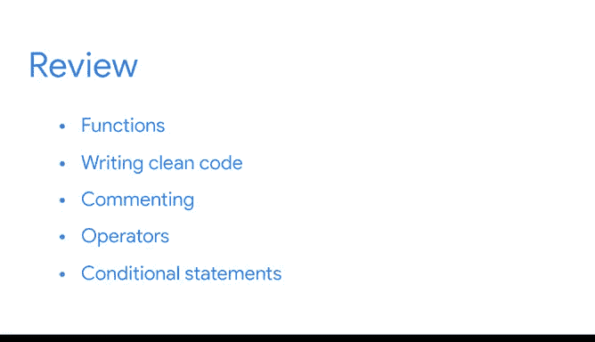

# 020：《Python入门》课程总结 🎯

在本节课中，我们将对《Python入门》课程的第二部分进行总结，回顾已学习的关键概念与技能。

---

你已经完成了Python课程第二部分的全部内容。你为你的技能库增添了许多新的Python技能，并在处理数据方面获得了宝贵的实践经验。做得很好。

在此过程中，我们探讨了Python代码如何帮助你快速对数据执行复杂操作。你也学会了如何编写**清晰、可读的代码**，这些代码能够被其他数据专业人士轻松理解和复用。这是在任何数据项目中与团队成员协作的重要部分。编写清晰的代码将帮助你的团队减少错误、提高工作效率、更有效地沟通，并交付更好的成果。

我们首先探讨了**函数**，即可重复使用的代码块，它们让你能够执行特定任务。接下来，我们讨论了编写清晰代码的两个重要元素：**可复用性**和**模块化**。我们还讨论了编写清晰代码的另一个最佳实践：**代码注释**。

之后，我们回顾了两种Python运算符：**比较运算符**和**逻辑运算符**。最后，你学习了如何编写条件语句，例如 `if`、`else` 和 `elif` 语句。

接下来，你将迎来一次分级评估。

---

为了做好准备，请复习列出了所有新术语的阅读材料，并随时重新观看视频、阅读材料以及其他涵盖关键概念的资源。

祝贺你取得的进步。让我们继续保持前进。