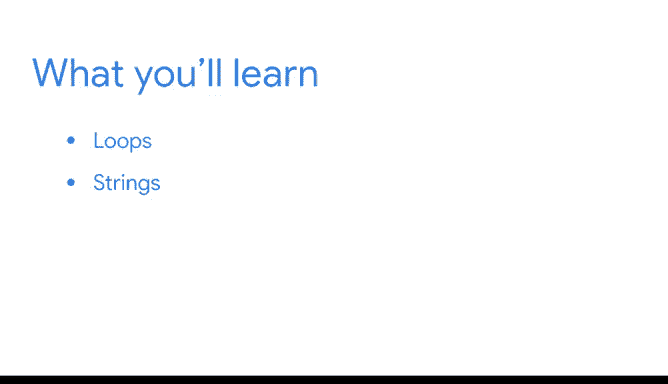

# 021：模块3 欢迎与字符串循环 🚀


在本节课中，我们将学习如何使用循环（Loops）来自动化重复性任务，并重点探索如何对字符串（Strings）进行迭代操作。掌握这些技能将帮助你更高效地处理数据，减少重复劳动和人为错误。

---

## 回顾与过渡 🔄

上一节我们介绍了Python的基础概念，包括变量、数据类型、函数、运算符和条件语句。你已经掌握了编写清晰、可重用代码的能力，这是进行更高级数据分析的第一步。

本节中，我们来看看如何利用循环自动化重复任务。作为数据专业人士，你经常需要对大量数据执行相同操作，例如对数百个价格值进行相同计算。手动为每个值编写代码既低效又容易出错，而循环可以自动重复执行代码段，直到过程完成。

---

## 循环：自动化重复任务 🔁

循环能自动重复执行一部分代码，直到某个过程完成。我们将讨论两种类型的循环：**while循环**和**for循环**。

使用Python自动化重复任务可以节省大量时间和精力，降低人为错误的风险。这不仅能减轻整体工作量，还能提高工作效率，使你有更多时间专注于数据分析的主要目标：为利益相关者生成洞察。

---

## 字符串迭代 📝

在Python中，你可以对多种数据类型进行迭代，例如字符串、列表、集合和字典。本节课程我们将重点讨论**字符串**。后续课程中，我们会详细讨论其他数据类型。

作为数据专业人士，你在分析数据时经常会处理字符串。例如，你可能需要分析与公司产品、服务、客户反馈等相关的文本数据。**索引（indexing）** 和**切片（slicing）** 等操作能让你快速高效地选择、筛选和编辑数据。

以下是字符串索引和切片的基本示例：

```python
# 字符串索引示例
text = "数据分析"
print(text[0])  # 输出：数

# 字符串切片示例
print(text[0:2])  # 输出：数据
```

这些是每位数据专业人士都应掌握的宝贵Python技能。

---

## 总结 🎯



本节课中，我们一起学习了如何使用循环自动化重复性任务，并重点探索了字符串的迭代操作。掌握循环和字符串处理技能，将使你在数据分析工作中更加高效和精准。

准备好学习更多内容后，我们将在下一个视频中继续探索。