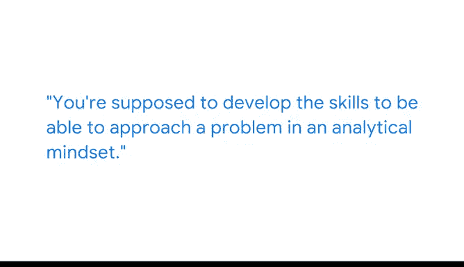

# 022：以分析性思维解决问题 💡

在本节课中，我们将跟随谷歌数据工程师米歇尔的分享，学习如何运用分析性思维解决实际问题。课程将重点介绍如何克服自我怀疑、将复杂问题分解，并最终通过自动化工作流来达成目标。

---

我叫米歇尔，是谷歌的一名数据工程师。我大学刚毕业时，最初担任的是文档专员。

但身处众多从事分析工作的技术人员之中，让我对这个领域产生了浓厚兴趣，并渴望加入团队，投身于那个世界。我曾预想，在刚进入这个领域时，会因为自己没有分析学学位而面临他人的评判或轻视。

我很高兴根据我的经验告诉大家，这种情况并未发生。那只是我自己脑海中的负面自我对话。我周围的每个人都热情、包容，并且非常高兴团队中有一位通过非传统路径进入工程和分析领域的人，因为我带来了独特的视角。

冒名顶替综合症是非常真实的存在。我认为每个人都会经历，我也一样。有很多次，我会停下来想：也许我不属于这里。我没有分析学或信息科学的高级学位。此时此刻，在这个房间里，我真的能做出任何贡献吗？

我克服它的方式是认识到：从事数据分析和数据科学的职业，并非要记住所有可能场景下的每一个答案。完全不是这样。其目的是培养你以分析性思维处理问题的能力。

在我职业生涯早期，有一个项目，我非常想自动化分析工作流的某个部分。我知道我需要做什么，但我不确切知道如何去做。

---

## 解决问题的步骤 🛠️

上一节我们讨论了分析性思维的重要性，本节中我们来看看米歇尔解决具体问题的实际步骤。

以下是米歇尔解决问题的方法：

1.  **用通俗语言描述目标**：首先，在不使用任何计算机代码或编程语言的情况下，用简单的英语写下我想要实现的目标。
2.  **分解与搜索**：然后，我需要在谷歌上进行大量搜索。我在各种论坛上查找如何在Python中实现X、Y、Z功能，如何使用`for`循环，以及如何利用Python进行数据科学和自动化分析。
3.  **逐步实现自动化**：我慢慢地、一步一步地，最终完全自动化了我想要自动化的工作流。

> 能够自动化那个工作流，给我带来了一种成就感，这种成就感一直持续到今天。

---

## 总结与启示 🌟

本节课中，我们一起学习了米歇尔从非技术背景转型为数据工程师的经历，以及她如何运用分析性思维解决问题。

有时，当你面前有一大堆工作，或者有一个看似遥不可及的目标时，可能会感到非常气馁，觉得这不可能完成。但事实并非如此，只要你把事情分解成更小、更易管理的部分，你绝对能够到达彼岸。然后，你会到达一个节点，回头一看，心想：天啊，我做到了。我已经一路走到了这里。

关键在于：**将复杂问题 `分解` 为可执行的步骤**，并相信通过持续学习和实践，你能够克服挑战，实现目标。