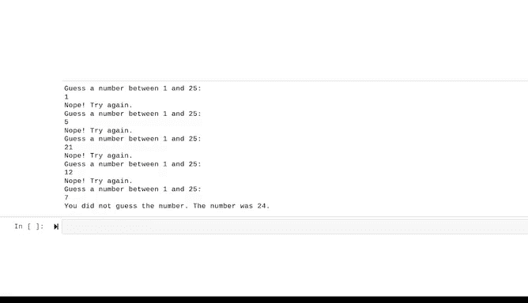

# 023：while循环简介 🌀


在本节课中，我们将要学习Python编程中一个非常重要的概念——**while循环**。循环能帮助我们让计算机自动重复执行某些任务，从而节省时间，避免重复劳动。我们将通过具体的例子，理解while循环的工作原理、语法结构以及如何在实际编程中应用它。

---

## 循环基础概念回顾

上一节我们介绍了循环的基本概念，本节中我们来看看这些概念的具体定义。

*   **循环**：用于执行迭代的代码块。
*   **迭代**：一组语句的重复执行。一次迭代即代码块的一次执行。
*   **可迭代对象**：可以被循环或迭代的对象。

数据专业人员通常使用**for循环**和**while循环**来处理可迭代对象。本视频将重点介绍while循环。

---

## 什么是while循环？🤔

一个**while循环**是一种根据条件值，指示计算机持续执行代码的循环。

我们可以通过一个生活场景来理解它：想象Maggali拿着一袋零食，只要零食袋还在她腿上，小狗Fido就会一直待在那里吃零食。一旦Maggali把零食袋收起来（条件不再满足），Fido就会离开。

while循环的运行方式与此类似。它的逻辑是：**只要某个条件为真，就重复执行循环体内的代码**。

while循环的工作方式与分支结构中的`if`语句相似，区别在于：在while循环中，循环体可以**多次执行**，而不仅仅是执行一次。这能有效避免代码冗余。

---

## while循环语法解析

让我们通过一个例子来解析while循环的语法。

```python
x = 0
while x < 5:
    print("x的当前值是：", x)
    x += 1
print("循环结束，x的最终值是：", x)
```

以下是这段代码的逐步解析：

1.  **初始化变量**：首先，我们将变量`x`的值赋为`0`。这称为**初始化**，即给变量一个初始值。
2.  **设置循环条件**：使用`while`关键字开始循环，并设置条件`x < 5`。由于`x`刚被初始化为`0`，这个条件目前为**真**。
3.  **定义循环体**：在`while`语句末尾的冒号`:`之后，缩进的代码块就是**循环体**。只要条件为真，这个块中的代码就会重复执行。
4.  **执行循环体**：
    *   第一行打印一条消息和`x`的当前值。
    *   第二行使用`x += 1`将`x`的值增加1。这是一种简写，等同于`x = x + 1`。
5.  **循环迭代**：执行完循环体后，计算机会**返回**并重新评估`while`的条件。只要条件`x < 5`仍为真，就会再次执行循环体。
6.  **退出循环**：当`x`的值增加到`5`时，条件`x < 5`变为**假**，循环停止。
7.  **执行后续代码**：循环结束后，程序会继续执行循环体之后的第一行代码，即打印`x`的最终值。

**重要提示**：while循环所使用的条件，其最终结果必须能评估为**真（True）**或**假（False）**。无论是使用比较运算符（如`<`, `>`, `==`）还是调用其他函数，都需要满足这一点。

我们也可以像在`if`语句中一样，在while循环的条件中使用逻辑运算符`and`、`or`和`not`来组合多个表达式。

---

## 综合应用示例：猜数字游戏 🎮

现在，我们将运用目前学到的多个概念（甚至包括一些新概念）来编写一个猜数字的小程序。通过上下文理解新概念是学习编程的有效方法。

在这个例子中，我们将编写一个程序：它生成一个随机数，然后给用户5次机会来猜中它。

```python
import random

number = random.randint(1, 25)
number_of_guesses = 0

while number_of_guesses < 5:
    print('猜一个1到25之间的数字：')
    guess = input()
    guess = int(guess)

    number_of_guesses += 1

    if guess == number:
        break

    if number_of_guesses == 5:
        break
    else:
        print('不对，再试一次。')

if guess == number:
    print(f'恭喜你！你在第{number_of_guesses}次猜中了。')
else:
    print(f'很遗憾，你没猜中。正确的数字是{number}。')
```

以下是代码的详细解释：

1.  **导入模块**：`import random` 导入了Python的`random`模块，用于生成随机数。
2.  **生成目标数字**：`random.randint(1, 25)` 生成一个1到25之间（包含1和25）的随机整数，并赋值给变量`number`。
3.  **初始化计数器**：变量`number_of_guesses`被初始化为`0`，它将作为计数器，控制程序的逻辑。
4.  **while循环开始**：条件是 `number_of_guesses < 5`，即最多允许猜5次。
5.  **获取用户输入**：
    *   `input()`函数会创建一个提示，让用户输入他们的猜测。
    *   `int(guess)`将输入的字符串转换为整数，这是进行比较的关键步骤。
6.  **更新计数器**：`number_of_guesses += 1` 每次猜测后，计数器加1。**这一步至关重要**，如果遗漏，循环将永远不会停止（无限循环）。
7.  **分支逻辑判断**：
    *   如果猜测正确 (`guess == number`)，则执行 `break` 语句。**`break`是一个关键字**，它能让你立即跳出循环，并且不会触发循环内后续的`else`语句。
    *   如果这是第5次猜测且仍未猜中 (`number_of_guesses == 5`)，同样执行 `break` 跳出循环。
    *   如果以上都不是，则执行 `else` 分支，提示“不对，再试一次。”，然后循环继续。
8.  **循环后判断**：循环结束后，根据`guess`是否等于`number`来打印成功或失败的消息。

运行这个程序，尝试猜出数字吧！

---

## 总结 📝



本节课中我们一起学习了**while循环**。我们了解到while循环是一种在条件为真时重复执行代码块的结构。我们分析了它的基本语法，并通过一个“猜数字”的综合示例，实践了如何将变量初始化、条件判断、用户输入、类型转换以及`break`关键字等概念整合到一个脚本中，来解决一个包含复杂逻辑的问题。

掌握循环是成为数据专业人士的宝贵技能，它能让你自动化处理重复性任务，专注于更有意义的分析工作。