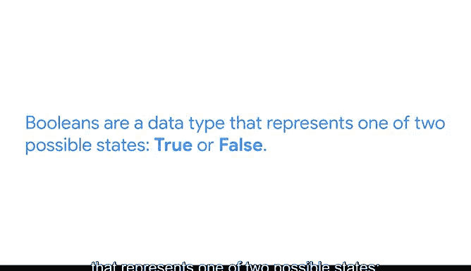

# 025：多参数范围循环 🔄


在本节课中，我们将学习如何在Python的`range`函数中使用多个参数来控制循环的起始值、结束值和步长。掌握这些技巧能让你更灵活地处理数据序列。

---

## 概述

之前我们学习了`range`函数，它默认生成一个从0开始的数字序列。然而，在数据分析工作中，我们并不总是需要从0开始。`range`函数允许我们设置起始值、结束值和步长，从而精确控制循环的范围。本节将详细介绍如何使用这三个参数。

---

## 使用起始值和结束值

首先，我们来看一个使用起始值和结束值的例子。以下是一个计算9的阶乘的`for`循环：

```python
product = 1
for n in range(1, 10):
    product = product * n
print(product)  # 输出：362880
```

在这个例子中，`range(1, 10)`生成一个从1开始、到9结束的序列（注意结束值10不被包含）。循环依次将`product`乘以序列中的每个数字，最终得到9的阶乘，即362880。

**关键点**：我们选择从1开始而不是0。如果从0开始，任何数与0相乘的结果都是0，这将导致整个乘积为0。

---

## 引入步长参数

`range`函数还允许我们指定第三个参数——步长。步长决定了序列中相邻数字之间的差值。默认步长为1，但我们可以根据需要调整。

下面是一个使用步长参数的例子。我们将创建一个函数，将华氏温度转换为摄氏温度，并打印出从0°F到100°F每隔10°F的转换表。

首先，定义转换函数：

```python
def fahrenheit_to_celsius(x):
    return (x - 32) * 5 / 9
```

接下来，使用`for`循环和带步长的`range`函数生成转换表：

```python
for temp_f in range(0, 101, 10):
    temp_c = fahrenheit_to_celsius(temp_f)
    print(f"{temp_f}°F = {temp_c:.2f}°C")
```

在这个循环中，`range(0, 101, 10)`生成一个从0开始、到100结束、步长为10的序列。注意，为了包含100，我们将结束值设为101。循环体计算每个华氏温度对应的摄氏温度并打印出来。

---

## `for`循环与`while`循环的选择

在编程中，我们经常需要在`for`循环和`while`循环之间做出选择。以下是选择建议：

- **使用`for`循环**：当你需要遍历一个序列（如列表、元组或数据集中的记录）时，`for`循环是更合适的选择。它不仅代码简洁，还能提高可读性。
- **使用`while`循环**：当你需要重复执行某个操作，直到某个布尔条件发生变化时，`while`循环是理想选择。布尔条件是一种数据类型，通常表示为`True`或`False`。
- **个人偏好**：如果某个任务既可以用`for`循环也可以用`while`循环完成，选择你更习惯的那种即可。两种循环都是Python工具箱中非常有用的工具。



---

## 总结

本节课我们一起学习了如何在`range`函数中使用起始值、结束值和步长参数来控制`for`循环。通过调整这些参数，我们可以更灵活地处理数据序列，满足不同的编程需求。同时，我们还探讨了在`for`循环和`while`循环之间如何做出选择，以便在编写代码时做出更明智的决策。