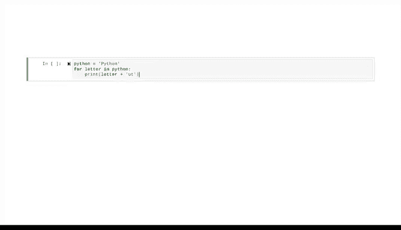

# 026：字符串操作 🧵


在本节课中，我们将学习Python中字符串的基本操作。字符串是包含文本信息的字符序列，掌握其操作是数据处理的基础。

## 概述

到目前为止，我们已经学习了很多内容。你了解了函数、条件语句和循环。

现在，我们将从字符串开始，更深入地学习Python中的不同数据类型。

## 字符串基础

字符串是一个包含文本信息的字符和标点符号序列。

这是一种**不可变**的数据类型，这意味着其值永远不能被更改或更新。

尽管字符串是不可变的，我们仍然可以对它们进行很多操作。

## 字符串连接

我们可以连接字符串。“连接”意味着链接或结合在一起。

因此，连接字符串就是将两个或多个较短的字符串组合成一个更长的字符串。

要在Python中连接字符串，我们只需使用加法运算符。

如果我们有两个字符串：“Hello”和“world”，我们可以通过将它们相加来连接它们。

```python
"Hello" + "world"
```

结果是单个字符串，但它也是一个单词。这是因为空格（在计算机编程中称为空白字符）本身算作一个字符。

如果你想在连接的字符串之间有一个空格，其中一个字符串必须包含一个空格，或者你必须在它们之间添加一个只包含空格的第三个字符串。

使用指向字符串的变量时，适用相同的规则。

如果“Ho”被赋值给变量`greeting1`，“world”被赋值给变量`greeting2`，我们可以通过将这两个变量相加来连接字符串。

```python
greeting1 = "Ho"
greeting2 = "world"
greeting1 + greeting2
```

## 字符串乘法

我们也可以使用乘法运算符来“乘以”字符串。

```python
"Danger" * 3
```

结果是“DangerDangerDanger”。

但是，我们不能对字符串进行除法或减法运算，尝试这样做会导致错误。

## 处理特殊字符

如你所知，在处理字符串时，某些字符被保留用于特定目的。

例如，引号用于指示字符串的开始和结束。

但是，如果我们希望字符串包含引号怎么办？有两种方法可以解决这个问题。

第一种方法是利用字符串既可以用单引号也可以用双引号书写这一事实。

如果你想在字符串中包含双引号，请使用单引号来开始和结束你的字符串，反之亦然。

```python
'She said, "Hello."'
```

第二种方法是使用反斜杠，它充当转义字符。转义字符会改变其后字符的典型行为。

在这种情况下，引号的典型行为是开始或结束字符串。但如果我们在每个引号前加上反斜杠，它们就会在字符串中表现为常规的标点符号。

```python
"She said, \"Hello.\""
```

反斜杠字符作为其他特殊字符的转义字符也很有用。

例如，`\n` 是一个特殊的字符组合，用于在打印字符串时指示换行。

```python
print("Line 1\nLine 2")
```

但是，如果你想在打印字符串时将 `\n` 作为字符包含在字符串中，你必须在组合前加上一个初始的反斜杠。

```python
print("This is a backslash-n: \\n")
```

## 遍历字符串

接下来，我们也可以用循环来遍历字符串。

在这个例子中，我们使用一个for循环来遍历单词“Python”的每个字母，并打印该字母加上字母“UT”。

```python
for letter in "Python":
    print(letter + "UT")
```



这些只是处理字符串的几种方法。作为一名数据专业人士，在分析数据时，你会经常处理字符串。

在接下来的课程中，我们将介绍更多可以对字符串执行的有用操作。

## 总结

本节课中，我们一起学习了Python字符串的基础操作。我们了解了字符串是不可变的数据类型，学习了如何连接和“乘以”字符串，掌握了在字符串中包含引号等特殊字符的技巧，并探索了如何使用循环遍历字符串。这些是处理文本数据的基本技能，将在后续的数据分析工作中发挥重要作用。