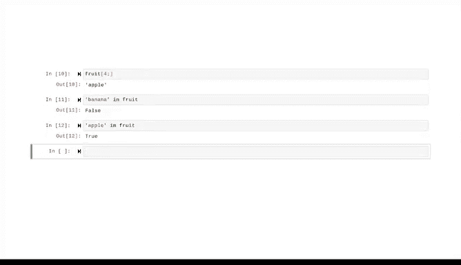

# 027：字符串切片 🍰


在本节课中，我们将要学习Python中一个非常实用的概念——字符串切片。切片允许我们从字符串中提取特定的部分，这对于数据清洗和预处理至关重要。

上一节我们介绍了字符串的基础知识。本节中，我们来看看如何通过索引和切片来更精细地操作字符串。

## 索引：定位字符的基础 🔢

在深入了解切片之前，我们需要理解Python的索引机制。索引是Python让我们通过相对位置来引用可迭代对象中单个元素的方式。

**核心概念**：Python使用**0起始索引**。这意味着序列的第一个元素的索引是0。对于字符串，索引将字符串解释为一个字符序列，每个字符都有一个编号的位置。

*   从左向右读取时，第一个字符位于位置0。
*   第二个字符位于位置1，第三个位于位置2，依此类推。

索引不仅仅是字符串的专利，它也适用于列表、元组等其他可迭代的数据类型。

## 索引的实践应用 🛠️

以下是使用索引的一些基本方法。

### 使用 `index()` 方法

`index()` 是一个字符串方法，用于输出某个字符在字符串中的索引号。其基本语法是 `变量名.index(‘字符’)`。

```python
pets = "cats and dogs"
position = pets.index('s')
print(position)  # 输出：3
```

需要注意的是，如果存在多个相同字符，`index()` 方法只返回第一个匹配的位置。如果搜索不存在的子字符串，则会引发 `ValueError` 错误。

### 直接通过索引访问字符

我们可以将索引号放在变量名后的方括号中，来访问特定位置的字符。

```python
name = "Jolene"
print(name[0])  # 输出：J
print(name[5])  # 输出：e
```

如果使用的索引超出了字符串的范围（例如 `name[6]`），Python会引发 `IndexError` 错误。

### 使用负索引

即使不知道字符串的长度，我们也可以使用负索引来访问末尾的字符。索引-1代表最后一个字符，-2代表倒数第二个，以此类推。

```python
greeting = "Hello!"
print(greeting[-1])  # 输出：!
print(greeting[-2])  # 输出：o
```

## 字符串切片：提取子字符串 ✂️

现在我们已经掌握了索引的基础，让我们开始进行切片。字符串切片是字符串的一部分，也称为子字符串。

切片通过在方括号内使用冒号分隔的起始和结束索引来定义范围：`字符串[起始索引:结束索引]`。**请注意，结束索引对应的字符不会被包含在切片结果中。**

例如，从字符串 `"orange"` 中提取索引1到4（不包含4）的字符：

```python
fruit = "orange"
slice_result = fruit[1:4]
print(slice_result)  # 输出：ran
```

### 省略索引的切片

我们可以省略切片中的一个或两个索引。
*   如果省略起始索引（如 `[:4]`），则默认从0开始。
*   如果省略结束索引（如 `[4:]`），则默认切片到字符串末尾。

```python
word = "pineapple"
print(word[:4])  # 输出：pine
print(word[4:])  # 输出：apple
```

## 检查子字符串是否存在 🔍

数据专业人员经常需要检查一个字符串是否包含特定的子字符串。这时可以使用关键字 `in`。

```python
fruit = "pineapple"
print("banana" in fruit)  # 输出：False
print("apple" in fruit)   # 输出：True
```

确认子字符串是否存在于一个字符串中，是各类数据工作中常见的实践。

## 总结 📝



本节课中我们一起学习了Python字符串的索引和切片。
*   **索引**让我们能够通过位置（从0开始）访问字符串中的单个字符，包括使用负索引从末尾开始计数。
*   **切片** `[start:end]` 让我们能够提取字符串的任意部分，是处理数据（如移除货币符号）的强大工具。
*   使用 `in` 关键字可以快速检查一个子字符串是否存在于目标字符串中。

我鼓励你花时间自己重新演练这些步骤。你越多地应用所学知识，就会感到越得心应手。