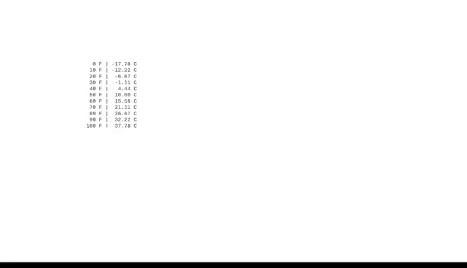

# 028：格式化字符串 📝


在本节课中，我们将要学习如何使用Python的`format`方法高效地创建和操作字符串。掌握字符串格式化技巧，能帮助你更灵活地构建输出信息，提升代码的可读性和工作效率。

## 概述

上一节我们介绍了字符串的基础知识。本节中，我们来看看如何使用`format`方法对字符串进行格式化。这种方法允许你将特定的值插入到字符串的指定位置，并能控制其显示格式。

## 使用`format`方法插入值

`format`方法使用花括号`{}`来标记变量应插入到字符串中的位置。

以下是基本用法示例：

```python
name = "Data"
number = 100
print("{} is number {}".format(name, number))
```

在这段代码中，`name`和`number`两个变量被作为参数传递给`format`方法。`format`方法会将这些变量所代表的值作为字符串插入。值的插入顺序与它们作为参数输入的顺序一致。第一个`{}`对应`name`，第二个`{}`对应`number`。

## 使用关键字参数明确指定位置

你可以通过为花括号内的占位符命名关键字，来更明确地指定每个子字符串的插入位置。

以下是使用关键字参数的示例：

```python
name = "Data"
number = 100
print("数据科学与人工智能笔记（一） is number {numb}".format(name=name, numb=number))
```

这种方法下，在方法参数中为关键字显式分配变量。运行时，变量值会根据其关键字被插入到打印的字符串中。此时，方法参数的输入顺序不再重要，`name`会被插入到字符串的`name`字段，`number`会被插入到`numb`字段。

这种方法非常有用。例如，当输出信息需要翻译成另一种语言时，许多语言会改变词序来表达相同的意思。此方法使得重新排列字符串变得快速而简单。

## 使用索引指定插入顺序

另一种将值插入字符串的方法是，在花括号中使用整数值来指示插入参数的顺序。

以下是使用索引的示例：

```python
name = "Data"
number = 100
print("{1} is number {0}".format(number, name))
```

请注意在这个例子中，我们可以在参数字段中以与它们插入打印字符串不同的顺序输入变量`number`和`name`。

作为一名数据专业人士，这些不同的向字符串插入值的方法，为你如何选择工作和解决问题提供了很大的灵活性。

## 格式化数值输出

以下是一个不仅将子字符串插入更大字符串，还对其格式进行设置的例子。

想象你需要打印一件商品含税和不含税的价格。根据税率，数字的小数点后位数可能超过两位。我们可以使用字符串格式化来限制输出中的小数位数，使其更易读。

```python
price = 7.75
tax_rate = 0.07
price_with_tax = price * (1 + tax_rate)
print("Price without tax: ${:.2f}".format(price))
print("Price with tax: ${:.2f}".format(price_with_tax))
```

在这段代码中，我们的商品不含税价格为7.75美元，税率为7%。因此含税价格为8.2925美元。为了将输出限制在小数点后两位，我们使用了特殊的语法：以冒号开头，将表达式与关键字名称（如果使用的话）分开。冒号后，写入`.2f`。`.2`指的是小数点后两位，`f`代表浮点数。

现在，让我们检查运行此单元格时会发生什么。很好，含税价格现在有两位小数了。你可以将表达式中的`2`替换为你想要的任意小数位数。如果填入`0`，则只会打印整数。

## 对齐文本输出

`format`函数还有更多方法来优化表达式。让我们探索之前将华氏温度转换为摄氏温度的示例。

顶部是我们编写的用于计算转换的函数。但现在，我们不仅要打印结果，还要对它们进行格式化。

```python
def fahrenheit_to_celsius(f):
    return (f - 32) * 5/9

temperatures_f = [32, 50, 68, 86, 104]
print("{:>3}°F | {:>6}°C".format("F", "C"))
for temp_f in temperatures_f:
    temp_c = fahrenheit_to_celsius(temp_f)
    print("{:>3.0f} | {:>6.2f}".format(temp_f, temp_c))
```



再次以冒号开始，然后使用大于运算符`>`将文本右对齐，使输出格式整洁。`>3`将使输出右对齐3个空格。对于转换后的摄氏温度值，使用`>6`，这将使摄氏温度右对齐6个空格。请注意输出是多么整洁。我们的小数被截断到百分位，并且值以漂亮的表格形式输出。

## 总结

本节课中，我们一起学习了Python中`format`方法的各种应用。你了解了如何向字符串中插入值，如何使用关键字和索引控制插入位置，以及如何格式化数值和对齐文本。关于字符串的一切知识都将帮助你更有效地工作，简化流程，并为你的公司节省大量时间和资源。使用Python的核心在于以最小的努力实现最大的生产力，使其成为帮助你实现这些目标的完美工具。