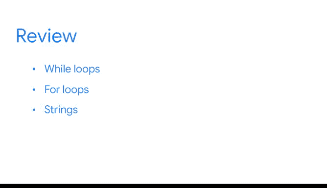

# 029：第3节总结 🎯


在本节课中，我们将回顾Python入门课程的第三部分内容。这一部分主要聚焦于如何使用Python自动化重复性任务，以及字符串的基本操作。通过学习循环和字符串处理，你将能够更高效地处理数据，为未来的数据分析工作打下坚实基础。

---

## 课程第三部分结束 🏁

这是Python课程第三部分的结尾。

自课程开始以来，你已经取得了长足的进步。祝贺你取得的所有进展。

在课程的这一部分，我们重点学习了使用Python代码自动化重复性任务，而不是每次想让计算机重复一个动作时都编写新的代码。

你可以编写**迭代语句**或**循环**来实现自动化。

**循环**会自动重复一部分代码，直到某个过程完成。

使用Python自动化重复性任务将帮助你更有效地工作，简化流程，并节省大量的时间和精力。

作为一名数据专业人士，你将拥有更多时间来处理最重要的任务：分析数据，为利益相关者生成有用的见解。

---

## 自动化重复性任务的两种方法 🔄

我们讨论了自动化重复性任务的两种不同方法：**while循环**和**for循环**。

你学习了如何为while循环和for循环编写代码，以及何时使用每种方法。

以下是两种循环的基本代码结构：

**while循环**示例：
```python
while condition:
    # 执行的代码块
```

**for循环**示例：
```python
for item in sequence:
    # 执行的代码块
```

---

## 字符串操作 📝

我们还讨论了**字符串**，即由字母和标点符号等字符组成的序列。

你学习了如何通过**切片**、**索引**和**格式化**来操作字符串。

作为一名数据专业人士，你将经常处理文本数据，例如产品信息或客户反馈。

切片和索引等操作使你能够快速高效地选择、筛选和编辑数据。

以下是字符串索引和切片的基本公式：
- **索引**：`string[index]`
- **切片**：`string[start:end:step]`



---

## 持续学习与成长 🌱

学习Python是一段令人兴奋的旅程，将在你未来的职业生涯中持续进行。

我参与的每个数据项目都有其特定的挑战。我总是在网上探索或与队友交流，在工作中学习新的Python技能。这帮助我解决问题并更高效地工作。

随着你继续学习和练习Python，你的数据分析技能将不断增长。

接下来，你需要准备一个分级评估。复习列出所有新术语的阅读材料，并随时重新观看视频、阅读材料以及其他涵盖关键概念的资源。

你做得很好。继续保持。😊

---

## 总结 📚

在本节课中，我们一起回顾了Python入门课程第三部分的核心内容。你学习了如何使用**while循环**和**for循环**自动化重复性任务，以及如何通过**切片**、**索引**和**格式化**操作字符串。这些技能将帮助你在数据处理中节省时间，提高效率，为后续的数据分析工作奠定坚实基础。继续练习和探索，你的Python技能将不断进步！