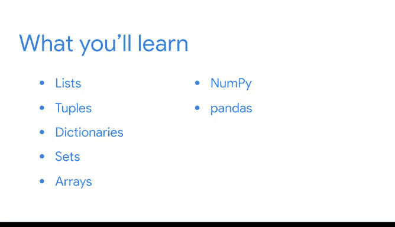

# 030：数据结构与库 🚀

在本模块中，我们将学习Python中用于高效组织和处理数据的核心数据结构，并介绍两个对数据分析至关重要的库：NumPy和pandas。

---

欢迎回来。你的学习之旅已经取得了长足的进步。

回顾一下你在此过程中掌握的所有新Python技能。

你已经学会了如何使用变量来存储和标记数据，以及如何处理不同的数据类型，例如整数、浮点数和字符串。

你可以调用函数来对数据执行操作，并使用运算符来比较值。

你也知道如何编写清晰易懂、便于其他数据专业人员理解和重用的代码。

你可以编写条件语句，告诉计算机如何根据你的指令做出决策。

最近，你还学会了如何使用循环来自动化重复性任务。

接下来，我们将探索数据结构。数据结构是数据值或包含不同数据类型的对象的集合。

数据专业人员使用数据结构来快速高效地存储、访问、组织和分类数据。

了解哪种数据结构适合你的特定任务是数据工作的关键部分，并将有助于简化你的分析。

我们将重点介绍对数据专业人员最有用的一些数据结构：列表、元组、字典、集合和数组。

使Python成为一种强大且多功能的编程语言的部分原因，在于其可用的库和包。

在回顾了基本数据结构之后，我们将讨论对数据专业人员最重要的两个库和包。

第一个是NumPy（Numerical Python），以其高性能计算能力而闻名。

数据专业人员使用NumPy来快速处理大量数据。我经常在工作中使用NumPy，因为它对于分析大型复杂数据集非常有用。

第二个是pandas（Python Data Analysis Library），它是高级数据分析的关键工具。

pandas使得以行和列表格形式分析数据变得更加容易和高效，因为它拥有专门为此设计的工具。

---

当你准备好后，我们将在下一个视频中继续学习。