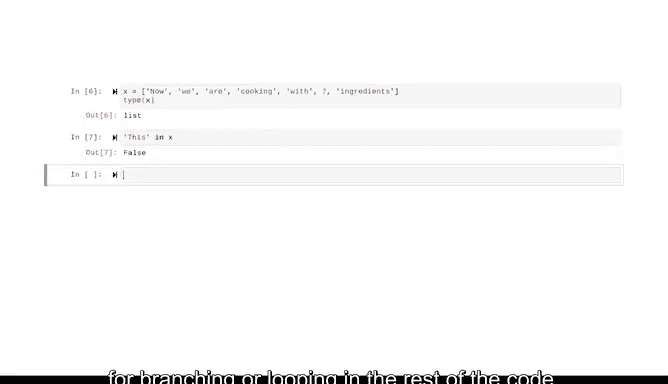

# 031：列表简介 📚


在本节课中，我们将要学习数据类型与数据结构之间的区别，并重点探索Python中一种重要的数据结构——**列表**。我们将了解列表的特性、如何创建和操作列表，以及它与字符串的异同。

---

## 数据类型与数据结构 📊

上一节我们介绍了Python的基础语法，本节中我们来看看数据是如何被组织和存储的。

**数据类型** 是描述一段数据的属性，它基于数据的值、编程语言或可执行的操作。在Python中，常见的数据类型包括整数（`int`）、字符串（`str`）、浮点数（`float`）和布尔值（`bool`）。

**数据结构** 是数据值或对象的集合，可以包含不同的数据类型。数据结构能够更高效地存储、访问和修改数据，并允许你组织和关联数据集合。

---

## 列表简介 📝

列表是Python中的一种数据结构，用于存储和操作一个**有序**的项目集合。例如，一个与用户账户关联的电子邮件地址列表。

列表与字符串有许多相似之处。例如，两者都允许重复元素，并且都支持**索引**和**切片**操作。此外，它们都属于**序列**——即按位置顺序排列的项目集合。

然而，关键区别在于：字符串是**字符**的序列，而列表可以存储**任何数据类型**元素的序列。

---

## 可变性与不可变性 🔄

不同数据结构具有**可变**或**不可变**的特性。

*   **可变性** 指的是改变数据结构内部状态的能力。
*   **不可变性** 则相反，数据结构的元素值永远不能被更改或更新。

**列表及其内容是可变**的，这意味着可以修改、添加或删除其中的元素。  
**字符串是不可变**的，一旦创建就无法更改。

可以将列表想象成一个被分成多个槽位的长盒子。每个槽位包含一个值，每个值可以存储任何数据——可以是另一个数据结构（如另一个列表），也可以是整数、字符串、浮点数或另一个函数的输出。

---

## 列表的索引与切片 🔢

当处理列表时，我们使用**索引**来访问每个元素。索引提供了有序序列中每个元素的编号位置。

以下是创建和访问列表的示例：

```python
# 创建一个列表并赋值给变量 x
x = ["Now", "we", "are", "cooking", "with", "seven", "ingredients"]
```

在Python中，我们使用方括号 `[]` 表示列表的开始和结束，并使用逗号 `,` 分隔其中的每个元素。

要打印列表中的特定元素，需要使用其索引号。**索引总是从0开始**。

```python
# 打印列表中的第三个元素（索引为2）
print(x[2])  # 输出: are
```

我们也可以使用索引范围来创建列表的**切片**，使用两个由冒号分隔的数字。

```python
# 获取列表中索引1到3（不包括3）的元素
print(x[1:3])  # 输出: ['we', 'are']

# 获取从开始到索引2（不包括2）的所有元素
print(x[:2])   # 输出: ['Now', 'we']

# 获取从索引2到列表末尾的所有元素
print(x[2:])   # 输出: ['are', 'cooking', 'with', 'seven', 'ingredients']
```

切片规则与字符串相同：如果起始索引留空，则默认为0；如果结束索引留空，则默认为列表的长度。

---

## 检查列表成员资格 ✅

要检查某个元素（例如单词 `"this"`）是否存在于列表中，可以使用关键字 `in` 来生成一个布尔语句。

```python
# 检查 "this" 是否在列表 x 中
print("this" in x)  # 输出: False
```

此检查的结果是一个布尔值（`True` 或 `False`），我们可以在代码的其余部分将其用作分支或循环的条件。

---

## 列表的实用性 💡

当你处理许多相关值时，列表非常有用。它们使你能够：
*   将正确的数据保持在一起。
*   简化你的代码。
*   一次性对多个值执行相同的操作。

---

## 总结 📋

本节课中我们一起学习了：
1.  **数据类型**与**数据结构**的基本概念。
2.  **列表**作为一种有序、可变的数据结构，可以存储多种数据类型。
3.  列表的**创建**、**索引**和**切片**操作。
4.  使用 `in` 关键字**检查元素**是否存在于列表中。
5.  列表的**可变性**与字符串的**不可变性**之间的核心区别。



列表是Python编程中组织和管理数据的强大工具。在接下来的课程中，我们将继续深入学习列表的更多操作方法。