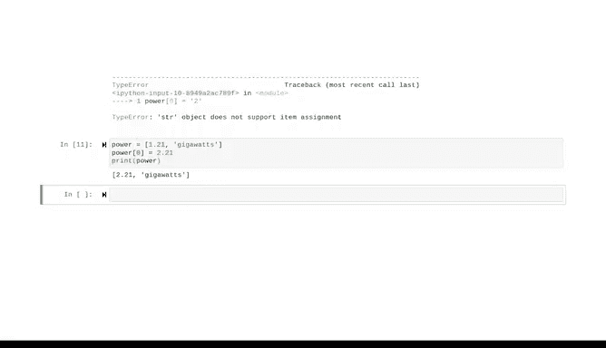

# 032：修改列表内容 📝


在本节课中，我们将学习如何修改Python列表的内容。你将掌握如何向列表中添加新元素、移除现有元素以及更改特定位置上的元素值。这些操作能让你更灵活地管理和更新数据集合。

上一节我们介绍了列表的基本概念和索引方法，本节中我们来看看如何实际改变列表中的内容。

## 理解列表的可变性 🔄

我们可以将列表想象成一个被分成多个格子的盒子。修改列表意味着我们保留这个盒子本身，但可以增加、移除或更换盒子里的物品。这与字符串不同，字符串是不可变的，而列表是可变的。

为了说明这一点，请看以下对比：

```python
# 字符串不可变示例
my_string = "hello"
# my_string[0] = 'H'  # 这行会报错，因为字符串不可变
my_string = 'H' + my_string[1:]  # 必须创建新字符串并重新赋值

# 列表可变示例
my_list = ['a', 'b', 'c']
my_list[0] = 'A'  # 可以直接修改，不会报错
```

## 向列表添加元素 ➕

以下是向列表中添加元素的常用方法。

### 使用 `append()` 方法

`append()` 方法将一个元素添加到列表的末尾。它只需要一个参数，即要添加的元素。

```python
fruits = ['apple', 'banana', 'cherry']
fruits.append('kiwi')
print(fruits)  # 输出: ['apple', 'banana', 'cherry', 'kiwi']
```

你甚至可以从一个空列表开始，然后不断添加元素。

```python
shopping_list = []
shopping_list.append('milk')
shopping_list.append('eggs')
```

### 使用 `insert()` 方法

`insert()` 方法在列表的指定索引位置插入一个元素。它需要两个参数：索引位置和要插入的元素。

```python
fruits = ['apple', 'banana', 'cherry']
fruits.insert(1, 'orange')  # 在索引1（第二个位置）插入'orange'
print(fruits)  # 输出: ['apple', 'orange', 'banana', 'cherry']

# 在列表开头插入元素
fruits.insert(0, 'mango')
print(fruits)  # 输出: ['mango', 'apple', 'orange', 'banana', 'cherry']
```

## 从列表移除元素 ➖

以下是几种从列表中移除元素的方法。

### 使用 `remove()` 方法

`remove()` 方法根据元素的值来移除列表中**第一个**匹配到的项。它只需要一个参数。

```python
fruits = ['apple', 'banana', 'cherry', 'banana']
fruits.remove('banana')  # 移除第一个'banana'
print(fruits)  # 输出: ['apple', 'cherry', 'banana']
```

如果要移除的元素不在列表中，Python会引发一个 `ValueError`。

```python
# fruits.remove('strawberry')  # 会报错: ValueError
```

### 使用 `pop()` 方法

`pop()` 方法根据元素的索引来移除并返回该元素。如果不提供索引，默认移除并返回最后一个元素。

```python
fruits = ['apple', 'orange', 'banana', 'cherry']
removed_fruit = fruits.pop(2)  # 移除索引为2的元素（'banana'）
print(removed_fruit)  # 输出: banana
print(fruits)         # 输出: ['apple', 'orange', 'cherry']

# 不提供索引，移除最后一个元素
last_fruit = fruits.pop()
print(last_fruit)  # 输出: cherry
```

## 直接修改列表元素 ✏️

除了增删，我们还可以直接通过索引来修改列表中某个位置的值。

```python
fruits = ['apple', 'pineapple', 'cherry']
fruits[1] = 'mango'  # 将索引1处的'pineapple'替换为'mango'
print(fruits)  # 输出: ['apple', 'mango', 'cherry']
```

## 总结 📚



本节课中我们一起学习了如何修改Python列表。我们掌握了三种核心操作：
1.  **添加元素**：使用 `append()` 在末尾添加，或使用 `insert()` 在指定位置插入。
2.  **移除元素**：使用 `remove()` 按值移除，或使用 `pop()` 按索引移除。
3.  **修改元素**：通过索引直接赋值来更改特定位置的值。

理解列表是“可变的”这一特性至关重要，它意味着我们可以在不创建新列表的情况下直接修改其内容，这与字符串的行为截然不同。现在你已经掌握了操控列表数据的基本技能，可以更自如地处理各种数据集合了。