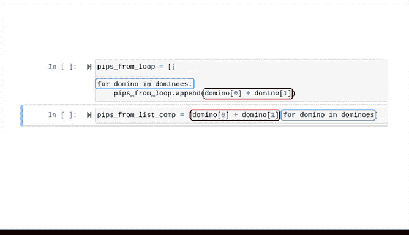

# 034：循环、列表与元组进阶 🔄

在本节课中，我们将学习循环、列表与元组的进阶用法。课程将介绍一些对数据专业人士有用的新工具，并通过更复杂的示例来展示如何结合使用字符串格式化、循环、元组和列表。

上一节我们介绍了循环和列表的基础知识，本节中我们来看看如何将它们应用于更实际的场景。

## 处理球员数据列表 🏀

我们继续使用上一视频中的女子篮球队球员列表。这个列表由多个元组组成，每个元组包含球员的姓名、年龄和位置。

我们将定义一个函数，用于提取每位球员的姓名和位置，并将信息格式化为一个列表以便打印。

该函数名为 `player_position`，其参数是一个包含球员信息的元组列表。

首先，实例化一个空列表来存放结果，该列表将在我们遍历数据时逐步构建。

接下来，使用 `for` 循环来解包球员列表中的元组。

循环中分配的变量必须与元组的格式对齐。每个元组包含三个部分：姓名、年龄和位置，因此我们的 `for` 循环需要三个变量。

如果尝试仅用两个变量（如 `for name, age in players`）来解包元组，计算机会报错，因为它不知道如何处理元组中的第三个元素。

因此，我们这样开始 `for` 循环：`for name, age, position in players`。

然后，使用字符串格式化将每个姓名和位置附加到结果列表中。每个字符串都包含一些位置格式和一个换行符。

最后，在一个 `for` 循环中调用此函数。该循环将遍历函数输出的结果列表，并打印每一项。

现在，我们得到了一个格式美观、易于阅读的球员和位置表格。

## 嵌套循环的应用 🎲

以下是循环和列表的另一个应用示例，展示了嵌套循环的用法。嵌套循环是指一个循环位于另一个循环内部。

这段代码生成了一副多米诺骨牌游戏中所有不同的骨牌。多米诺骨牌是一种使用带有点数（或称“点”）的游戏棋子进行的游戏。

以下是生成骨牌的代码逻辑：

我们首先确定骨牌左侧的数字，这些数字代表骨牌上的点数，范围从0到6。

对于这个范围内的每个数字，我们将运行另一个循环来生成骨牌右侧的点数。

然后，将左侧数字和右侧数字插入一个格式化的打印语句中。

以下是生成的骨牌。请注意，在第一个打印语句中，我们包含了一个名为 `end` 的参数，其值是一个空格。

默认情况下，当打印语句执行时，它会以换行符结束。因此，如果没有这个参数，所有骨牌将被打印成一条垂直线，一个接一个。

但当我们把结束字符设置为一个空格时，它会在每个骨牌之间打印一个空格。

## 使用列表存储与索引 📊

同样的代码，我们也可以不将骨牌打印为字符串，而是将每个骨牌作为整数元组存储在一个名为 `dominoes` 的列表中。

现在，假设我们想检查索引为4的元组中的第二个数字。我们可以通过索引来实现。

首先访问我们想要访问的列表 `dominoes`，并在括号中放入我们想要访问的元组的索引。然后，再添加一对括号，其中包含该元组内值的索引。

例如：`dominoes[4][1]`。

如果我们想计算每个骨牌上的总点数，可以用一个 `for` 循环遍历每个元组，将索引0的值和索引1的值相加，并将总和附加到一个列表中。

## 列表推导式：更优雅的解决方案 ✨

但有一个更简单的方法，叫做列表推导式。列表推导式可以根据现有列表中的值，以公式化的方式创建一个新列表。

以下是它的工作原理：

首先，为一个新列表分配一个变量，我们称之为 `pips_from_list_comp`。为其值创建一个空列表。

然后，我们基本上是以相反的顺序编写一个 `for` 循环。我们从创建列表每个元素的计算开始。

在本例中，我们希望每个元素是骨牌上的总点数，即 `domino[0] + domino[1]`。

然后，我们添加一个 `for` 语句。

我们可以检查以确保它给出的结果与我们的 `for` 循环相同。结果是相同的。

请注意发生了什么。这就是为什么我说列表推导式就像一个反向编写的 `for` 循环。它的 `for` 部分在语句的末尾，而计算部分在开头。

`for` 循环和列表推导式做的是同一件事，但列表推导式通常更优雅，执行速度也更快。

## 总结 📝

本节课中我们一起学习了循环、列表与元组的进阶应用。我们通过处理结构化数据（球员列表）和生成组合数据（多米诺骨牌）的示例，实践了嵌套循环和字符串格式化。最后，我们介绍了列表推导式这一强大而优雅的工具，它能更简洁高效地基于现有列表创建新列表。

希望你现在能体会到Python这些基础构建模块的强大之处。鼓励你自行探索本课程中的代码，通过添加或修改内容来尝试会发生什么。动手实践是学习编程的最佳方式之一。

