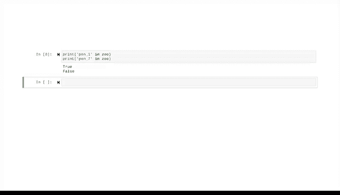

# 035：字典简介 📚


在本节课中，我们将要学习Python中一个极其重要且广泛使用的数据结构——字典。我们将了解字典的基本概念、创建方法、核心特性以及如何访问其中的数据。

---

## 什么是字典？

字典是一种由**键值对**集合组成的数据结构。它使用花括号 `{}` 或 `dict()` 函数来创建。无论是资深的数据专家还是入门级的数据从业者，都会利用字典强大的快速处理能力来分析大型数据集，这有助于他们收集和转换用户信息。

字典提供了一种直观的数据存储方式，让用户能更容易地找到特定信息。我们可以用一个生活中的例子来理解：使用一本普通的纸质字典（不是数据结构，而是真实的书籍）时，你查找一个单词，找到它，然后阅读其定义。Python字典本质上也是如此：你查找一个**键**，从而访问与该键关联的**值**。这就是“键值对”的含义。

---

## 一个简单的例子 🐘

假设我们有一个动物园，园内有不同的围栏，里面饲养着不同的动物。我们可以用一个字典来存储这些信息，其中围栏编号作为**键**，动物作为**值**。

我们可以用这个字典来查询每个围栏里有哪些动物。例如，如果我们想知道2号围栏里有什么动物，我们可以这样操作：

```python
# 定义一个动物园字典
zoo = {1: '狮子', 2: '斑马', 3: '大象'}

# 查询2号围栏的动物
animal_in_pen_2 = zoo[2]
print(animal_in_pen_2)  # 输出：斑马
```

以这种方式访问字典时，程序总是在**键**中搜索，并返回对应键的**值**。这个过程是单向的，不能反向操作。例如，你不能通过索引来搜索“斑马”并找出它所在的围栏号，那样会导致 `KeyError`，因为“斑马”不是字典中的一个键。

---

## 如何创建字典？

字典主要有两种创建方式。

**第一种方式是使用花括号 `{}`。** 在这种方法中，每个键和它的值之间用冒号 `:` 分隔，每个键值对之间用逗号 `,` 分隔。

```python
# 使用花括号创建字典
zoo = {1: '狮子', 2: '斑马', 3: '大象'}
```

**第二种方式是使用 `dict()` 函数。** 使用 `dict()` 函数时，语法略有不同。当键是字符串时，你可以将它们作为关键字参数输入。

```python
# 使用dict()函数创建字典
zoo = dict(pen1='狮子', pen2='斑马', pen3='大象')
```

请注意，上次我们用花括号创建字典时，使用了引号来表示键是字符串。而在这里，作为关键字参数，我们不需要引号。同时，键和值之间使用的是等号 `=` 而不是冒号 `:`。

无论使用花括号还是 `dict()` 函数，字典的查找方式都是相同的。`dict()` 函数在使用上更加灵活。例如，我们还可以通过传递一个列表的列表、元组的列表或列表的元组作为参数来创建同一个字典。

```python
# 使用列表的列表创建字典
zoo_list = [[1, '狮子'], [2, '斑马'], [3, '大象']]
zoo_from_list = dict(zoo_list)

# 使用元组的元组创建字典
zoo_tuple = ((1, '狮子'), (2, '斑马'), (3, '大象'))
zoo_from_tuple = dict(zoo_tuple)
```

它们都会得到相同的结果。

---

## 字典的核心特性

上一节我们介绍了如何创建和访问字典，本节中我们来看看字典的几个重要特性。

**1. 添加新的键值对**
如果想向现有字典中添加新的键值对，例如将鳄鱼放入4号围栏，可以像下面这样直接赋值：

```python
zoo[4] = '鳄鱼'
```

**2. 键必须是不可变的**
字典的键必须是不可变对象。不可变键的类型包括但不限于：整数、浮点数、元组和字符串。列表、集合和其他字典不属于此类，因为它们是可变的。

**3. 字典是无序的**
这意味着你不能通过位置索引来访问它们。如果你尝试用索引 `2` 访问我们的 `zoo` 字典，你会得到一个 `KeyError`，因为计算机会将 `2` 解释为一个字典键，而不是一个位置索引。同时，由于字典是无序的，你有时会发现条目的顺序在你操作过程中可能会发生变化。如果你的数据顺序很重要，最好使用像列表这样的有序数据结构。

**4. 检查键是否存在**
你可以简单地使用 `in` 关键字来检查某个键是否存在于你的字典中。

```python
# 检查键 2 是否存在
if 2 in zoo:
    print("2号围栏存在")
```

请注意，这种方法只适用于检查**键**，不能用于检查**值**。

---



## 总结与展望

本节课中，我们一起学习了Python字典的基础知识。我们了解了字典作为键值对集合的本质，掌握了使用花括号 `{}` 和 `dict()` 函数创建字典的两种方法，并探讨了字典的核心特性，如键的不可变性、无序性以及如何检查和添加数据。

字典的功能远不止于此，我们在这里回顾的只是一个开始。接下来，我们将通过更多示例来展示字典的强大功能，并学习一些让字典操作变得轻松便捷的工具。我们下节课再见！