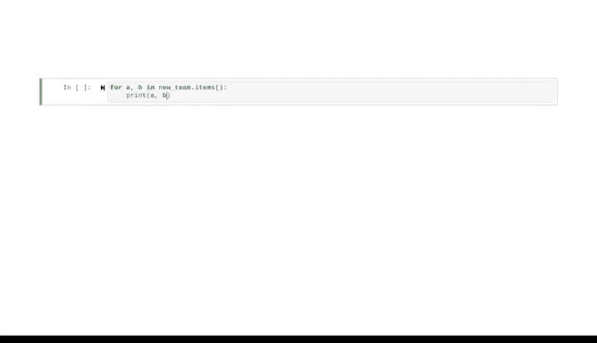

# 036：字典方法 🗂️


在本节课中，我们将继续学习Python字典，并重点介绍如何将列表数据转换为字典，以及如何使用字典的`keys()`、`values()`和`items()`方法来高效地访问数据。

---

## 概述

上一节我们介绍了字典的基本概念和工作原理。本节中，我们将通过一个具体的例子，学习如何将球员信息列表转换为按位置组织的字典，并探索几个关键的字典方法，以便更灵活地操作和访问数据。

---

## 从列表到字典的转换

让我们回顾之前使用过的女子篮球队阵容示例。该阵容最初被编码为一个元组列表，每个元组代表一名球员的姓名、年龄和位置。当球队只有首发五人时，这种列表结构是有效的。

如果我们想增加更多球员，字典可以帮助我们根据特定需求组织数据。例如，如果我们希望按位置查找球员，可以创建一个字典，其中**键**是位置，**值**是球员信息（以包含姓名和年龄的元组表示）。

我们可以手动重新输入或复制粘贴信息来创建字典，但更好的方法是编写代码来自动转换。考虑到如果数据量很大（例如整个联盟的球员），手动操作将非常低效。

以下是将列表转换为字典的步骤：

1.  实例化一个空字典。
2.  遍历原始列表中的每个元组。
3.  提取位置作为字典的键。
4.  提取球员的姓名和年龄，组成元组，作为该键对应的值（值将是一个包含多个元组的列表）。

以下是实现此转换的代码：

```python
# 原始球员列表（姓名， 年龄， 位置）
roster = [
    ("Alice", 22, "Guard"),
    ("Bob", 24, "Forward"),
    ("Cathy", 23, "Center"),
    ("Diana", 25, "Guard"),
    ("Eva", 21, "Forward")
]

# 步骤1：创建空字典
new_team = {}

# 步骤2：遍历列表并填充字典
for name, age, position in roster:
    # 步骤3和4：检查位置是否已存在，然后添加球员信息
    if position in new_team:
        # 如果位置键已存在，将球员元组追加到对应的列表中
        new_team[position].append((name, age))
    else:
        # 如果位置键不存在，创建新键并初始化列表
        new_team[position] = [(name, age)]

# 检查结果
print(new_team)
```

运行这段代码后，`new_team`字典将按位置组织所有球员，每个位置键对应一个球员信息元组的列表。这种方式在数据分析中非常常见，掌握它能使你成为更高效的数据专业人士。

---

## 实用的字典方法

创建字典后，我们需要有效访问其中的数据。以下是三个核心方法：

### `keys()` 方法

如果你直接遍历字典，循环只会访问键，而不是值。但你不必每次都写循环来获取键，这正是`keys()`方法的作用。它返回字典中所有键的视图。

```python
# 获取字典的所有键
positions = new_team.keys()
print(positions)  # 输出类似 dict_keys(['Guard', 'Forward', 'Center'])
```

### `values()` 方法

类似地，`values()`方法让你能检索字典中所有的值。对于我们的`new_team`字典，值是由元组组成的列表，因此调用此方法会返回一个“列表的列表”。

```python
# 获取字典的所有值
players_info = new_team.values()
print(players_info)  # 输出所有球员信息列表
```

### `items()` 方法

如果你想同时访问键和其对应的值，可以使用`items()`方法。它返回一个包含（键， 值）对元组的视图。为了更清晰地查看输出，我们通常配合循环使用。

```python
# 使用items()方法遍历键值对
for position, players in new_team.items():
    print(f"位置: {position}")
    for player in players:
        print(f"  - 球员: {player[0]}, 年龄: {player[1]}")
```

---



## 总结

本节课中，我们一起学习了如何将列表数据转换为更有组织的字典结构，并掌握了三个强大的字典方法：`keys()`、`values()`和`items()`。字典使得数据的存储和检索变得快速而高效。

请继续探索字典的更多功能，随着时间推移，你会发现它已成为你数据分析工具箱中不可或缺的重要工具。