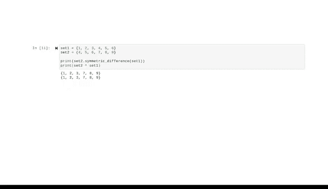

# 037：集合简介 📚


在本节课中，我们将要学习Python中的一种重要数据结构——**集合**。集合用于存储无序且唯一的元素，在数据处理中非常有用，例如去除重复项或进行数学集合运算。

---

## 什么是集合？ 🧩

上一节我们介绍了列表和元组，本节中我们来看看集合。集合是Python中的一种数据结构，它包含**无序**且**不可重复**的元素。

集合可以通过 `set()` 函数或非空花括号 `{}` 来创建。集合中的每个元素必须是**唯一**且**不可变**的，但集合本身是**可变**的。

在数据表中存储混合数据，或需要确保大量元素中每个只出现一次时，集合非常有价值。由于集合是可变的，因此**不能**用作字典的键。

---

## 如何创建集合？ 🛠️

创建集合主要有两种方法。

### 方法一：使用 `set()` 函数

`set()` 函数接受一个可迭代对象作为参数，并返回一个新的集合对象。

以下是使用列表、元组和字符串创建集合的示例：

```python
# 从列表创建集合
my_list = ["foo", "bar", "baz", "foo"]
set_from_list = set(my_list)
print(set_from_list)  # 输出可能是 {'foo', 'bar', 'baz'}，注意第二个'foo'被去除了

# 从元组创建集合
my_tuple = (1, 2, 2, 3)
set_from_tuple = set(my_tuple)
print(set_from_tuple)  # 输出 {1, 2, 3}

# 从字符串创建集合
my_string = "hello"
set_from_string = set(my_string)
print(set_from_string)  # 输出可能是 {'e', 'h', 'l', 'o'}，字母无序且唯一
```
`set()` 函数会将可迭代对象拆分为单个元素，并仅保留其中唯一的元素。

### 方法二：使用花括号 `{}`

使用花括号可以直接创建集合，但**花括号内必须有内容**。空的花括号 `{}` 会被Python解释为空字典，而不是空集合。

```python
# 创建非空集合
my_set = {"apple", "banana", "cherry"}
print(my_set)

# 创建仅包含一个字符串的集合
single_set = {"python"}
print(single_set)  # 输出 {'python'}
```
**注意**：定义空集合或新建集合时，最好使用 `set()` 函数。仅当集合非空且要赋值给变量时，才使用花括号。

此外，由于集合元素是无序的，因此**无法**通过索引或切片来访问集合中的元素。

---

## 集合的常用操作 🔧

集合支持多种数学集合运算。以下是几个核心操作及其对应的方法和运算符。

### 交集

交集用于找出两个集合**共有**的元素。

```python
set1 = {1, 2, 3, 4}
set2 = {3, 4, 5, 6}

# 使用方法
intersection_result = set1.intersection(set2)
print(intersection_result)  # 输出 {3, 4}

# 使用运算符 &
intersection_result_operator = set1 & set2
print(intersection_result_operator)  # 输出 {3, 4}
```

### 并集

并集用于获取两个集合中**所有**的元素。

```python
x1 = {"a", "b", "c"}
x2 = {"c", "d", "e"}

# 使用方法
union_result = x1.union(x2)
print(union_result)  # 输出 {'a', 'b', 'c', 'd', 'e'}

# 使用运算符 |
union_result_operator = x1 | x2
print(union_result_operator)  # 输出 {'a', 'b', 'c', 'd', 'e'}
```
并集是数学中的可交换操作，因此无论变量顺序如何，结果都相同。

### 差集

差集用于找出存在于**第一个**集合中，但**不在第二个**集合中的元素。

```python
set_a = {7, 8, 9, 10}
set_b = {9, 10, 11, 12}

# 使用方法：set_a 减去 set_b
difference_result = set_a.difference(set_b)
print(difference_result)  # 输出 {7, 8}

# 使用运算符 -
difference_result_operator = set_a - set_b
print(difference_result_operator)  # 输出 {7, 8}

# 反向差集：set_b 减去 set_a
reverse_difference = set_b - set_a
print(reverse_difference)  # 输出 {11, 12}
```
差集**不是**可交换操作，`set_a - set_b` 与 `set_b - set_a` 的结果不同。

### 对称差集

对称差集用于找出两个集合中**互不共有**的所有元素。

```python
set_x = {1, 2, 3}
set_y = {3, 4, 5}

# 使用方法
symmetric_diff_result = set_x.symmetric_difference(set_y)
print(symmetric_diff_result)  # 输出 {1, 2, 4, 5}

# 使用运算符 ^
symmetric_diff_operator = set_x ^ set_y
print(symmetric_diff_operator)  # 输出 {1, 2, 4, 5}
```

---



## 总结 📝

本节课中我们一起学习了Python中的集合。

我们了解了集合是存储**无序**、**唯一**元素的数据结构，掌握了使用 `set()` 函数和花括号创建集合的两种方法。我们还深入探讨了集合的四种核心操作：**交集**、**并集**、**差集**和**对称差集**，并学会了如何使用对应的方法和运算符来执行这些操作。


集合是数据处理中去除重复和进行集合运算的强大工具，为后续更复杂的数据分析工作奠定了重要基础。