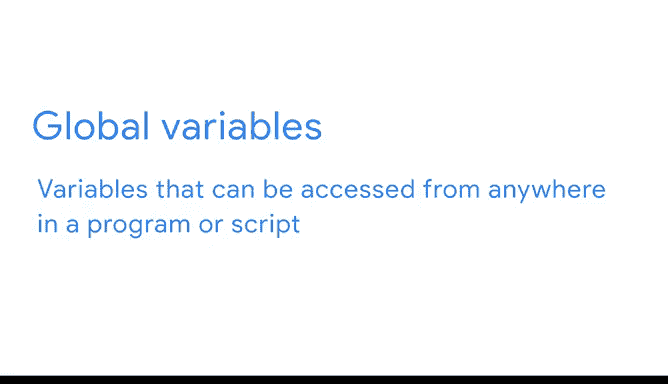

# 038：包的强大功能 📦

在本节课中，我们将要学习Python中用于数据工作和其他科学应用的高级计算能力。这些功能通过库、包和模块来提供，它们能扩展、增强和复用代码，从而节省时间，并提供额外的数据类型用于数据分析或机器学习模型构建。

---

## 库与包：可复用的代码集合

上一节我们介绍了Python的基础知识，本节中我们来看看如何通过库和包来扩展Python的功能。

库或包广义上指的是一个可复用的代码集合，它包含相关的模块和文档。在数据工作中，你经常会遇到“库”和“包”这两个术语被互换使用。

以下是数据工作中常用的两个库：

*   **Matplotlib**：一个用于在Python中创建静态、动画和交互式可视化的综合库。
*   **Seaborn**：一个基于Matplotlib的数据可视化库，它为处理常见的图表和图形提供了更简单的接口。

证书课程还集成了另外两个常用的数据工作库：NumPy和pandas。

*   **NumPy**（Numerical Python）是一个核心库，包含多维数组和矩阵数据结构以及操作它们的函数。这个库用于科学计算。
*   **pandas**（Python Data Analysis）是一个建立在NumPy之上的强大库，用于操作和分析表格数据。

数据专业工作中还有许多其他流行的Python库和包，例如Scikit-learn和Statsmodels。Scikit-learn是一个库，Statsmodels是一个包，它们包含了数据专业人员可以用来测试统计模型性能的函数，被广泛应用于各个科学领域。Scikit-learn和Statsmodels相当高级，因此在本课程中你不会直接使用它们，但在课程项目的其他地方将有机会接触。

再次强调，该领域的不同从业者经常将库和包混用，所以你可能会听到他们以其中一种或两种方式来指代。库和包为数据专业人员提供了必不可少的模块集合。

---

## 模块：组织代码的结构化方式

上一节我们了解了库和包，本节中我们来看看构成它们的更小单元——模块。

模块是从包或库中访问的Python文件，包含函数和全局变量的集合。全局变量与其他变量的区别在于，这些变量可以从程序或脚本的任何地方访问。

模块用于以结构化的方式组织函数、类和其他数据。在内部，模块是通过包含这些必要类和函数的独立文件来设置的。当你导入一个模块时，你就是在使用预先编写好的代码组件。每个模块都是一个可执行文件，可以添加到你的脚本中。

以下是数据专业工作中常用的模块：

*   **`math`**：提供对数学函数的访问。
*   **`random`**：用于生成随机数。这在从列表中随机选择元素、随机打乱元素或进行随机抽样时非常有用，你将在后续课程中探索这些内容。

根据你是想使用整个包还是仅使用单个预定义的函数或功能，有几种导入模块的方法。这为执行专门的操作增加了功能。

---

## 总结与后续

关于库、包和模块还有很多需要学习，你可以随时参考课程资源以获取有关安装这些功能的更多信息，并持续增长你的Python知识。但请注意，你无需安装任何东西，因为完成证书课程不同部分所需的一切都已内置在你在Coursera上将使用的Notebook中。

在下一个视频中，我将向你介绍一些库。😊