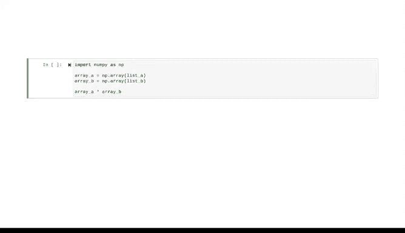

# 039：NumPy简介 🐍


在本节课中，我们将要学习NumPy库的基础知识。NumPy是Python中用于科学计算的核心库之一，它提供了高性能的多维数组对象以及处理这些数组的工具。理解NumPy是掌握Python数据分析的关键一步。

---

## NumPy的强大之处：向量化

上一节我们介绍了Python的强大功能部分源于其丰富的包和库。本节中我们来看看其中最重要且广泛使用的库之一：NumPy。

NumPy的核心优势在于**向量化**。向量化允许对数据对象的多个组成部分同时执行操作。这对于数据专业人员尤其有用，因为他们经常需要处理大量数据。向量化代码计算效率更高，能节省大量时间。

让我们进一步探讨这个概念。假设我们有两个长度相同的列表A和B，我们想创建一个新列表C，它是两个列表的逐元素乘积。

如果尝试直接相乘列表A和B，计算机会报错。为了执行此操作，我们可以编写一个`for`循环。

以下是使用循环的实现方式：
```python
# 定义列表A和B
A = [1, 2, 3]
B = [4, 5, 6]

# 使用for循环计算逐元素乘积
C = []
for i in range(len(A)):
    C.append(A[i] * B[i])
```
这种方法可以完成任务，但代码较为繁琐。

---

## 使用NumPy进行向量化计算

我们可以使用NumPy将此操作作为向量化计算来执行。

以下是使用NumPy的实现方式：
```python
import numpy as np

# 将列表转换为NumPy数组
A_np = np.array([1, 2, 3])
B_np = np.array([4, 5, 6])

# 使用乘法运算符直接进行向量化计算
C_np = A_np * B_np
```
两种方法的结果相同，但向量化方法更简单、更易读且执行速度更快。因为`for`循环一次迭代一个元素，而向量操作在单个语句中同时计算所有元素。

这种效率在处理小数据时可能不明显，但在处理大型数据集时将变得至关重要。此外，向量化操作占用的内存空间更少，这在处理大量数据时是另一个重要因素。

---

## 导入语句与别名

你可能注意到，在使用NumPy之前，我们必须先导入它。这称为**导入语句**。

导入语句使用`import`关键字将外部库、包、模块或函数加载到你的计算环境中。一旦你将某个内容导入到笔记本中并运行该单元格，除非重启笔记本，否则无需再次导入。

当我们导入NumPy时，通常将其导入为`np`。这称为**别名**。别名允许你分配一个备用名称来引用某个对象。在这种情况下，我们将`numpy`缩写为`np`。

以下是导入和别名的示例：
```python
import numpy as np
```
注意下面创建数组的代码中使用了`np`。如果我们没有给NumPy起别名`np`，就必须在这里完整地键入`numpy`才能访问其数组函数。使用`np`作为别名使代码更短、更易读。请注意，`np`是标准别名，如果你使用其他名称，其他人在阅读你的代码时可能会感到困惑。

---

## NumPy的广泛影响

除了本身非常有用之外，NumPy还为许多其他Python库（如pandas）提供了动力。因此，理解NumPy的工作原理将帮助你更好地使用这些其他包。



关于NumPy，还有更多内容等待探索。在接下来的课程中，你将学习其核心数据结构和功能。

---

本节课中我们一起学习了NumPy库的基本概念，包括其向量化计算的优势、如何通过导入语句和别名使用它，以及它在Python数据科学生态系统中的核心地位。掌握这些基础知识是高效进行数据分析的重要一步。