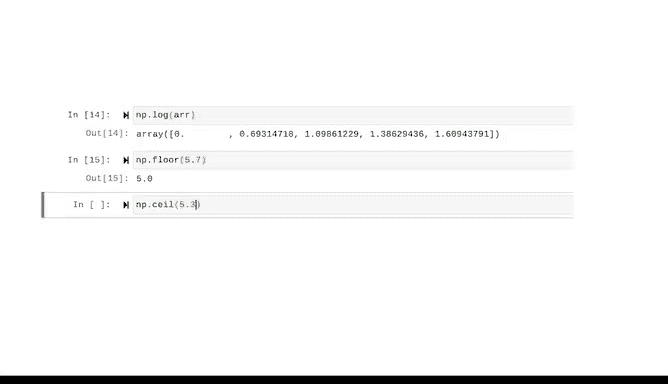

# 040：基本数组操作 📊


在本节课中，我们将要学习NumPy库中数组的核心概念与基本操作。我们将了解什么是N维数组，如何创建和修改它，以及如何检查其属性和形状。掌握这些基础知识对于后续使用更高级的数据分析库至关重要。

## 欢迎回来 👋

上一节我们介绍了NumPy如何利用向量化来更快速、高效地处理数据。我演示了NumPy如何通过将列表转换为数组，然后直接相乘，来实现两个列表的逐元素乘法。

现在，我们将继续学习数组以及如何操作它们。

## 数组：NumPy的核心数据结构 🧱

数组是NumPy的核心数据结构。数据对象本身被称为N维数组，简称ND数组。

ND数组就是一个向量。回顾一下，向量使得许多操作可以在代码执行时同时进行，从而实现更快的运行速度和更少的内存占用。

你可以通过将Python对象传递给`np.array`函数来创建一个ND数组。

```python
import numpy as np
my_array = np.array([1, 2, 3, 4])
```

## 数组的可变性与限制 ⚙️

ND数组是可变的，这意味着你可以改变它们包含的值。

例如，如果我想将数组`[‘a1‘， ‘a2‘， ‘a3‘， ‘a4‘]`中的最后一个值从‘a4‘改为‘a5‘，可以通过索引号来实现。由于是最后一个值，需要使用索引`-1`。

```python
my_array = np.array([‘a1‘， ‘a2‘， ‘a3‘， ‘a4‘])
my_array[-1] = ‘a5‘
```

但是，如果不重新赋值，就无法改变数组的大小。如果尝试在数组末尾添加一个数字，计算机会报错。因此，要改变数组大小，必须重新赋值。

数组的另一个要求是，其所有元素必须是相同的数据类型。

如果我创建一个包含整数`1`、`2`和字符串`‘coconut‘`的数组，NumPy会尝试将所有内容强制转换为相同的数据类型。在本例中，所有内容都变成了字符串（用`U21`表示，意为Unicode 21）。

```python
mixed_array = np.array([1, 2, ‘coconut‘])
print(mixed_array.dtype) # 输出：<U21
```

所以在创建数组时，请确保它们包含相同类型的数据，或者这种混合类型是你有意为之且对任务有用的。

## 检查数组属性 🔍

之前学过，对对象调用`type`函数会返回该对象的数据类型。对数组使用此函数，会得到`numpy.ndarray`。

```python
print(type(my_array)) # 输出：<class ‘numpy.ndarray‘>
```

如果我们想检查数组内容的数据类型，可以使用`dtype`属性。例如，对于一个整数数组，`dtype`属性会显示为`int`。

```python
int_array = np.array([1, 2, 3])
print(int_array.dtype) # 输出：int64
```

## 多维数组 📐

顾名思义，ND数组可以是多维的。

对于一维数组，NumPy会接收一个长度为X的类数组对象（如列表），并创建一个形状为`(X,)`的ND数组。一维数组既不是行也不是列。

我们可以使用`shape`属性来确认数组的形状，使用`ndim`属性来确认数组的维数。

```python
arr_1d = np.array([1, 2, 3, 4])
print(arr_1d.shape) # 输出：(4,)
print(arr_1d.ndim)  # 输出：1
```

数据专业人员经常需要确认数组的形状和维数，例如在尝试将其连接到另一个现有数组时。这些方法也常用于帮助理解代码出错的原因。

二维数组可以从一个列表的列表中创建，其中每个内部列表长度相同。你可以将这些内部列表视为单独的行，因此最终的数组就像一个表格。

```python
arr_2d = np.array([[1, 2], [3, 4], [5, 6], [7, 8]])
print(arr_2d.shape) # 输出：(4, 2)
print(arr_2d.ndim)  # 输出：2
```

如果二维数组是列表的列表，那么三维数组就是一个包含两个这种结构的列表，即列表的列表的列表。这个数组可以看作是两个表格，每个表格有两行三列，因此它具有三个维度。

```python
arr_3d = np.array([[[1, 2, 3], [4, 5, 6]], [[7, 8, 9], [10, 11, 12]]])
print(arr_3d.shape) # 输出：(2, 2, 3)
print(arr_3d.ndim)  # 输出：3
```

这种维度可以无限扩展。幸运的是，有一些方法可以帮助简化多维数组的操作，你将在以后学到。除非进行非常高级的科学计算，否则通常不会直接处理超过三维的NumPy数组。

## 重塑数组形状 🔄

NumPy允许我们使用`reshape`方法重塑数组的形状。

我们的二维数组是4行2列。但如果我们希望这些数据变成2行4列呢？我们只需将这些值填入`reshape`方法，并将结果重新赋值给变量即可。

```python
arr_2d = np.array([[1, 2], [3, 4], [5, 6], [7, 8]])
arr_reshaped = arr_2d.reshape(2, 4)
print(arr_reshaped)
# 输出：
# [[1 2 3 4]
#  [5 6 7 8]]
```

重塑数据是数据分析中的常见任务，因此熟悉其含义和工作原理非常重要。

## NumPy的其他强大功能 ⚡

可以对数组执行许多其他操作，你将在项目需要时学习它们。但NumPy中还有其他一些你会经常使用的有用函数和方法。

这些包括计算平均值、自然对数等函数，以及分别将数字四舍五入到最近较小和较大整数的向下取整（`np.floor`）和向上取整（`np.ceil`）操作，以及许多其他常用的数学和统计运算。

```python
arr = np.array([1.2, 2.7, 3.5])
print(np.mean(arr))   # 输出平均值
print(np.floor(arr))  # 输出向下取整结果
print(np.ceil(arr))   # 输出向上取整结果
```



NumPy非常强大，你可以用它做很多事情，我们在这里只能简要介绍。

## 总结与展望 🎯


本节课中，我们一起学习了NumPy数组的基础知识。我们了解了N维数组的概念、如何创建和修改数组、检查其数据类型和形状，以及如何重塑数组。

如你所知，NumPy为许多其他有用的库和包提供支持。在本证书课程中，我们不会直接大量使用NumPy，但会大量使用依赖于它的库——Pandas。理解NumPy的基础知识非常重要，因为它将帮助你在开始使用Pandas时更加得心应手。

随着你数据专业技能的发展，你会发现你会一次又一次地回到NumPy，因为它是高级数据分析不可或缺的一部分。

现在，你对数组有了基本的了解，为后续更复杂的数据操作打下了坚实的基础。下次见！