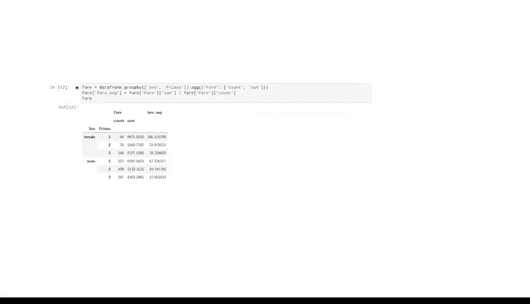

# 041：Pandas简介 🐼


在本节课中，我们将要学习一个名为Pandas的Python库。Pandas是数据分析领域的一个核心工具，它极大地简化了表格数据的处理和分析工作。

## 概述

上一节我们介绍了NumPy及其在高效计算中的重要性。本节中，我们来看看另一个建立在NumPy之上的强大库——Pandas。Pandas专门用于处理和分析表格数据，为数据专业人员提供了直观且强大的接口。

## 导入Pandas

因为Pandas是一个为Python核心工具集增加功能的库，所以使用前需要先导入它。

通常，我们会同时导入NumPy和Pandas，这主要是为了方便，因为两者经常结合使用。严格来说，使用Pandas并不强制要求导入NumPy，Pandas本身是完全独立可用的。

以下是导入的代码示例：
```python
import numpy as np
import pandas as pd
```

## Pandas的核心功能

Pandas的核心功能是操作和分析表格数据。表格数据是指以行和列的形式组织的数据，电子表格就是一个常见的例子。

虽然NumPy也能实现许多与Pandas相同的功能和操作，但使用起来并不总是那么方便，因为它要求你更抽象地处理数据并跟踪每一步操作。Pandas则提供了一个简单的界面，允许你将数据显示为行和列，这意味着在操作数据时，你总能清楚地看到数据发生了什么变化。

## 数据框：Pandas的核心数据结构

在Pandas中，表格数据被称为“数据框”。数据框是Pandas的一个核心数据结构。

请注意，数据框由行和列组成，它可以包含许多不同的数据类型，包括整数、浮点数、字符串、布尔值等。

## 加载与查看数据

首先，你可以轻松地从不同格式的文件中将数据加载到Pandas中，例如逗号分隔值文件、Excel电子表格、数据库等。

以下是一个从网络URL加载CSV文件的示例。该文件包含了泰坦尼克号部分乘客的信息，如姓名、船票等级、年龄、票价和船舱号。

## 基本数据分析操作

以下是Pandas可以执行的一些基本数据分析操作：

*   **计算平均值**：要计算乘客的平均年龄，可以选择“年龄”列并对其调用`mean`方法。
*   **获取统计值**：只需付出最少的努力，就能获得最大值、最小值和标准差。
*   **数据分组统计**：可以快速检查每个等级的乘客数量。
*   **生成汇总统计**：仅需一行代码即可检查整个数据集的摘要统计信息。此方法会给出每个数值列的行数、均值、标准差、最小值、最大值以及四分位数。

## 数据筛选

Pandas允许你基于简单或复杂的逻辑进行筛选。

例如，可以筛选出年龄大于60岁的三等舱乘客。

## 数据操作与转换

除了数据分析工具，Pandas还提供了操作和更改数据的方法。

例如，可以添加一个新列，表示从1912年到2023年经通货膨胀调整后的票价。

## 数据索引与选择

你可以使用索引从数据中选择行、列或单个单元格。

例如，Florence Briggs Thayer的名字位于第1行、第3列。

## 数据分组与聚合

Pandas支持更复杂的数据分组和聚合操作。

例如，可以按乘客的等级和性别进行分组，然后计算每个组的平均票价。



## 总结

本节课中，我们一起学习了Pandas库的基本介绍。我们了解了Pandas的核心功能是处理表格数据，认识了其核心数据结构“数据框”，并演示了如何加载数据、进行基本统计分析、数据筛选、转换以及分组聚合。希望你对开始使用Pandas感到兴奋，这是一个强大且有趣的数据分析工具。