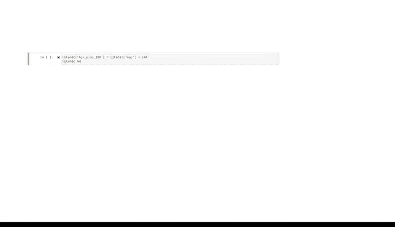

# 042：Pandas基础 🐼


在本节课中，我们将要学习Pandas库的基础知识。Pandas是数据分析的核心工具，广泛应用于数据科学领域。我们将重点介绍Pandas的两个核心对象类：DataFrame和Series，并学习如何创建、查看和操作它们。

---

## DataFrame：二维表格结构

上一节我们介绍了NumPy的基础，本节中我们来看看Pandas的核心数据结构之一：DataFrame。DataFrame是一个二维的、带标签的数据结构，包含行和列。你可以将其想象成一个电子表格或SQL表，它可以容纳多种不同类型的数据。

我们可以使用`pandas.DataFrame()`函数来创建DataFrame。这个函数非常灵活，可以将多种数据格式转换为DataFrame对象。

以下是创建DataFrame的两种常见方法：

1.  **从字典创建**：字典的每个键代表列名，对应的值是一个列表，列表中的每个元素代表该列在不同行的值。
    ```python
    import pandas as pd
    data = {'Name': ['Alice', 'Bob'], 'Age': [25, 30]}
    df = pd.DataFrame(data)
    ```

2.  **从NumPy数组创建**：数组类似于列表的列表，其中每个子列表代表表格的一行。我们可以使用`columns`和`index`参数来命名列和行。
    ```python
    import numpy as np
    array_data = np.array([[1, 2, 3], [4, 5, 6]])
    df = pd.DataFrame(array_data, columns=['A', 'B', 'C'], index=['Row1', 'Row2'])
    ```

数据从业者经常需要从非Python代码编写的现有数据（如CSV文件）创建DataFrame。CSV（逗号分隔值）是一种纯文本文件，使用逗号分隔不同的值。

Pandas提供了`read_csv()`函数来读取CSV文件并创建DataFrame。该函数可以从URL或本地硬盘路径读取文件。
```python
# 从URL读取
df = pd.read_csv('https://example.com/data.csv')
# 从本地文件读取
df = pd.read_csv('path/to/your/file.csv')
```

---

## Series：一维标签数组

现在，让我们讨论Pandas的另一个主要类：Series。Series是一个一维的标签数组。Series对象最常用于表示DataFrame的单个列或行。

我们可以从DataFrame中选择一列或一行，其类型就是`pandas.Series`。
```python
# 选择一列，得到一个Series
age_series = df['Age']
print(type(age_series))  # 输出：<class 'pandas.core.series.Series'>
```

与DataFrame类似，Series也可以从各种数据对象创建，包括NumPy数组、字典甚至标量。

---

## 操作DataFrame与Series

DataFrame和Series类有许多非常有用的方法和属性，可以简化常见任务。记住，**方法**是属于类的函数，它对对象执行操作；**属性**是与类实例关联的值，通常表示实例的特征。两者都使用点号访问，但方法使用括号，而属性不用。

假设我们将泰坦尼克号数据集命名为`titanic`。

以下是几个常用的属性和方法：

*   **`.columns`属性**：返回所有列名的索引。
    ```python
    print(titanic.columns)
    ```

*   **`.shape`属性**：返回DataFrame包含的行数和列数。
    ```python
    print(titanic.shape)  # 输出：(891, 12)
    ```

*   **`.info()`方法**：提供关于DataFrame的摘要信息，包括行数、列数、列名、每列的数据类型、非空值数量以及内存使用量。
    ```python
    titanic.info()
    ```

关于Pandas术语的两个要点：
1.  缺失值在Pandas中用`NaN`（Not a Number）表示。
2.  如果一个Series对象包含混合或字符串数据类型，其数据类型将显示为`object`。

---

## 数据选择与索引

在Pandas中，最常见任务之一是选择或引用DataFrame的特定部分，这与索引和切片非常相似。

以下是选择数据的不同方式：

*   **选择单列**：可以使用括号加列名字符串，或使用点号（仅当列名不含空格时）。
    ```python
    # 括号表示法（推荐）
    name_series = titanic['Name']
    # 点号表示法（简单代码可用）
    name_series = titanic.Name
    ```

*   **选择多列**：在括号内传入一个列名列表。
    ```python
    subset_df = titanic[['Name', 'Age', 'Fare']]
    ```

*   **按整数位置选择（`.iloc`）**：`iloc`用于基于整数位置进行选择。
    ```python
    # 选择单行（返回Series）
    first_row = titanic.iloc[0]
    # 选择单行（返回DataFrame）
    first_row_df = titanic.iloc[[0]]
    # 选择行范围
    rows_0_to_2 = titanic.iloc[0:3]  # 选择索引0, 1, 2
    # 同时选择行和列的子集
    subset = titanic.iloc[0:3, [3, 4]]
    # 获取特定行和列的单个值
    single_value = titanic.iloc[0, 3]
    ```

*   **按标签选择（`.loc`）**：`loc`用于按行和列的名称进行选择。如果行索引是数字，则使用数字；如果行有命名索引，则使用名称。
    ```python
    # 选择特定行（索引为数字时）的特定列
    subset = titanic.loc[[1, 2, 3], ['Name']]
    ```

*   **添加新列**：可以通过简单的赋值语句向DataFrame添加新列。
    ```python
    titanic['New_Column'] = range(len(titanic))
    ```

---

## 总结与后续



本节课中我们一起学习了Pandas的基础知识。我们介绍了DataFrame和Series这两个核心数据结构，学习了如何从不同来源创建它们，并探索了查看数据摘要、选择特定行和列以及添加新列的基本操作。

Pandas的功能非常丰富，本课仅涵盖了基础部分。在未来的学习中，你可能会遇到本课未明确涵盖的任务。在这种情况下，官方文档始终是你最好的朋友，它几乎总是提供简单的示例来演示如何完成你需要做的事情。

数据分析之旅还在继续，我们下节课再见。