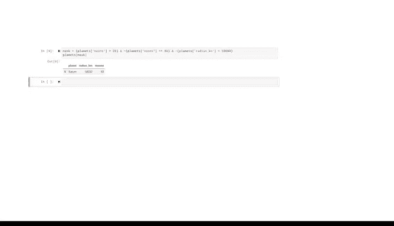

# 043：布尔掩码 🎭


在本节课中，我们将要学习如何使用**布尔掩码**来根据数值条件筛选数据框中的数据。这是一种基于数值条件进行数据过滤的强大技术。

---

## 概述

上一节我们介绍了基于列名、行索引以及行列组合的数据选择方法。本节中，我们来看看如何根据数值条件来筛选数据。

布尔掩码是一种过滤技术，它将一个布尔值网格覆盖在数据框上，从而只选择数据框中与网格中“真”值对齐的数据。

---

## 什么是布尔掩码？

布尔值用于描述只有两种可能值的二元变量：`True` 或 `False`。在 pandas 中，布尔掩码是一个 pandas 序列对象，它根据特定条件为数据框中的每个值（通常是行）标记 `True` 或 `False`。

**核心概念**：布尔掩码本质上是一个与数据框索引长度相同的布尔值序列。当将其应用于数据框时，只有对应掩码值为 `True` 的行会被保留。

---

## 创建与应用布尔掩码

假设我们有一个关于行星及其卫星数量的数据框。我们想筛选出卫星数量少于 20 颗的行星。

以下是创建和应用布尔掩码的步骤：

1.  **创建数据框**：首先，我们使用 pandas 的 `DataFrame` 函数从一个预定义的字典创建数据框。
    ```python
    import pandas as pd
    planets = pd.DataFrame({
        'name': ['Earth', 'Mars', 'Jupiter', 'Saturn'],
        'moons': [1, 2, 80, 83],
        'radius_km': [6371, 3389, 69911, 58232]
    })
    ```

2.  **创建布尔掩码**：通过编写一个逻辑语句来创建掩码。我们的目标是保留卫星数少于 20 的行星。
    ```python
    mask = planets['moons'] < 20
    ```
    执行这行代码会生成一个布尔序列 `mask`，其中每个索引位置的值表示对应行是否满足条件（`moons < 20`）。

3.  **应用布尔掩码**：将掩码放入选择器括号中，应用于原始数据框。
    ```python
    filtered_planets = planets[mask]
    ```
    也可以跳过创建中间变量 `mask` 的步骤，直接将条件逻辑应用于数据框：
    ```python
    filtered_planets = planets[planets['moons'] < 20]
    ```

**重要提示**：应用布尔掩码进行条件筛选只会生成数据框的一个过滤视图，并不会永久修改原始数据框。调用 `planets` 变量仍然会返回完整的数据框。如果需要重复使用筛选结果，可以将其赋值给一个新变量。

---

## 使用多个条件进行筛选

有时我们需要基于多个条件来过滤数据。Pandas 使用逻辑运算符来组合条件：

*   `&` 表示 **与**
*   `|` 表示 **或**
*   `~` 表示 **非**

以下是使用多个条件的示例：

**示例1：选择卫星数少于10颗或多于50颗的行星**
```python
# 注意：每个条件必须用括号括起来
mask = (planets['moons'] < 10) | (planets['moons'] > 50)
result = planets[mask]
```

**示例2：选择卫星数大于20颗，但排除恰好有80颗卫星或半径小于50000公里的行星**
```python
mask = (planets['moons'] > 20) & ~(planets['moons'] == 80) & ~(planets['radius_km'] < 50000)
result = planets[mask]
# 结果将只留下土星（Saturn），因为它有83颗卫星且半径大于50000公里。
```

**关键点**：在编写包含多个条件的复杂逻辑语句时，务必用括号将每个独立的条件括起来，否则代码可能会报错或返回非预期的结果。

---

## 总结

本节课中我们一起学习了**布尔掩码**这一核心的数据筛选技术。我们掌握了：



1.  布尔掩码的概念：它是一个基于条件判断生成的布尔值序列。
2.  如何创建单个条件的布尔掩码并将其应用于数据框。
3.  如何使用逻辑运算符 `&`、`|`、`~` 来组合多个条件，进行更复杂的筛选。

使用目前学到的基本工具，选择和筛选数据的方法几乎是无限的。要熟练掌握各种选择语句的执行方式，需要大量的练习。请务必收藏你觉得有用的所有参考资料，以便随时查阅。

继续努力，我们下一个视频再见。