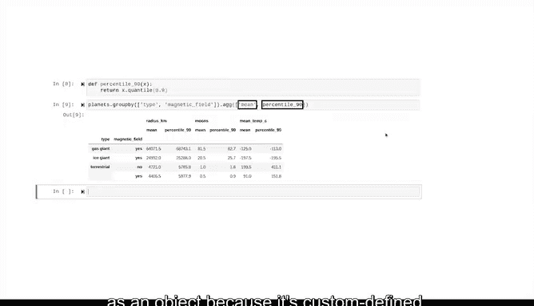

# 044：分组与聚合 📊

在本节课中，我们将要学习如何使用Pandas库对数据进行分组和聚合计算。你已经学会了如何通过名称和位置索引以及布尔掩码来选择和筛选数据，现在是时候进入下一步了。掌握分组与聚合能帮助你发现数据背后的故事。

## 理解Group By方法 🧩

上一节我们介绍了数据筛选，本节中我们来看看如何将数据分组。Pandas中一个最重要且常用的分组工具是 `groupby` 方法。

`groupby` 是Pandas DataFrame的一个方法，它根据一列或多列的值将数据框的行分组，以便对各个组进行进一步分析。为了演示其用法，我们使用一个包含更多信息的行星数据集，新增了行星类型、是否有行星环、平均温度（摄氏度）以及是否有全球磁场等列。

在学习新工具时，从一个简单的例子开始总是有益的，这能帮助你准确理解其运作机制。

首先，让我们看看调用 `groupby` 方法时发生了什么。当你对一个数据框调用此方法时，它会创建一个 `groupby` 对象。如果不对该对象进行任何操作，它本身没有太大用处，只会显示一个内存地址。但一旦拥有了这个对象，你就可以用它做很多事情。

## 基础分组与计算 ➕

以下是 `groupby` 方法的一些基础应用：

例如，如果我们按 `type` 列对数据框进行分组，然后对分组对象应用 `sum` 方法，计算机会返回一个包含三行（每种行星类型一行）和三列（每个数值列一列）的新数据框。只有数值列被返回，因为 `sum` 方法只对数值数据有效。`type` 列则成为这个新数据框的索引。这些信息可以解释为每个组在相应列上所有值的总和。

虽然像所有气态巨行星的半径总和为128,143公里这样的信息可能用处不大，但所有卫星的总数可能是我们想要计算的有用指标。

如果你想只针对特定列进行计算，只需在 `groupby` 语句后的选择括号中插入列名列表即可。

你还可以使用 `sum` 之外的其他方法，例如 `min`、`max`、`mean`、`median`、`count` 等。

## 多列分组与聚合 🔢

`groupby` 方法同样适用于多列分组。

当我们向 `groupby` 方法传入一个包含 `type` 和 `magnetic_field` 列的列表，然后对结果应用 `mean` 方法时，我们会得到一个数据框，其中每一行对应行星类型和磁场状态的唯一组合。同样，各列包含的是每个组在每个数值列上的计算平均值。

分组功能非常有用，因为它能帮助你更好地理解数据，也能为你想要绘制图表的数据进行组织，这一点我们将在后续课程中详细学习。

## 使用Aggregate方法进行多重聚合 🛠️

另一个用于分组对象的重要方法是 `agg` 方法，它是“aggregate”（聚合）的缩写。这个方法允许你对数据组应用多种计算。

让我们从一个简单的例子开始。假设我们想按行星类型分组，然后为每个组计算数值列的平均值和中位数。

我们在 `groupby` 语句后调用 `agg` 方法。在其参数中，我们输入想要应用于数据的计算列表。如果这些计算是 `groupby` 对象的现有方法，可以直接以字符串形式输入。

我们可以按多列分组，并对每个组应用多个聚合函数。例如，我们可以按行星类型和是否有磁场进行分组，然后使用 `agg` 方法计算每组的平均值和最大值。

我们甚至可以定义自己的函数并应用它们。例如，假设我们想计算每个组的第90个百分位数。

我们可以定义一个名为 `percentile_90` 的函数，该函数对数组使用 `quantile` 方法并返回第90个百分位数的值。然后，我们可以在聚合中调用这个自定义函数。

请注意，我们可以将 `mean` 作为字符串输入，因为它是 `groupby` 对象的现有方法；但我们需要将 `percentile_90` 函数作为对象输入，因为它是自定义的。

## 总结 📝

本节课中我们一起学习了 `groupby` 和 `aggregate` 这两个强大的工具，它们结合起来可以深入揭示数据所讲述的故事。我们演示的这类计算是几乎所有领域数据专业人员的日常任务。

尽管我们只将它们应用在一个非常小的数据集上，但完全相同的操作也适用于包含银河系所有行星的数据集（如果我们知道所有数据并且有足够的计算能力来执行聚合的话）。

关于 `groupby` 和 `aggregate` 还有更多可以探索的功能。希望你通过本课，对如何以及何时应用这些工具有了扎实的理解。