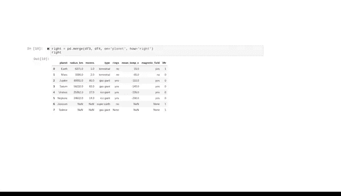

# 045：数据合并与连接 📊➡️🔗


在本节课中，我们将学习如何使用Pandas库中的`concat`和`merge`函数，将多个数据框（DataFrame）合并或连接在一起。这是数据分析中整合不同数据源的常见且关键的任务。

你已经学习了许多关于Pandas的知识，它是一个强大的库，能让处理表格数据变得更简单高效。你学会了如何选择和索引数据框中的数据，如何使用布尔掩码筛选数据，以及如何分组和聚合数据以获取洞察。在本视频中，你将学习如何向现有数据框添加新数据。这是数据专业人员的常见任务，但它并非简单地将两个数据框相加。其中有一些重要的注意事项需要了解。到本课程结束时，你将很好地理解这些注意事项，从而能够就如何最好地为项目添加数据做出明智的决策。

我们将学习两个Pandas函数：`concat`和`merge`。这两个函数的功能有相当大的重叠，但最重要的是你要掌握每个的基础知识，因为作为数据专业人员，你会经常遇到它们。

## 使用 `concat` 函数进行拼接

我们将从`concat`函数开始。回想一下，“concatenate”的意思是链接或连接在一起。Pandas的`concat`函数通过水平添加（为现有行添加新列）或垂直添加（为现有列添加新行）来组合数据。它还能够处理出现的许多数据特定的复杂性，从而允许高度的用户控制。在本视频中，我将演示如何使用`concat`函数向现有列添加新行。但请记住，如果你需要更多信息，有大量的支持文档可供查阅。

Pandas有一种特定的方式来指示我们希望数据沿哪个方向拼接。我们通过引用“轴”来实现这一点。事实上，许多Pandas和NumPy函数都有一个`axis`关键字，因此你可以指定是希望函数跨行应用还是沿列应用。数据框的两个轴是：**轴0**，垂直贯穿行；**轴1**，水平贯穿列。

我们将使用一个基本的行星数据集来演示`concat`的工作原理。

这个数据包含四颗行星：半径和卫星数量，但它缺少木星、土星、天王星和海王星的数据。现在，假设我们想添加这些数据，它们存在于一个单独的数据框中。

在合并之前，让我们先检查一下这个包含木星、土星、天王星和海王星信息的第二个数据集。

请注意，此数据的格式与`df1`数据框中的数据格式相同。它拥有相同的列：`planet`、`radius`和`moons`。要组合这两个数据框，我们希望将`df2`作为新行添加到`df1`下方。

以下是拼接两个数据框的步骤：

1.  调用`pd.concat()`函数。
2.  将要拼接的数据框以列表形式传入。
3.  包含`axis`关键字参数，以指定拼接方向。

```python
import pandas as pd

# 假设 df1 和 df2 已经定义
combined_df = pd.concat([df1, df2], axis=0)
```

`axis=0`指示函数垂直组合数据。换句话说，我们希望通过扩展垂直轴（轴0）来添加新数据。

完美，数据已作为新行添加。请注意，每一行都保留了其原始数据框中的索引号。

如果你想重新开始编号，只需重置索引。

```python
combined_df_reset = combined_df.reset_index(drop=True)
```

我们可以包含`drop=True`参数，因为否则会向数据框添加一个新的索引列，而在此情况下我们不需要。现在，行索引的枚举从0到7。

`concat`函数非常适合处理包含格式完全相同、只需垂直组合的数据框。如果你想水平添加数据，请考虑使用`merge`函数。

## 使用 `merge` 函数进行连接

`merge`函数是一个将两个数据框连接在一起的Pandas函数。它只通过沿轴1（水平方向）扩展来组合数据。

让我们回到行星数据。现在，我们拥有了所有八颗行星的半径和卫星数量，但假设我们想添加行星类型、是否有光环、平均温度、是否有磁场以及是否存在生命等数据。

也许这些数据存在于一个单独的数据框中，但它缺少水星和金星的数据，并且包含一些来自其他恒星系的最近发现的行星，比如Jansen和Tadmore。没关系，我们仍然可以处理。

首先，让我们概念化两个数据集如何连接才能工作。它们需要共享一个共同的参考点。换句话说，两个数据集都必须有某些方面在每一个中都是相同的。这些被称为“键”。键是不同数据框之间共享的参考点，用于匹配。在我们的例子中，键是行星。每个数据框都包含供我们匹配的行星。

现在，让我们考虑连接这些数据的不同方式。

以下是四种主要的连接类型：

*   **内连接**：只包含两个数据框中都存在的键。
*   **外连接**：包含两个数据框中所有的键。
*   **左连接**：包含左侧数据框中的所有键，即使它们不在右侧数据框中。
*   **右连接**：包含右侧数据框中的所有键，即使它们不在左侧数据框中。

让我们看看每种连接类型如何影响我们的行星数据。首先，我们将调用函数，分别输入`df3`和`df4`作为左侧和右侧的位置参数。然后，我们包含关键字参数`on`，它让我们指定用于匹配的键应该是什么。在本例中，我们想使用`planet`列。

现在，我们还有`how`关键字参数。这是我们输入所需连接类型的地方。让我们先试试内连接。

```python
inner_merged = pd.merge(df3, df4, on='planet', how='inner')
```

这将数据合并，并且只保留了同时出现在两个数据框中的行星。这意味着我们丢失了左侧数据框中水星和金星的数据，以及右侧数据框中Jansen和Tadmore的数据。

现在，让我们尝试外连接。

```python
outer_merged = pd.merge(df3, df4, on='planet', how='outer')
```

与预期一样，这产生了一个包含两个初始数据框中所有键的数据框。请注意，因为Jansen和Tadmore不在左侧数据框中，它们没有半径和卫星的信息，所以这些列被填充为`NaN`。同样，因为水星和金星不在右侧数据框中，它们在最终表格中也缺少一些信息，用`NaN`表示。

接下来，我们将进行左连接。同样，函数语法相同，只是`how`参数设置为`left`。

```python
left_merged = pd.merge(df3, df4, on='planet', how='left')
```

这产生了一个保留左侧数据框中所有键，并且只包含右侧数据框中那些也存在于左侧数据框中的键的数据框。因此，Jansen和Tadmore被排除在外。

最后，我们将执行右连接。



```python
right_merged = pd.merge(df3, df4, on='planet', how='right')
```

正如预期，结果是一个拥有右侧数据框中所有键，但不包含左侧数据框中那些不在右侧数据框中的键的数据框。因此，水星和金星被排除在外。

做得好。现在你了解了基本原理，你可以使用这些Pandas工具来完成最常见的数据连接类型，这对于各种各样的数据项目都将非常有用。随着你职业生涯的发展，你会发现更多关于数据连接的知识，以及它如何变得非常复杂。这些工具将对你大有帮助。你已经走了很长的路，我们现在已经准备好开始像真正的数据专业人员一样使用Pandas来探索你的数据了。下次见。