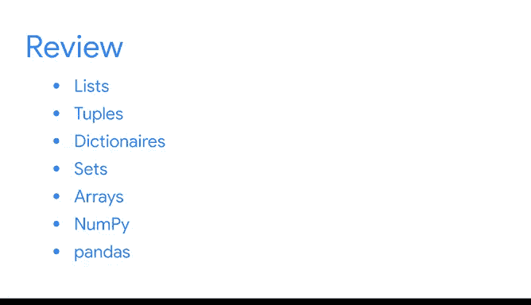

# 046：第四部分总结 🎯

在本节课中，我们将回顾并总结《Python入门》课程的第四部分内容。本节重点介绍了数据专业人士如何利用Python的数据结构和工具来高效地存储、访问和组织数据，为后续的数据分析工作打下坚实基础。

---

## 第四部分内容回顾 📚

上一节我们介绍了Python的基础语法和编程概念，本节中我们来看看数据专业人士如何运用特定的数据结构和工具来处理数据。

这是Python课程第四部分的结尾。

现在，你已经掌握了坚实的Python技能基础，可以在未来作为数据专业人士的职业生涯中持续构建。

在本节课程中，你学习了数据专业人士如何使用数据结构来存储、访问和组织他们的数据。

理解哪种数据结构适合你的特定任务是数据工作的关键部分，并将帮助你快速高效地分析数据。

我们回顾了对数据专业人士极为有用的基本数据结构。

以下是这些核心数据结构：

*   列表（Lists）
*   元组（Tuples）
*   字典（Dictionaries）
*   集合（Sets）
*   数组（Arrays）

我们还讨论了两种在高级数据分析中应用最广泛且最重要的Python工具。

第一个是NumPy，数据专业人士因其强大的计算能力而使用它。

你学习了NumPy如何帮助你快速处理大量数据并执行有用的计算。

你学习的第二个Python工具是pandas。

它是一个用于分析表格数据的强大工具。

你学习了pandas如何帮助你执行关键任务，例如筛选、分组和合并数据。

数据专业人士经常处理表格数据。你将在证书课程的其余部分以及未来的职业生涯中使用pandas。

接下来，你将有一个分级评估。为了准备，请复习列出了你所学所有新术语的阅读材料，并随时重新观看视频、阅读材料和其他涵盖关键概念的资源。

祝贺你取得的所有进步，干得漂亮。

---

## 核心概念与工具总结 🔧

本节课中我们一起学习了Python中用于数据处理的核心数据结构和两大关键库。

**核心数据结构**包括：
*   **列表**：有序、可变的元素集合，例如 `my_list = [1, 2, 3]`
*   **元组**：有序、不可变的元素集合，例如 `my_tuple = (1, 2, 3)`
*   **字典**：键值对的集合，例如 `my_dict = {'key': 'value'}`
*   **集合**：无序、不重复元素的集合，例如 `my_set = {1, 2, 3}`
*   **数组**：通常通过NumPy库实现，用于高效的数值计算，例如 `np.array([1, 2, 3])`

**关键数据分析工具**：
1.  **NumPy**：提供强大的多维数组对象和数学函数，是科学计算的基础。
2.  **pandas**：构建于NumPy之上，提供了`DataFrame`等数据结构，专门用于表格数据的操作和分析。

---

## 总结与展望 🚀

在本节课中，我们总结了《Python入门》第四部分的核心内容。你不仅掌握了列表、元组、字典、集合和数组这些基本数据结构，还初步了解了NumPy和pandas这两个在数据科学领域不可或缺的强大工具。理解并熟练运用这些知识，将显著提升你处理和分析数据的效率与能力。

请利用提供的资源充分准备接下来的评估，并带着这些坚实的技能基础，自信地迈向后续更深入的数据分析学习之旅。