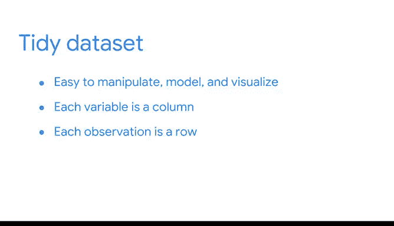

# 047：模块5 欢迎与项目介绍 🎯

在本节课中，我们将学习如何将本课程所学的Python技能应用于一个实际的组合项目。这个项目旨在帮助你构建专业作品集，为未来的求职面试做好准备。

大家好，很高兴再次与大家见面。你可能在上一个课程中认识我。我是Tiffany，负责谷歌负责任AI项目管理团队。我回来是为了更多地与大家讨论你们的组合项目，以及如何在求职中运用它们。

既然我们已经花了一些时间探索Python，我很高兴能帮助你们完成一个可以添加到专业作品集的项目。随着我们完成课程的这一部分，你将有机会开始展示你的编程技能。

## 组合项目的价值 💼

上一节我们介绍了组合项目的背景，本节中我们来看看这个项目的具体价值。

这个组合项目是培养你面试技能的宝贵机会。当潜在雇主评估你作为候选人时，他们可能会要求你提供过去如何应对编码挑战的具体例子。你可以利用你的作品集来讨论你解决过的实际问题。

此外，一些雇主可能会在面试中要求你加载、清理和构建数据，以证明你的熟练程度。通过练习创建数据库结构来解决数据驱动项目，意味着你将为此类情况做好准备。

## 实践学习与项目目标 🎯

以下是关于实践学习和项目目标的说明。

你已经了解了体验式学习，即通过实践来理解的理念。这个组合项目是一个绝佳的机会，让你真正发现组织如何使用Python管理数据，并练习你在这门课程中学到的技能。

为了完成组合项目，你将获得一些商业案例详情和一些非结构化数据文件。选择一个商业场景，并根据该场景，使用说明在你的薪酬策略文档中完成一个新条目。

你的任务是加载、清理和构建数据，使你的最终产品成为一个整洁的数据集。数据整理是指构建数据集以促进分析。整洁的数据集易于操作、建模和可视化，并具有特定的结构。

每个变量是一列。每个观测值是一行，每种观测单位类型是一个表格。

## 项目成果与后续步骤 📈

以下是完成项目后你将获得的成果。

完成这个项目后，你将拥有一个结构化的数据集，可用于下一个课程的组合项目。在你的薪酬策略文档中，你还将记录你所采取的步骤，这些记录可用于向未来的招聘经理解释你的工作和思考过程。

此时，你即将完成本课程，这意味着你已经掌握了作为一名数据专业人士持续发展所需的一切知识。项目的这一部分将侧重于展示对数据操作的掌握，并理解数据专业人士如何使用Python通过自定义函数探索和提取信息。

准备好了吗？那么让我们开始吧。

---

**本节课总结**

本节课中我们一起学习了第五模块的组合项目介绍。我们明确了该项目的目标是创建一个可用于求职作品集的整洁数据集，理解了数据整理的核心原则（每个变量是一列，每个观测值是一行），并认识到完成此项目对于展示技能和准备技术面试的重要性。接下来，我们将开始具体的项目实践。