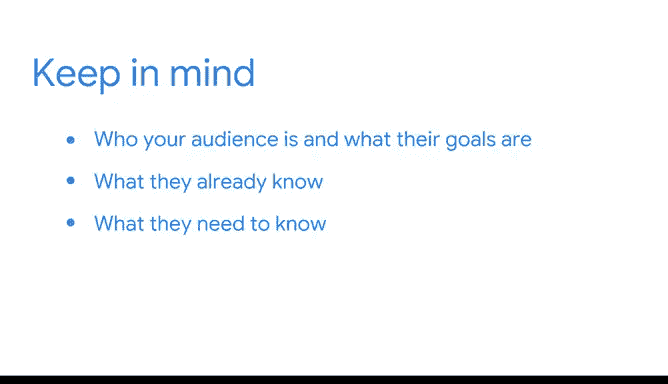
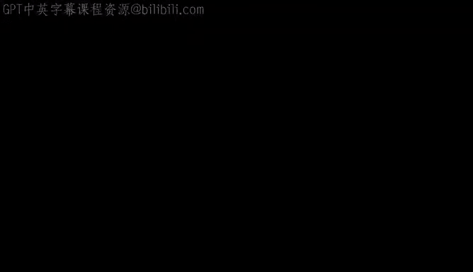

# 049：期末项目总结与职业持续成功建议 📊


在本节课中，我们将对已完成的期末项目进行总结，并探讨如何将项目经验转化为职业优势，为未来的面试和工作做好准备。

你已经完成了大量的工作。你在薪资策略文档中完成了两项记录，并开始编写自己的代码。

随着你继续完善你的作品集项目，你需要考虑如何记录你的工作过程，并能在未来的面试中向潜在雇主和招聘经理清晰地解释你所做的工作。

## 强调可迁移技能 🔄

首先，重要的是要认识到，作为一名数据专业人士，你可能需要学习和适应新的工具。市场上有许多优秀的工具，不同的企业会根据自身需求有不同的偏好。

在求职时，请记住，你已经学到了许多**可迁移的技能**，这些技能可以应用于不同的组织和行业。例如，在你刚刚完成的作品集项目中，你使用 **Python** 构建了一个整洁的数据库，专注于解决一个以数据为核心的业务场景。

```python
# 示例：使用Python进行数据处理的核心技能
import pandas as pd
# 数据清洗、整合与分析是可迁移的核心能力
data = pd.read_csv('business_data.csv')
cleaned_data = data.dropna()
```

Python 是一个强大的工具，掌握它是一项重要的技能。但更重要的是，你学会了思考数据专业人士的工作如何为商业决策和战略洞察做出贡献。你学到了沟通的重要性、可用工具的价值，以及如何使用 Python 管理大型数据集。这些都是在工作面试中值得强调的技能，无论职位要求使用什么工具。

这个作品集项目是展示这些可迁移技能的绝佳方式，它能让面试官深入了解你解决问题的方法、你的思维过程以及你做出某些决定的原因。

## 考虑你的受众 🎯

除了确保在谈论你的作品集项目时突出可迁移技能，你还需要确保考虑到你的受众。

正如你在整个课程中所学到的，你经常需要与不同类型、拥有不同技术水平的相关方合作。当你与他们沟通技术流程时，你需要记住你的受众是谁、他们的目标是什么、他们已经知道什么以及他们需要知道什么。



当你与面试官讨论你的作品集项目时，这一点同样重要。通常，参与或主持你面试的人不一定都是数据专业人士。例如，招聘经理可能不像你那样对数据流程有详细的理解。

为了让你的陈述对他们保持相关性，请尝试记住关于受众的那些关键问题。你的面试官面临着一个业务挑战，就像数据项目中的相关方一样。他们有一个需要填补的职位空缺。

思考他们需要了解你的哪些信息，才能做出解决该挑战的决定。


## 下一步：用数据讲故事 📖

接下来，你将全面学习如何用数据讲故事。然后，你将有机会进行一些探索性数据分析并创建数据可视化图表。

到本课程结束时，你将拥有一个强大的作品集。



---

**本节课总结**

在本节课中，我们一起学习了如何对期末项目进行职业化的总结与呈现。核心要点包括：
1.  **识别并强调可迁移技能**，如问题解决、业务思维和工具应用能力。
2.  **在沟通中始终考虑受众**，根据面试官的角色和背景调整你的表达方式。
3.  认识到作品集项目是展示你综合能力的窗口，而不仅仅是技术代码的堆砌。


通过有策略地展示你的项目，你可以更有效地在求职过程中脱颖而出，为持续的职业成功奠定基础。