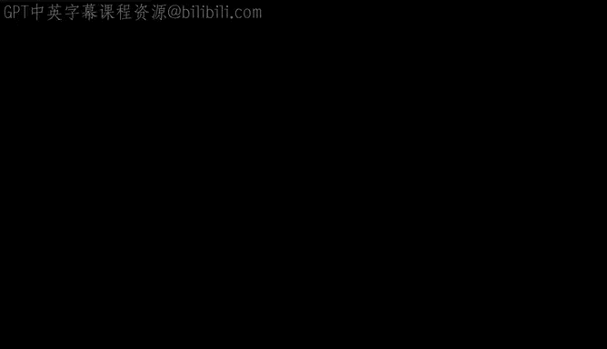
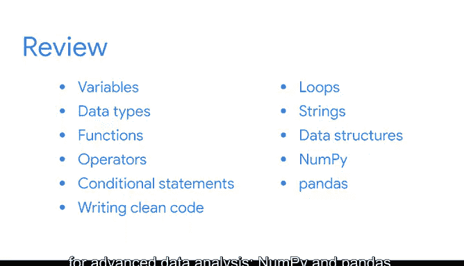

# 050：《Python入门》课程总结 🎉

在本节课中，我们将回顾并总结《Python入门》课程的核心内容。你已经完成了最终的课程项目，现在拥有了一个可以向未来雇主展示的具体成果，这证明了你的Python熟练程度。

## 课程核心技能回顾 📚

上一节我们完成了课程项目，本节中我们来系统回顾一下在整个课程中学到的重要Python技能。

以下是你在本课程中掌握的核心Python技能：

*   **变量与数据类型**：你学会了如何使用变量来存储和标记数据，以及如何转换和组合不同的数据类型，例如整数（`int`）和浮点数（`float`）。
*   **函数与运算符**：你学会了如何调用函数来对数据执行有用的操作，并使用运算符来比较值。
*   **条件语句**：你学会了如何编写条件语句（如 `if-elif-else`），以指示计算机如何根据你的指令做出决策。
*   **代码规范**：你练习了编写清晰、易于其他数据专业人士理解和复用的整洁代码。
*   **循环结构**：你发现了如何使用循环（如 `for` 循环和 `while` 循环）来自动化重复性任务。
*   **字符串操作**：你学会了如何通过切片、索引和格式化来操作字符串。
*   **数据结构**：你探索了基本的数据结构，例如列表（`list`）、元组（`tuple`）、字典（`dict`）、集合（`set`）和数组。
*   **数据分析工具**：最后，你学习了两个在高级数据分析中最广泛使用和最重要的Python工具：**NumPy** 和 **pandas**。

## 下一步学习方向 🚀

掌握了如何创建系统来为利益相关者准备数据之后，接下来你将迎来更令人兴奋的发现。现在是时候开始思考如何呈现这些数据，并使其对决策制定产生价值了。

## 总结与展望 🌟

本节课中，我们一起学习了Python编程的基础与核心技能。你现在已经拥有了坚实的Python技能基础，可以在未来作为数据专业人士的职业生涯中持续构建。

所以，请做好准备，继续你的学习之旅吧。