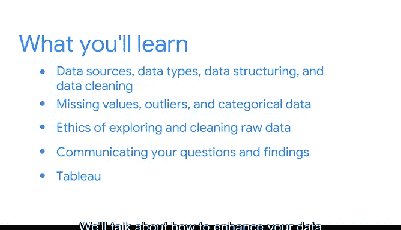

# 001：将数据转化为洞察 🚀

在本课程中，我们将学习如何将原始数据转化为引人入胜的故事。我们将探索数据分析的核心过程，学习如何发现数据中的隐藏信息，并有效地将其传达给不同的受众。

---

想象你是一位考古学家，一位通过挖掘文物来研究古代文明、保存历史故事的人。

你非常兴奋，因为你是第一个探索一个新遗址的人。

初升的太阳在你面前古河床的橙黄色岩石上投下温暖的光芒。

你呼吸着清新干净的空气，忘记了清晨的疲惫和昨天15个小时的飞行。

你停下来，想起了昨晚领队的话。

这个地方从未被研究过，但保存条件堪称完美。

你一定能发现些什么，而我们发现的任何东西，都将在明年夏天的国际考古研究所大会上展示。

那块岩石下可能隐藏着什么？哪些古老的谜团将被揭开？哪些故事将被发掘？可能性似乎是无穷的。

大家好，我叫Rob。

我是一名消费品营销负责人，在谷歌负责营销项目。每次我有机会分析数据时，都感觉自己像是一位即将有惊人发现的考古学家。

有些人看到数据表或一堆杂乱无章的数字会想：“呃，这太无聊了。”

但我们数据专业人士更清楚，不是吗？我们知道，隐藏在数字、列和行中的，是信息的金块、前所未见的洞察或引人注目的趋势。

这些有趣的隐藏知识，就是等待被分享的故事。而故事，是传达想法最有影响力的方式之一。

对我们数据专业人士来说，一个奇妙的事实是：所有数据都有故事要讲。

所以，无论你是一位有抱负的数据专业人士，还是想学习如何讲好故事，或者两者皆是，都欢迎来到这门课程。

---

到目前为止，你应该对这个项目的范围和Python编码基础有了相当好的了解。

现在，是时候深入挖掘未经探索的数据，并尝试理解它了。你准备好探索了吗？

我们将从如何使用一个名为“探索性数据分析”的六步流程来寻找和塑造故事开始。

然后，我们将讨论“PACE”工作流如何应用于用数据讲故事。

你还记得数据专业工作流缩写“PACE”吗？即**计划**、**分析**、**构造**和**执行**。我们将讨论PACE如何应用于探索数据，并了解可视化在理解数据中的必要性。

最后，我将向你展示如何在Python中对数据集执行探索性数据分析，扩展你之前学到的Python技能。

在本课程的后半部分，你将学习数据源、数据类型、数据结构和数据清理。

我们将使用Python笔记本，讨论如何处理缺失值、异常值和分类数据。

我们将探讨探索和清理原始数据的伦理问题，以及如何向不同的受众传达你的问题和发现。

在本课程的后半部分，你将了解更多关于可视化分析平台Tableau的知识。我们将讨论如何通过视觉和演示来增强你的数据故事。

---

在此过程中，我将分享针对不同受众塑造数据故事的技巧，例如如何构建满足受众需求的数据可视化。

谷歌的数据专业人士确定了在数据领域工作的基本技能。在整个课程中，将有机会练习用数据寻找和讲述故事。

简而言之，故事可以改变生活。而数据驱动的故事尤其引人注目，因为它们基于数字。

它们也可以向他人传达原则、概念、警示和新想法。

给你举一个我生活中的例子：我实际上是从一家医疗保健咨询公司的数据分析师开始我的职业生涯的。

我的职责是为患有严重疾病的患者（从哮喘到糖尿病再到癌症）识别并推荐最有效的治疗方案。

为了制定我的建议，我分析了数百万患者的医疗记录，并比较和对比了每种治疗的结果、副作用和医疗成本。

通过我的发现，我们能够推荐不仅帮助这些患者康复，还能帮助他们提高生活质量并减少医疗费用的治疗方案。

故事就在那里，等待着被发现。

所以，拿出你的铲子和放大镜，让我们开始探索吧。

---

## 总结

在本节课中，我们一起学习了数据分析的核心目标：将数据转化为有洞察力的故事。我们了解了探索性数据分析的重要性，并预览了PACE工作流、数据清理、可视化以及伦理考量等关键主题。记住，数据背后总是藏着等待被讲述的故事，而你的任务就是发现并讲述它们。